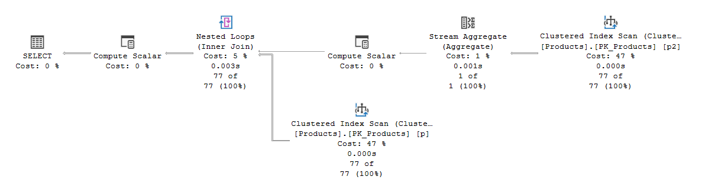
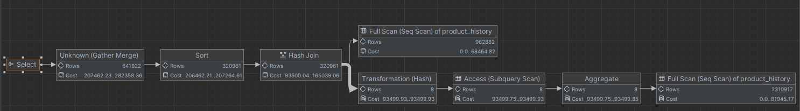
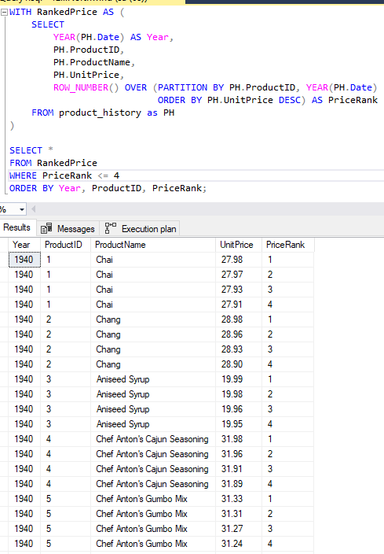
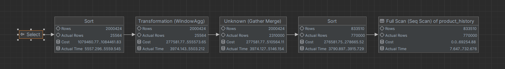
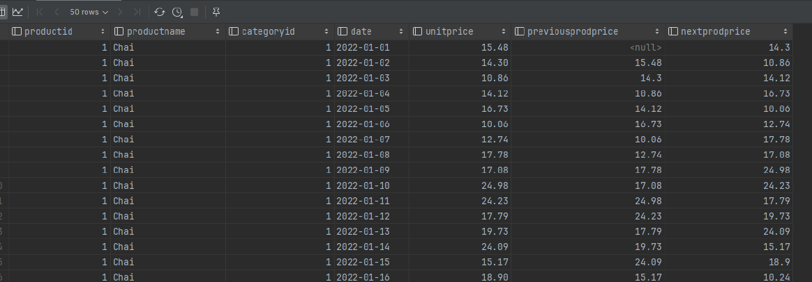
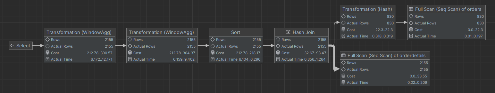
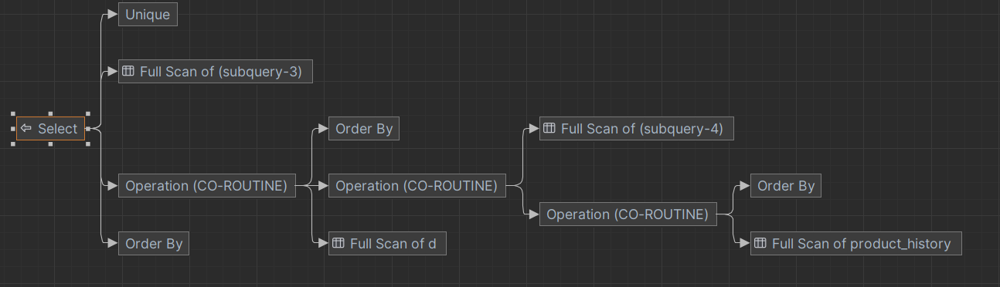
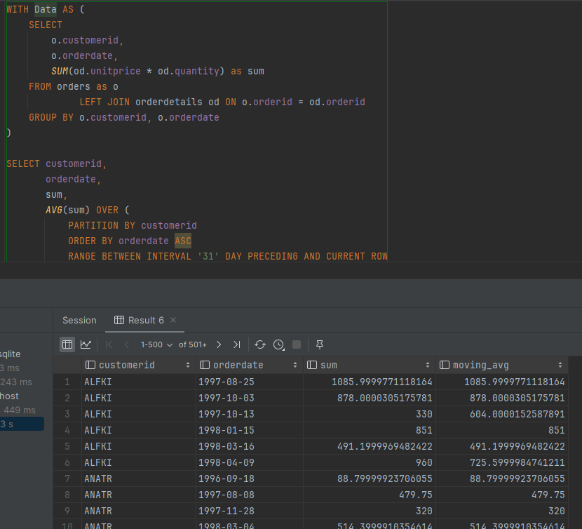

# SQL - Funkcje okna (Window functions)

# Lab 1-2

---

**Imię i nazwisko:**

- **Szymon Budziak**
- **Piotr Ludynia**

---

Celem ćwiczenia jest zapoznanie się z działaniem funkcji okna (window functions) w SQL, analiza wydajności zapytań i
porównanie z rozwiązaniami przy wykorzystaniu "tradycyjnych" konstrukcji SQL

Swoje odpowiedzi wpisuj w miejsca oznaczone jako:

```sql
-- wyniki ...
```

Ważne/wymagane są komentarze.

Zamieść kod rozwiązania oraz zrzuty ekranu pokazujące wyniki, (dołącz kod rozwiązania w formie tekstowej/źródłowej)

Zwróć uwagę na formatowanie kodu

---

## Oprogramowanie - co jest potrzebne?

Do wykonania ćwiczenia potrzebne jest następujące oprogramowanie:

- MS SQL Server - wersja 2019, 2022
- PostgreSQL - wersja 15/16
- SQLite
- Narzędzia do komunikacji z bazą danych
  - SSMS - Microsoft SQL Managment Studio
  - DtataGrip lub DBeaver
- Przykładowa baza Northwind
  - W wersji dla każdego z wymienionych serwerów

Oprogramowanie dostępne jest na przygotowanej maszynie wirtualnej

## Dokumentacja/Literatura

- Kathi Kellenberger, Clayton Groom, Ed Pollack, Expert T-SQL Window Functions in SQL Server 2019, Apres 2019
- Itzik Ben-Gan, T-SQL Window Functions: For Data Analysis and Beyond, Microsoft 2020

- Kilka linków do materiałów które mogą być
  pomocne - https://learn.microsoft.com/en-us/sql/t-sql/queries/select-over-clause-transact-sql?view=sql-server-ver16

  - https://www.sqlservertutorial.net/sql-server-window-functions/
  - https://www.sqlshack.com/use-window-functions-sql-server/
  - https://www.postgresql.org/docs/current/tutorial-window.html
  - https://www.postgresqltutorial.com/postgresql-window-function/
  - https://www.sqlite.org/windowfunctions.html
  - https://www.sqlitetutorial.net/sqlite-window-functions/

- Ikonki używane w graficznej prezentacji planu zapytania w SSMS opisane są tutaj:
  - [https://docs.microsoft.com/en-us/sql/relational-databases/showplan-logical-and-physical-operators-reference](https://docs.microsoft.com/en-us/sql/relational-databases/showplan-logical-and-physical-operators-reference)

---

# Zadanie 1 - obserwacja

Wykonaj i porównaj wyniki następujących poleceń.

```sql
select avg(unitprice) avgprice
from products p;

select avg(unitprice) over () as avgprice
from products p;

select categoryid, avg(unitprice) avgprice
from products p
group by categoryid

select avg(unitprice) over (partition by categoryid) as avgprice
from products p;
```

Jaka są podobieństwa, jakie różnice pomiędzy grupowaniem danych a działaniem funkcji okna?

| Zapytanie | MS SQL                    | Postgres                   | SQLite                   |
| --------- | ------------------------- | -------------------------- | ------------------------ |
| 1         |  |  |  |
| 2         |  |  |  |
| 3         |  |  |  |
| 4         |  |  |  |

> Widzimy, że funkcje okna przypisują obliczoną wartość każdemu wierszowi danych.
> Grupowanie automatycznie agreguje wartości do grup.

> **Zapytanie 1** zwraca średnią cenę wszystkich produktów.

> **Zapytanie 2**, które używa funkcji okna, zwraca tę samą wartość liczbową co
> **Zapytanie 1**, ale dodaje te wartość dla każdego produktu.

> **Zapytanie 3** używające group by, oblicza średnią wartość dla każdej z grup,
> rozróżnianych przed categoryid.

> **Zapytanie 4** używające funkcji okna, różni się od **Zapytania 2** tym, że liczy średnią cenę na grupach produktów, które łączy top samo categoryid. Wartości są zwracane dla
> każðego produktu podobnie jak w **Zapytaniu 2**.

# Zadanie 2 - obserwacja

Wykonaj i porównaj wyniki następujących poleceń.

```sql
--1)

select p.productid,
       p.ProductName,
       p.unitprice,
       (select avg(unitprice) from products) as avgprice
from products p
where productid < 10

--2)
select p.productid,
       p.ProductName,
       p.unitprice,
       avg(unitprice) over () as avgprice
from products p
where productid < 10
```

Jaka jest różnica? Czego dotyczy warunek w każdym z przypadków? Napisz polecenie równoważne

1. z wykorzystaniem podzapytania
2. z wykorzystaniem funkcji okna. Napisz polecenie równoważne

---

> 1. Pierwsze zapytanie używa `podzapytania w klauzuli SELECT` do obliczenia średniej ceny wszystkich produktów. Warunek
>    productid < 10 jest używany do filtracji wyników na podstawie identyfikatora produktu mniejszego niż 10.
> 2. Drugie zapytanie wykorzystuje `funkcję okna avg(unitprice) over ()` do obliczenia średniej ceny wszystkich produktów,
>    ale bez potrzeby podzapytania. Warunek productid < 10 również jest używany do filtracji wyników na podstawie
>    identyfikatora produktu mniejszego niż 10.

| Zapytanie    | MS SQL Server              | Postgres                    | SQLite                    |
| ------------ | -------------------------- | --------------------------- | ------------------------- |
| 1 oryginalne |  |  |  |
| 1 równoważne |  |  |  |
| 2 oryginalne |  |  |  |
| 2 równoważne |  |  |  |

# Zadanie 3

Baza: Northwind, tabela: products

Napisz polecenie, które zwraca: id produktu, nazwę produktu, cenę produktu, średnią cenę wszystkich produktów.

Napisz polecenie z wykorzystaniem podzapytania, join'a oraz funkcji okna.

- Polecenie z wykorzystaniem podzapytania

```sql
SELECT p.ProductID,
       p.ProductName,
       p.UnitPrice,
       (SELECT AVG(p2.UnitPrice) FROM Products AS p2) AS AveragePrice
FROM Products AS p
```

- Polecenie z wykorzystaniem joina przed poprawą

```sql
SELECT p.ProductID,
       p.ProductName,
       p.UnitPrice,
       AVG(p2.UnitPrice) AS AveragePrice
FROM Products p
         CROSS JOIN Products p2
GROUP BY p.ProductID, p.ProductName, p.UnitPrice
```

- Polecenie z wykorzystaniem joina po poprawie

```sql
SELECT p.ProductID,
       p.ProductName,
       p.UnitPrice,
	   p2.avgPrice
FROM Products p
       CROSS JOIN (SELECT AVG(UnitPrice) as avgPrice FROM Products) p2
GROUP BY p.ProductID, p.ProductName, p.UnitPrice, p2.avgPrice
```

- Polecenie z wykorzystaniem funkcji okna

```sql
SELECT p.ProductID,
       p.ProductName,
       p.UnitPrice,
       AVG(UnitPrice) OVER() AS AveragePrice
FROM Products AS p
```

---

Porównaj czasy oraz plany wykonania zapytań. Przetestuj działanie w różnych SZBD (MS SQL Server, PostgreSql, SQLite)

W SSMS włącz dwie opcje: Include Actual Execution Plan oraz Include Live Query Statistics


W DataGrip użyj opcji Explain Plan/Explain Analyze


**Porównanie dla MS SQL**

| Zapytanie       | MS SQL                     |
|-----------------|----------------------------|
| Podzapytanie    |  |
| Join            |  |
| Join poprawiony |  |
| Funkcja okna    |  |

> Plany zapytania zawierają informacje o czasie. Wszystkie 4 zapytania wykonują się podobnie szybko. SSMS pokazywał dla wszystkich z nich czas równy 00:00:01 s.


> Możemy zauważyć, że zapytanie z użyciem podzapytania, większość kosztu utrzymuje w węzłach reprezentujących skan indeksu - po 47% dla obu skanów. Użycie joina dalej utrzymało podobny koszt w skanie indeksu ale pozwoloło uniknąć jednej operacji obliczania skalara. 

> W poprzedniej wersji sprawozdania wysłaliśmy joina który właśnie tak działał. Zgodnie z sugestią z raportu postanowiliśmy go poprawić tym razem najpierw obliczając tabelę ze średnią wartością cen i potem przeprowadzając cross join. W ten sposó ograniczyliśmy liczbę agregacji strumieni.

> W ostatnim planie zapytania możemy zauważyć optymalizację. Użcie funkcji okna pozwala pozbyć się jednego ze skanów indeksów i zamiast tego użycie operacji Table Spool która używa raz obliczonych wartości które są przechowywane w tymczasowej tabeli. W ten sposó ograniczamy się do jednego skanu tabeli. Wszystkie zapytania wykonują się w podobnym krótkim czasie rzędu kilku milisekund.

**Porównanie dla Postgres**

| Zapytanie       | Postgres                      | Czase                           |
|-----------------|-------------------------------|---------------------------------|
| Podzapytanie    |  |  |
| Join            |  |  |
| Join poprawiony |  |  |
| Funkcja okna    |  |  |

> Dla Postgres-a widzimy zasadniczą różnicę. Czas wykonania nie ma jednostki a koszt jest liczbą a nie procentem rozłożenia kosztu między operacjami składającymi się na zapytanie. Sprawia to, że nie możemy porównać jakości odpowiednich zapytań w jasny sposób z MS SQL. Za to możemy porównać różne zapytania między sobą w obrębie Postgres-a. Czas mierzony przez IDE nie wydaje się być współmierny do wartości z planu zapytania. Można z tąd wywnioskować, że nie jest on pewnym wyznacznikiem jakości zapytania.

> Dla pierwszych trzech zapytań (podzapytania i 2 funkcji join) a użycie funkcji okna używa tylko jednego. Tutaj już widzimy zasadniczą różnicę między joinami. Koszt dla niepoprawnego joina jest około 20 razy większy niż dla poprawionego w operacji agregacji. Wartość czasu również jest dużo większa dla niepoprawnego joina.  

**Porównanie dla SQLite**

| Zapytanie       | SQLite                      | Czas wykonania                |
|-----------------|-----------------------------|-------------------------------|
| Podzapytanie    |  |  |
| Join            |  |  |
| Join poprawiony |  |  |
| Funkcja okna    |  |  |

> Sqlite nie daje możliwości stworzenia precyzyjnego planu który pokazał by wartość czasu wykonania. Musimy użyć wbudowanego pomiaru czasu IDE.

> Porównując między sobą czas wykonania zapytań pomiędzy SZBD nie zauważamy widocznych różnic w jakości.

---

# Zadanie 4

Baza: Northwind, tabela products

Napisz polecenie, które zwraca: id produktu, nazwę produktu, cenę produktu, średnią cenę produktów w kategorii, do której należy dany produkt. Wyświetl tylko pozycje (produkty), których cena jest większa niż średnia cena.

Napisz polecenie z wykorzystaniem podzapytania, join'a oraz funkcji okna.

- Polecenie z wykorzystaniem podzapytania

```sql
SELECT p.ProductID,
       p.ProductName,
       p.UnitPrice,
       (SELECT AVG(p2.UnitPrice)
        FROM Products AS p2
        WHERE p2.CategoryID = p.CategoryID) AS AvgCategoryPrice
FROM Products p
WHERE p.UnitPrice > (SELECT AVG(p3.UnitPrice)
                     FROM Products p3
                     WHERE p3.CategoryID = p.CategoryID);
```

- Polecenie z wykorzystaniem joina

```sql
SELECT p.ProductID,
       p.ProductName,
       p.UnitPrice,
       AVG(p2.UnitPrice) AS AvgCategoryPrice
FROM Products p
         JOIN Products AS p2 ON p.CategoryID = p2.CategoryID
GROUP BY
    p.ProductID,
    p.ProductName,
    p.UnitPrice
HAVING p.UnitPrice > AVG(p2.UnitPrice);
```

- Polecenie z wykorzystaniem funkcji okna

```sql
WITH AvgPrices AS 
    (SELECT 
         ProductID,
         ProductName,
         UnitPrice,
         AVG(UnitPrice) 
            OVER (PARTITION BY CategoryID) AS AvgCategoryPrice
    FROM Products)
SELECT ProductID,
       ProductName,
       UnitPrice,
       AvgCategoryPrice
FROM AvgPrices
WHERE UnitPrice > AvgCategoryPrice;
```

Porównaj zapytania. Porównaj czasy oraz plany wykonania zapytań. Przetestuj działanie w różnych SZBD (MS SQL Server, PostgreSql, SQLite)

**Wyniki**

| Zapytanie    | MS SQL                    | Postgres                   | SQLite                   |
| ------------ | ------------------------- | -------------------------- | ------------------------ |
| Podzapytanie |  |  |  |
| Join         |  |  |  |
| Funkcja okna |  |  |  |

**Porównanie czasów wykonania**

| Zapytanie    | MS SQL                        | Postgres                       | SQLite                       |
| ------------ | ----------------------------- | ------------------------------ | ---------------------------- |
| Podzapytanie |  |  |  |
| Join         |  |  |  |
| Funkcja okna |  |  |  |

> Dla MS SQL czas jest rzędu mniej niż 10ms. Poomiar z IDE w pozosałych SZBD jest wolniejszy. Postgres najgorzej radzi sobie z zapytaniem 2 a SQLite z pierwszym.


**Porównanie planów wykonania**

| Zapytanie    | MS SQL                        | Postgres                       | SQLite                       |
| ------------ | ----------------------------- | ------------------------------ | ---------------------------- |
| Podzapytanie |  |  |  |
| Join         |  |  |  |
| Funkcja okna |  |  |  |

> Pomimo różnic pomiędzy 2 i 3 zapytaniem dały one taki sam plan wykonania dla MS SQL. Wygląda na to, że optymalizator sprowadza zapytania do takiej samej logiki przetwarzania. W 2 i 3 zapytaniu przeprowadzany jest tylko 1 skan tabeli. w pierwszym aż dwa, mimo że użyta jest operacja Table Spool. 

> Dla Postgres plany te są już różne! W każdym kolejnym zapytaniu zmniejszamy liczbę pełnych skanów tabeli products, aż do 1.

> Dla SQLite pierwsze zapytanie wykonuje 2 skany indeksu i jeden skan tabeli, drugie z joinem wykonuje jeden skan tabeli i jeden indeks skan a trzecie tylko indeks skan i full skan tabeli AvgPrices zdefiniowanej jako zapytanie z użyciem `WITH`.


---

# Zadanie 5 - przygotowanie

Baza: Northwind

Tabela products zawiera tylko 77 wiersz. Warto zaobserwować działanie na większym zbiorze danych.

Wygeneruj tabelę zawierającą kilka milionów (kilkaset tys.) wierszy

Stwórz tabelę o następującej strukturze:

Skrypt dla SQL Srerver

```sql
create table product_history
(
    id              int identity(1,1) not null,
    productid       int,
    productname     varchar(40) not null,
    supplierid      int null,
    categoryid      int null,
    quantityperunit varchar(20) null,
    unitprice       decimal(10, 2) null,
    quantity        int,
    value           decimal(10, 2),
    date            date,
    constraint pk_product_history primary key clustered
    (id asc )
)
```

Wygeneruj przykładowe dane:

Dla 30000 iteracji, tabela będzie zawierała nieco ponad 2mln wierszy (dostostu ograniczenie do możliwości swojego
komputera)

Skrypt dla SQL Srerver

```sql
declare
@i int
set @i = 1
while @i <= 30000
begin
    insert
product_history
select productid,
       ProductName,
       SupplierID,
       CategoryID,
       QuantityPerUnit,
       round(RAND() * unitprice + 10, 2),
       cast(RAND() * productid + 10 as int),
       0,
       dateadd(day, @i, '1940-01-01')
from products set @i = @i + 1;
end;

update product_history
set value = unitprice * quantity
where 1 = 1;
```

Skrypt dla Postgresql

```sql
create table product_history
(
    id              int generated always as identity not null
        constraint pkproduct_history primary key,
    productid       int,
    productname     varchar(40)                      not null,
    supplierid      int null,
    categoryid      int null,
    quantityperunit varchar(20) null,
    unitprice       decimal(10, 2) null,
    quantity        int,
    value           decimal(10, 2),
    date            date
);
```

Wygeneruj przykładowe dane:

Skrypt dla Postgresql

```sql
do
$$
begin
for cnt in 1..30000 loop
    insert into product_history(productid, productname, supplierid,
           categoryid, quantityperunit,
           unitprice, quantity, value, date)
select productid,
       productname,
       supplierid,
       categoryid,
       quantityperunit,
       round((random() * unitprice + 10):: numeric, 2),
       cast(random() * productid + 10 as int),
       0,
       cast('1940-01-01' as date) + cnt
from products;
end loop;
end; $$;

update product_history
set value = unitprice * quantity
where 1 = 1;
```

Wykonaj polecenia: `select count(*) from product_history`, potwierdzające wykonanie zadania

| MS SQL                    | Postgres                   | SQLite                   |
| ------------------------- | -------------------------- | ------------------------ |
|  |  |  |

---

# Zadanie 6

Baza: Northwind, tabela product_history

To samo co w zadaniu 3, ale dla większego zbioru danych

Napisz polecenie, które zwraca:

- id pozycji,
- id produktu,
- nazwę produktu,
- cenę produktu,
- średnią cenę produktów w kategorii do której należy dany produkt.

Wyświetl tylko pozycje (produkty) których cena jest większa niż średnia cena.

(przykłady poniżej)

Napisz polecenie z wykorzystaniem podzapytania, join'a oraz funkcji okna.

- Polecenie z wykorzystaniem podzapytania

```sql
-- 1
WITH data as
         (SELECT p.ProductID,
                 p.ProductName,
                 p.UnitPrice,
                 (SELECT AVG(ph.UnitPrice)
                  FROM product_history ph
                  WHERE ph.CategoryID = p.CategoryID) as avgprice
          FROM product_history as p)
SELECT * FROM data
WHERE UnitPrice > avgprice
ORDER BY productid, unitprice;
```

- Polecenie z wykorzystaniem joina

```sql
-- 2
WITH classes as
         (select categoryid, avg(unitprice) avgprice
          from product_history p
          group by categoryid)
SELECT p.ProductID,
       p.ProductName,
       p.UnitPrice,
       classes.avgprice
FROM product_history as p
         inner JOIN classes ON p.categoryid = classes.categoryid
WHERE p.unitprice > classes.avgprice
ORDER BY productid, unitprice;
```

- Polecenie z wykorzystaniem funkcji okna

```sql
-- 3
WITH data as
     (SELECT
          p.ProductID,
          p.ProductName,
          p.UnitPrice,
          AVG(p.UnitPrice) OVER (PARTITION BY p.CategoryID) AS avgprice
      FROM
          product_history AS p)
SELECT * from data
WHERE UnitPrice > avgprice
ORDER BY productid, unitprice;
```

Porównaj zapytania. Porównaj czasy oraz plany wykonania zapytań. Przetestuj działanie w różnych SZBD (MS SQL Server, PostgreSql, SQLite)

**Wyniki**

| SZBD     | wynik                              |
|----------|------------------------------------|
| MS SQL   |     |
| Postgres |  |  
| SQLite   |    | 

> Udało się dla wszystkich zapytań uzyskać ten sam wynik. By to osiągnąć, dodaliśmy sortowanie po ID produktu i cenie. Dzięki temu uzyskaliśmy pewność, że dla poprawnych zapytań w obrębie danej bazy danych tabele będą takie same.


**Porównanie czasów wykonania**

| Zapytanie    | MS SQL                        | Postgres                       | SQLite                       |
| ------------ | ----------------------------- | ------------------------------ | ---------------------------- |
| Podzapytanie |  |  |  |
| Join         |  |  |  |
| Funkcja okna |  |  |  |

 > Możemy zaobserwować, że zapytanie z użyciem podzapytania dla postgres nie wykonało się nawet po 5 minutach od wywołania. Dla SQLite również nie uzyskaliśmy wyniku po około 5 minutach. Jednym z pomysłow, było możliwe zawieszenie się bazy. Jednak, po testowym sprawdzeniu połączenia prostym zapytaniem, zakończyło się ono suckecem co świadczyło o poprawnym działaniu bazy, a problemem było mało efektywne działanie podzapytania w takim zapytaniu. Trochę lepiej poradziło sobie zapytanie z joinem a najlepiej z funkcją okna.

> Dla MS SQL czasy były dłuższe dla zapytań, które dla pozostałych SZBD się wykonały, jednak zapytanie 1 wykonało się w porównywalnym czasie do pozostałych zapytań. Można wnioskować, że dzięki odpowiednim optymalizacjom MS SQL lepiej radzi sobie z optymalizacją pewnych zapytań.

**Porównanie planów wykonania**

| Zapytanie    | MS SQL                         | Postgres                          | SQLite                          |
| ------------ |--------------------------------|-----------------------------------|---------------------------------|
| Podzapytanie |  |  |  |
| Join         |  |  |  |
| Funkcja okna |  |  |  |

> Dla Postgresa musieliśmy wygenerować plan przy pomocy funkcjonalności "Explain Plan" zamiast "Explain Analyse", gdyż ta druga wymaga uruchomienia i wykonania zapytania

> Dla MS SQL róznica między 1 i drugim zapytaniem jest bardzo prosta i polega na uniknięciu dodatkowej operacji compute scalar przez późniejsze łączenie tabel. Zapytanie trzecie jest optymalizowane przez pominięcie jednego ze skanów indeksów, za to ma 2 węzły sortowania w planie wykonania.

> Dla Postgresa pierwsze zapytanie wykonuje potrójny full scan tabeli. Może być to powodem powolnego działania. Drugie i trzecie zapytanie wykonują odpowiednio po 2 i 1 skanie oraz nie agregują ich w sposób w jaki robi to zapytanie 1. Znacznie przyspiesza to czas działania.

> Dla Sqlite pierwsze zpaytanie wykonuje 3 full skany, drugie za to jeden z nich zastępuje skanem indeksu w utworzonej tabeli classes. 3 zapytanie wykonuje tylko jeden pełny skan na wejściowej tabeli danych. 

---

# Zadanie 7

Baza: Northwind, tabela product_history

Lekka modyfikacja poprzedniego zadania

Napisz polecenie, które zwraca:

- id pozycji
- id produktu
- nazwę produktu
- cenę produktu oraz:
  - średnią cenę produktów w kategorii do której należy dany produkt.
  - łączną wartość sprzedaży produktów danej kategorii (suma dla pola value)
  - średnią cenę danego produktu w roku którego dotyczy dana pozycja

Napisz polecenie z wykorzystaniem podzapytania, join'a oraz funkcji okna. Porównaj zapytania. W przypadku funkcji okna spróbuj użyć klauzuli WINDOW.

- Polecenie z wykorzystaniem podzapytania

_MS SQL_

```sql
SELECT
    ph.productid,
    ph.ProductName,
    ph.date,
    ph.unitprice,
    (SELECT AVG(unitprice) FROM product_history 
	WHERE CategoryID = ph.CategoryID) AS avgPrice,
    (SELECT SUM(value) FROM product_history 
	WHERE CategoryID = ph.CategoryID) AS total,
    (SELECT AVG(unitprice) FROM product_history 
	WHERE productid = ph.productid AND YEAR(ph.date) = YEAR(date)) AS avgYear
FROM
    product_history ph
```

_Postgres_

```sql
SELECT
    ph.productid,
    ph.ProductName,
    ph.date,
    ph.unitprice,
    (SELECT AVG(unitprice) FROM product_history
     WHERE CategoryID = ph.CategoryID) AS avgPrice,
    (SELECT SUM(value) FROM product_history
     WHERE CategoryID = ph.CategoryID) AS total,
    (SELECT AVG(unitprice) FROM product_history
     WHERE productid = ph.productid 
     AND EXTRACT (YEAR FROM ph.date) = EXTRACT (YEAR FROM date)) AS avgYear
FROM
    product_history ph
```

_SQLite_

```sql
SELECT
    ph.productid,
    ph.ProductName,
    ph.date,
    ph.unitprice,
    (SELECT AVG(unitprice) FROM product_history
     WHERE CategoryID = ph.CategoryID) AS avgPrice,
    (SELECT SUM(value) FROM product_history
     WHERE CategoryID = ph.CategoryID) AS total,
    (SELECT AVG(unitprice) FROM product_history
     WHERE productid = ph.productid 
     AND strftime('%Y', ph.date) = strftime('%Y', date)) AS avgYear
FROM
    product_history ph
```

- Polecenie z wykorzystaniem joina

_MS SQL_

```sql
SELECT
    ph.id,
    ph.ProductID,
    ph.ProductName,
    ph.UnitPrice,
    AVG(ph2.unitprice) AS AveragePrice,
    SUM(ph2.value) AS TotalSale,
    AVG(ph3.unitprice) AS AveragePriceOverYear
FROM product_history AS ph
JOIN product_history AS ph2 ON ph.categoryid = ph2.categoryid
JOIN product_history AS ph3 ON ph.productid = ph3.productid 
        AND YEAR(ph.date) = YEAR(ph3.date)
GROUP BY
    ph.id,
    ph.ProductID,
    ph.ProductName,
    ph.UnitPrice;
```

_Postgres_

```sql
SELECT
    ph.id,
    ph.ProductID,
    ph.ProductName,
    ph.UnitPrice,
    AVG(ph2.unitprice) AS AveragePrice,
    SUM(ph2.value) AS TotalSale,
    AVG(ph3.unitprice) AS AveragePriceOverYear
FROM product_history AS ph
         JOIN product_history AS ph2 ON ph.categoryid = ph2.categoryid
         JOIN product_history AS ph3 ON ph.productid = ph3.productid
    AND EXTRACT (YEAR FROM ph.date) = EXTRACT (YEAR FROM ph3.date)
GROUP BY
    ph.id,
    ph.ProductID,
    ph.ProductName,
    ph.UnitPrice;
```

_SQLite_

```sql
SELECT
    ph.id,
    ph.ProductID,
    ph.ProductName,
    ph.UnitPrice,
    AVG(ph2.unitprice) AS AveragePrice,
    SUM(ph2.value) AS TotalSale,
    AVG(ph3.unitprice) AS AveragePriceOverYear
FROM product_history AS ph
         JOIN product_history AS ph2 ON ph.categoryid = ph2.categoryid
         JOIN product_history AS ph3 ON ph.productid = ph3.productid
    AND strftime('%Y', ph.date) = strftime('%Y', ph3.date)
GROUP BY
    ph.id,
    ph.ProductID,
    ph.ProductName,
    ph.UnitPrice;
```

- Polecenie z wykorzystaniem funkcji okna

_MS SQL_

```sql
SELECT ph.id,
     ph.ProductID,
     ph.ProductName,
     ph.UnitPrice,
     avg(ph.UnitPrice) over (partition by ph.categoryid) as AveragePrice,
     sum(ph.value) over (partition by ph.categoryid) as TotalSale,
     avg(ph.UnitPrice) over (partition by ph.productid, YEAR(ph.date)) as AveragePriceOverYear
FROM product_history AS ph
WINDOW w AS (partition by ph.categoryid),
     w2 AS (partition by ph.productid, YEAR(ph.date))
```

_Postgres_

```sql
SELECT ph.id,
     ph.ProductID,
     ph.ProductName,
     ph.UnitPrice,
     avg(ph.UnitPrice) over (partition by ph.categoryid) as AveragePrice,
     sum(ph.value) over (partition by ph.categoryid) as TotalSale,
     avg(ph.UnitPrice) over (partition by ph.productid, EXTRACT (YEAR FROM ph.date)) as AveragePriceOverYear
FROM product_history AS ph
WINDOW w AS (partition by ph.categoryid),
     w2 AS (partition by ph.productid, EXTRACT (YEAR FROM ph.date))
```

_SQLite_

```sql
SELECT ph.id,
     ph.ProductID,
     ph.ProductName,
     ph.UnitPrice,
     avg(ph.UnitPrice) over (partition by ph.categoryid) as AveragePrice,
     sum(ph.value) over (partition by ph.categoryid) as TotalSale,
     avg(ph.UnitPrice) over (partition by ph.productid, strftime('%Y', ph.date)) as AveragePriceOverYear
FROM product_history AS ph
WINDOW w AS (partition by ph.categoryid),
     w2 AS (partition by ph.productid, strftime('%Y', ph.date))
```

> W powyższych zapytaniach możemy zaobserwować, jakie róznice należało uwzględnić aby móc wyciągnąc date:
>
> - MS SQL: należy użyć `YEAR(ph.date)`
> - Postgres: należy użyć `EXTRACT (YEAR FROM ph.date)`
> - SQLite: należy użyć `strftime('%Y', ph.date)`

**Wyniki**

> Tylko dla zapytania 3 wszystkie 3 SZBD dały wyniki w rozsądnym czasie. Dla zapytania 2 z joinami nie było żadnego wyniku w dobrym czasie, a dla 1 zapytania dostaliśmy wyniki tylko dla MS SQL.

Wyniki dla MS SQL w zapytaniu 1


| SZBD     | Wyniki dla zapytania 3               |
|----------|--------------------------------------|
| MS SQL   |      |
| Postgres |  |
| SQLite   |    |

> Widzimy, że dla 3 zapytania wyniki są posortowane względem id produktu a nie id tak jak to ma miejsce w zapytaniu 1.

---

Porównaj czasy oraz plany wykonania zapytań. Przetestuj działanie w różnych SZBD (MS SQL Server, PostgreSql, SQLite).

**Porównanie czasów wykonania**

| Zapytanie    | MS SQL                         | Postgres                        | SQLite                        |
| ------------ |--------------------------------|---------------------------------|-------------------------------|
| Podzapytanie |  |  |  |
| Join         |  |  |  |
| Funkcja okna |  |  |  |

> Jak widać czasy dla joina, oraz dla podzapytania w Postgres i SQLite są zbyt długie. Można by się pokusić o stwierdzenie, że czas dla MS SQL również jest bardzo długi. Widzimy, że dla ostatniego zapytania MS SQL też nie radzi sobie najlepiej, bo wykonuje je w 2:47 minuty, kiedy Postgres i SQLite wykonują je w nieco ponad 10 sekund ewidentnie radząc sobie lepiej.

**Porównanie planów wykonania**

| Zapytanie    | MS SQL                         | Postgres                          | SQLite                          |
| ------------ |--------------------------------|-----------------------------------|---------------------------------|
| Podzapytanie |  |  |  |
| Join         |  |  |  |
| Funkcja okna |  |  |  |

> Dla MS SQL pierwsze zapytanie wykonuje 4 skany indeksu a dodatkowo 6 operacji hash match. Jest to nieoptymalne. Dla Joina plan tworzy dużo mniej rozbudowane drzewo niż w pierwszym przypadku, jednak nie oznacza to optymalizacji. Praktycznie cały koszt zapytania jest zawarty w skanie indeksu i obliczeniu skalarów. Dopiero użycie funkcji okna pozwala na użycie tylko jednego skanu indeksu, ale dalej zapytanie zajmuje dużo czasu.

> Dla Postgresa pierwsze zapytanie wykonuje 4 skany tabeli i 3 agregacje. Przez takie kosztowne operacje zapytanie wykonuje się długo. Użycie joinów zdecydowanie rozbudowuje plan zapytania, co jednak nie przyspiesza go. Wykonywane są duże agregacje, hash joiny i sortowania. Dla funkcji okna uzyskujemy prosty plan z 2 sortowaniami i 2 operacjiami transformacji co przekłada się na sprawne działanie. PLan jest bardzo podobny do tego dla MS SQL poza kilkoma drobnymi operacjami, które są na pominięte. 

> Dla SQLite, z planu pierwszego możemy wywnioskować, że użyte są 3 zapytania które obejmują skany tabel. Dodatkowo użyty jest jeszcze jeden skan product history. Poza tym nie mamy informacji o tym, jak dane są agregowane. Dla joinów można zauważyć użycie indeksów i jednego pełnego skanu. 2 węzły w planie są jednak niestety nierozpoznane przez program. Dla trzeciego planu widzimy tylko jeden skan tabeli. Pozostałe dwa to skany podzapytania. Jest to też jedyne zapytanie które dla SQLite wykonało się w sensownym czasie. Możemy wnioskować, że bardzo czasochłonną operacją jest właśnie skan tabeli.

---

# Zadanie 8 - obserwacja

Funkcje rankingu, `row_number()`, `rank()`, `dense_rank()`

Wykonaj polecenie, zaobserwuj wynik. Porównaj funkcje row_number(), rank(), dense_rank()

```sql
select productid,
       productname,
       unitprice,
       categoryid,
       row_number() over(partition by categoryid order by unitprice desc)
       as rowno,
       rank() over(partition by categoryid order by unitprice desc)
       as rankprice,
       dense_rank() over(partition by categoryid order by unitprice desc)
       as denserankprice
from products;
```

Spróbuj uzyskać ten sam wynik bez użycia funkcji okna.

Wykonanie bez funkcji okna.

```sql
SELECT
    p1.productid,
    p1.productname,
    p1.unitprice,
    p1.categoryid,
    (SELECT COUNT(*) + 1 FROM products p2
     WHERE p2.categoryid = p1.categoryid
         AND p2.unitprice > p1.unitprice) AS rowno,
	(SELECT COUNT(*) + 1 FROM products p2
     WHERE p2.categoryid = p1.categoryid
         AND p2.unitprice > p1.unitprice) AS rankprice,
	(SELECT COUNT(DISTINCT p2.unitprice) + 1 FROM products p2
     WHERE p2.categoryid = p1.categoryid
         AND p2.unitprice > p1.unitprice) AS denserankprice
FROM
    products p1
ORDER BY p1.categoryid, rowno;
```

Udało się uzyskać wyniki zgadzające się.

| MS SQL                    |
| ------------------------- |
|  |


> `row_number` służy do nadawania numerów porządkowych wierszom zgodnie z określonym porządkiem. W tym przypadku wykonywana jest po unit price i numeruje wiersze.

> `rank` przypisuje numer porządkowy każdemu wierszowi tabeli, sortując je według kolumny unit price i przypisuje równe wartości dla tych samych cen. Jeśli dwa wiersze mają takie same wartości w kolumnie sortującej, to funkcja `rank` przypisze im ten sam numer porządkowy, a następny numer zostanie pominięty.

> `dense_rank` jest podobna do funkcji `rank`, ale zachowuje się nieco inaczej w przypadku wierszy o takich samych wartościach w polu sortującym. W przypadku wierszy o takich samych wartościach w polu sortującym, `dense_rank` nadaje im kolejne, nieprzerwane numery porządkowe. W tym przypadku kolumną tą jest unit price i przypisuje równe wartości dla tych samych cen, ale nie ma przerw w numeracji.

> Do wykonania zapytania bez funkcji okna wykorzystano podzapytania do zliczenia liczby produktów w tej samej kategorii o wyższej cenie jednostkowej, co skutecznie klasyfikuje produkty. Należy pamiętać, że to podejście może być znacznie wolniejsze niż używanie funkcji okna, zwłaszcza w przypadku dużych zbiorów danych.

---

# Zadanie 9

Baza: Northwind, tabela product_history

Dla każdego produktu, podaj 4 najwyższe ceny tego produktu w danym roku. Zbiór wynikowy powinien zawierać:

- rok
- id produktu
- nazwę produktu
- cenę
- datę (datę uzyskania przez produkt takiej ceny)
- pozycję w rankingu

Uporządkuj wynik wg roku, nr produktu, pozycji w rankingu

Z powodu różnej składni dla wyboru roku w zapytaniu, dla różnych SZBD, stworzone zostały osobne zapytania dla każdego z nich.

**Zapytania**

_MS SQL_

```sql
WITH RankedPrice AS (
    SELECT
        YEAR(PH.Date) AS Year,
        PH.ProductID,
        PH.ProductName,
        PH.UnitPrice,
        ROW_NUMBER() OVER (PARTITION BY PH.ProductID, YEAR(PH.Date)
                           ORDER BY PH.UnitPrice DESC) AS PriceRank
    FROM product_history as PH
)

SELECT *
FROM RankedPrice
WHERE PriceRank <= 4
ORDER BY Year, ProductID, PriceRank;
```

_Postgres_

```sql
WITH RankedPrice AS (
    SELECT
        EXTRACT(year from PH.date) AS Year,
        PH.ProductID,
        PH.ProductName,
        PH.UnitPrice,
        ROW_NUMBER() OVER (PARTITION BY PH.ProductID, EXTRACT(year from PH.date)
                           ORDER BY PH.UnitPrice DESC) AS PriceRank
    FROM product_history as PH
)

SELECT *
FROM RankedPrice
WHERE PriceRank <= 4
ORDER BY Year, ProductID, PriceRank;
```

_SQLite_

```sql
WITH RankedPrice AS (
    SELECT
        strftime('%Y', PH.date) AS Year,
        PH.ProductID,
        PH.ProductName,
        PH.UnitPrice,
        ROW_NUMBER() OVER (PARTITION BY PH.ProductID, strftime('%Y', PH.date)
                           ORDER BY PH.UnitPrice DESC) AS PriceRank
    FROM product_history as PH
)

SELECT *
FROM RankedPrice
WHERE PriceRank <= 4
ORDER BY Year, ProductID, PriceRank;
```

**Wyniki zapytań**

| MS SQL                    | Postgres                   | SQLite                   |
| ------------------------- | -------------------------- | ------------------------ |
|  |  |  |

Spróbuj uzyskać ten sam wynik bez użycia funkcji okna, porównaj wyniki, czasy i plany zapytań. Przetestuj działanie w różnych SZBD (MS SQL Server, PostgreSql, SQLite)

**Zapytania bez funkcji okna**

_MS SQL_

```sql
WITH RankedPrice AS (
    SELECT
        YEAR(PH.Date) AS Year,
        PH.ProductID,
        P.ProductName,
        PH.UnitPrice,
        PH.Date AS PriceDate,
        (
            SELECT COUNT(DISTINCT PH2.UnitPrice) + 1
            FROM product_history AS PH2
            WHERE YEAR(PH2.Date) = YEAR(PH.Date)
                  AND PH2.ProductID = PH.ProductID
                  AND PH2.UnitPrice > PH.UnitPrice
        ) AS PriceRank
    FROM product_history AS PH
    INNER JOIN products AS P ON PH.ProductID = P.ProductID
)

SELECT
    Year,
    ProductID,
    ProductName,
    UnitPrice AS Price,
    PriceDate AS Date,
    PriceRank
FROM RankedPrice
WHERE PriceRank <= 4
ORDER BY Year, ProductID, PriceRank;
```

_Postgres_

```sql
WITH RankedPrice AS (
    SELECT
        EXTRACT(year from PH.date) AS Year,
        PH.ProductID,
        P.ProductName,
        PH.UnitPrice,
        PH.Date AS PriceDate,
        (
            SELECT COUNT(DISTINCT PH2.UnitPrice) + 1
            FROM product_history AS PH2
            WHERE EXTRACT(year from PH2.date) = YEAR(PH.Date)
                  AND PH2.ProductID = PH.ProductID
                  AND PH2.UnitPrice > PH.UnitPrice
        ) AS PriceRank
    FROM product_history AS PH
    INNER JOIN products AS P ON PH.ProductID = P.ProductID
)

SELECT 
    Year,
    ProductID,
    ProductName,
    UnitPrice AS Price,
    PriceDate AS Date,
    PriceRank
FROM RankedPrice
WHERE PriceRank <= 4
ORDER BY Year, ProductID, PriceRank;
```

_SQLite_

```sql
WITH RankedPrice AS (
    SELECT
        strftime('%Y',  PH.date) AS Year,
        PH.ProductID,
        P.ProductName,
        PH.UnitPrice,
        PH.Date AS PriceDate,
        (
            SELECT COUNT(DISTINCT PH2.UnitPrice) + 1
            FROM product_history AS PH2
            WHERE strftime('%Y',  PH2.date) = strftime('%Y', PH.Date)
              AND PH2.ProductID = PH.ProductID
              AND PH2.UnitPrice > PH.UnitPrice
        ) AS PriceRank
    FROM product_history AS PH
             INNER JOIN products AS P ON PH.ProductID = P.ProductID
)

SELECT
    Year,
    ProductID,
    ProductName,
    UnitPrice AS Price,
    PriceDate AS Date,
    PriceRank
FROM RankedPrice
WHERE PriceRank <= 4
ORDER BY Year, ProductID, PriceRank;
```

| MS SQL                    | Postgres                   | SQLite                   |
| ------------------------- | -------------------------- | ------------------------ |
|  |  |  |

**Czasy wykonania**

| Funkcja okna lub nie | MS SQL                        | Postgres                         | SQLite                         |
| -------------------- | ----------------------------- | -------------------------------- | ------------------------------ |
| Z funkcją okna       |  |    |  |
| Bez funkcji okna     |  |  |  |

**Plany wykonania**

| Funkcja okna lub nie | MS SQL                        | Postgres                         | SQLite                         |
| -------------------- | ----------------------------- | -------------------------------- | ------------------------------ |
| Z funkcją okna       |  |    |  |
| Bez funkcji okna     |  |  |  |

> W tym zadaniu, konieczne było skorzystanie z tabeli `product_history`, która posiada 2500 rekordów.

> Wyniki testów wyraźnie pokazują, że korzystanie z funkcji okna znacząco skraca czas wykonania zapytań w porównaniu z alternatywnym podejściem, które ich nie wykorzystuje. W każdym systemie zarządzania bazą danych zauważalne jest przyspieszenie, jednak różnice między użyciem funkcji okna a ich brakiem są najbardziej widoczne w przypadku SQLIte. W Postgres i MS SQL również obserwuje się znaczne skrócenie czasu wykonania zapytań przy użyciu funkcji okna.

> Koszt w przypadku wykorzystania funkcji okna jest znacznie niższy niezależnie od SZBD. Co do planów wykonania to dla `MS SQL` oraz `Postgres` plany są bardzo proste oraz podobne do siebie.

---

# Zadanie 10 - obserwacja

Funkcje `lag()`, `lead()`

Wykonaj polecenia, zaobserwuj wynik. Jak działają funkcje `lag()`, `lead()`

```sql
select productid,
       productname,
       categoryid, date, unitprice,
       lag(unitprice) over (partition by productid order by date) as previousprodprice,
       lead(unitprice) over (partition by productid order by date) as nextprodprice
from product_history
where productid = 1 and year (date) = 2022
order by date;

with t as (select productid, productname, categoryid, date, unitprice,
           lag(unitprice) over (partition by productid order by date) as previousprodprice,
           lead(unitprice) over (partition by productid order by date) as nextprodprice
from product_history
    )
select *
from t
where productid = 1 and year (date) = 2022
order by date;
```

| MS SQL                     |
| -------------------------- |
|  |

> Funckje `lag` i `lead` pozwalają na dostęp do wartości odpowiednio z poprzednich i kolejnych wierszy. Mogą być przydatne by porównywać wartości w różnych punktach czasu. Zastosowanie funkcji `lag(unitprice)` umożliwia pobranie ceny produktu z poprzedniego rekordu, które przez użycie funkcji okna i w niej order by date są posortowane według daty. Natomiast funkcja `lead(unitprice)` zwraca cenę produktu z następnego rekordu. Dzięki nim można porównywać bieżące wartości z cenami poprzednimi lub następnymi w uporządkowanym zestawie danych.

Spróbuj uzyskać ten sam wynik bez użycia funkcji okna, porównaj wyniki, czasy i plany zapytań. Przetestuj działanie w różnych SZBD (MS SQL Server, PostgreSql, SQLite)

**Wyniki bez funkcji okna**

_Zapytanie 1_

```sql
SELECT
    ph1.productid,
    ph1.productname,
    ph1.categoryid,
    ph1.date,
    ph1.unitprice AS currentprodprice,
    ph2.unitprice AS previousprodprice,
    ph3.unitprice AS nextprodprice
FROM product_history as ph1
LEFT JOIN product_history as ph2 ON ph1.productid = ph2.productid
                            AND ph1.date > ph2.date
                            AND year(ph1.date) = 2022
                            AND ph2.date = (
                                SELECT MAX(date)
                                FROM product_history
                                WHERE productid = ph1.productid
                                AND date < ph1.date
                                AND year(date) = 2022
                       )
LEFT JOIN product_history as ph3 ON ph1.productid = ph3.productid
                            AND ph1.date < ph3.date
                            AND year(ph1.date) = 2022
                            AND ph3.date = (
                                SELECT MIN(date)
                                FROM product_history
                                WHERE productid = ph1.productid
                                AND date > ph1.date
                                AND year(date) = 2022
                       )
WHERE ph1.productid = 1 AND year(ph1.date) = 2022
ORDER BY ph1.date;
```

_Zapytanie 2_

```sql
WITH t AS (
    SELECT
        ph1.productid,
        ph1.productname,
        ph1.categoryid,
        ph1.date,
        ph1.unitprice AS currentprodprice,
        ph2.unitprice AS previousprodprice,
        ph3.unitprice AS nextprodprice
FROM product_history as ph1
LEFT JOIN product_history as ph2 ON ph1.productid = ph2.productid
                            AND ph1.date > ph2.date
                            AND year(ph1.date) = 2022
                            AND ph2.date = (
                                SELECT MAX(date)
                                FROM product_history
                                WHERE productid = ph1.productid
                                AND date < ph1.date
                                AND year(date) = 2022
                           )
LEFT JOIN product_history as ph3 ON ph1.productid = ph3.productid
                            AND ph1.date < ph3.date
                            AND year(ph1.date) = 2022
                            AND ph3.date = (
                                SELECT MIN(date)
                                FROM product_history
                                WHERE productid = ph1.productid
                                AND date > ph1.date
                                AND year(date) = 2022
                           )
)
SELECT *
FROM t
WHERE productid = 1 AND year(date) = 2022
ORDER BY date;
```

**Wyniki zapytań**

| Zapytanie | MS SQL                     | Postgres                    | SQLite                    |
| --------- | -------------------------- | --------------------------- | ------------------------- |
| 1         |  |  |  |
| 2         |  |  |  |

**Czasy wykonania**

| Zapytanie | MS SQL | Postgres | SQLite |
| --------- | ------ | -------- | ------ |
| 1         | 2.4 s  | 1.5 s    | 1.2 s  |
| 2         | 2.3 s  | 1.7 s    | 1.0 s  |

**Plany wykonania**

| Zapytanie | MS SQL                         | Postgres                        | SQLite                          |
| --------- | ------------------------------ | ------------------------------- | ------------------------------- |
| 1         |  |  |  |
| 2         |  |  |  |

> W tym zadaniu, konieczne było skorzystanie z tabeli `product_history`, która posiada 2500 rekordów.

> Zapytania z funkcjami okna wykonują się znacznie szybciej, są prostrze, czytelniejsze i bardziej zwięzłe. Zapytania bez funkcji okna są bardziej skomplikowane, wymagają złączeń oraz podzapytań, co sprawia, że są mniej czytelne. Zapytania z użyciem funkcji okna mają również wielokrotnie mniejszy koszt wykonania i prostszy plan wykonania niż ich odpowiedniki bez funkcji okna.

> W PostgreSQL i SQLite zauważalne jest nieznaczne przyspieszenie zapytań wykorzystujących funkcje okna w porównaniu z ich odpowiednikami, które nie korzystają z tych funkcji. Natomiast w przypadku SQL Servera zapytania bez funkcji okna są nieco szybsze niż te z ich użyciem.

# Zadanie 11

Baza: Northwind, tabele customers, orders, order details

Napisz polecenie które wyświetla inf. o zamówieniach

Zbiór wynikowy powinien zawierać:

- nazwę klienta, nr zamówienia,
- datę zamówienia,
- wartość zamówienia (wraz z opłatą za przesyłkę),
- nr poprzedniego zamówienia danego klienta,
- datę poprzedniego zamówienia danego klienta,
- wartość poprzedniego zamówienia danego klienta.

**Zapytanie**

```sql
with Data as (
    SELECT O.OrderID, C.CompanyName, O.OrderDate,
    O.Freight + sum(OD.UnitPrice * OD.Quantity * (1 - OD.Discount)) as Cost,
    lag(O.OrderID) over (partition by C.CustomerID order by O.OrderDate) as PrevOrderID,
    lag(O.OrderDate) over (partition by C.CustomerID order by O.OrderDate) as PrevOrderDate
FROM Orders as O
JOIN Customers as C on O.CustomerID = C.CustomerID
JOIN [Order Details] as OD on O.OrderID = OD.OrderID
GROUP BY O.OrderID, C.CustomerID, C.CompanyName, O.OrderDate, O.Freight)


SELECT Data.*,
    O.Freight + sum(OD.UnitPrice * OD.Quantity * (1 - OD.Discount)) as PrevCost
FROM Data
LEFT JOIN Orders as O on O.OrderID = PrevOrderID
LEFT JOIN [Order Details] as OD on O.OrderID = OD.OrderID
GROUP BY O.Freight, Data.OrderID, Data.CompanyName, Data.OrderDate, Data.Cost, Data.PrevOrderID, Data.PrevOrderDate
ORDER BY Data.OrderID;
```

**Wynik**


**Czas wykonania**


**Plan wykonania**


> Zapytanie zostało sprawdzone zarówno na bazie danych MS SQL, jak i PostgreSQL. W każdym przypadku czas wykonania wyniósł mniej niż 500 ms. Analiza planu wykonania nie wykazała żadnych istotnych różnic między tymi systemami zarządzania bazą danych.

# Zadanie 12 - obserwacja

Funkcje `first_value()`, `last_value()`

Wykonaj polecenia, zaobserwuj wynik. Jak działają funkcje `first_value()`, `last_value()`. Skomentuj uzyskane wyniki.
Czy funkcja `first_value` pokazuje w tym przypadku najdroższy produkt w danej kategorii, czy funkcja `last_value()`
pokazuje najtańszy produkt? Co jest przyczyną takiego działania funkcji `last_value`. Co trzeba zmienić żeby funkcja
last_value pokazywała najtańszy produkt w danej kategorii

```sql
select productid,
       productname,
       unitprice,
       categoryid,
       first_value(productname) over (partition by categoryid
order by unitprice desc) first,
    last_value(productname) over (partition by categoryid
order by unitprice desc) last
from products
order by categoryid, unitprice desc;
```

**Wynik**


> Funkcje okna mają zasięg działania (RANGE). Jeśli używamy ORDER BY i nie podamy RANGE to domyślne wartości to: RANGE BETWEEN UNBOUNDED PRECEDING AND CURRENT ROW. Oznacza, że wybierzemy najmniejszą wartość między pierwszym, a obecnym wierszem tabeli. W zadaniu mamy klauzulę: **order by categoryid, unitprice desc**, to tabela już jest posortowana po cenie, daltego otrzyujemy zawsze przedmiot z obecnego wiersza.

> Funkcja **first_value()** pokazuje najdroższy produkt w danej kategorii natomiast funkcja **last_value()** pokazuje wiersz, który posiadałby najwyższą wartość funkcji **row_number()** dla wierszy posiadających taką samą wartość funkcji **rank()** jak aktualnie badany wiersz. Zachowanie funkcji last_value() można zmienić ustawiając opcję range na between unbounded preceding and unbounded following.

> Aby funkcja **last_value()** pokazywała najtańszy produkt w danej kategorii należy zamienić domyślny zakres funkcji z **RANGE BETWEEN UNBOUNDED PRECEDING AND CURRENT ROW** na **ROWS BETWEEN UNBOUNDED PRECEDING AND UNBOUNDED FOLLOWING**. Zmodyfikowane zapytanie wygląda następująco:

```sql
select productid, productname, unitprice, categoryid,
       first_value(productname) over (partition by categoryid order by unitprice desc
       ROWS BETWEEN UNBOUNDED PRECEDING AND UNBOUNDED FOLLOWING) first,
       last_value(productname) over (partition by categoryid order by unitprice desc
       ROWS BETWEEN UNBOUNDED PRECEDING AND UNBOUNDED FOLLOWING) last
from products
order by categoryid, unitprice desc;
```

Spróbuj uzyskać ten sam wynik bez użycia funkcji okna, porównaj wyniki, czasy i plany zapytań. Przetestuj działanie w różnych SZBD (MS SQL Server, PostgreSql, SQLite)

**Zapytania**

_MS SQL_

```sql
select p.productid, p.productname, p.unitprice, p.categoryid,
       (select top 1 p2.productname from product_history p2 where p2.CategoryID=p.CategoryID
       order by p2.UnitPrice desc) first,
       (select top 1 p2.productname from product_history p2 where p2.CategoryID=p.CategoryID
       order by p2.UnitPrice) last
from product_history p
order by p.categoryid, p.unitprice desc;
```

_PostgreSQL_

```sql
select p.productid, p.productname, p.unitprice, p.categoryid,
       (select p2.productname from product_history p2 where p2.CategoryID=p.CategoryID
       order by p2.UnitPrice desc limit 1) first,
       (select p2.productname from product_history p2 where p2.CategoryID=p.CategoryID
       order by p2.UnitPrice limit 1) last
from product_history p
order by p.categoryid, p.unitprice desc;
```

_SQLite_

```sql
select p.productid, p.productname, p.unitprice, p.categoryid,
       (select p2.productname from product_history p2 where p2.CategoryID=p.CategoryID
       order by p2.UnitPrice desc limit 1) first,
       (select p2.productname from product_history p2 where p2.CategoryID=p.CategoryID
       order by p2.UnitPrice limit 1) last
from product_history p
order by p.categoryid, p.unitprice desc;
```

> Bez użycia funkcji okna możemy uzyskać wyniki których potrzebujemy.

> W zadaniu tym należało użyć tabeli `product_history`, która posiada 2500 rekordów.

**Czasy wykonania**

| Zapytanie | MS SQL                         | Postgres                          | SQLite                          |
| --------- | ------------------------------ | --------------------------------- | ------------------------------- |
| 1         |  |  |  |
| 2         |  |  |  |

**Plany wykonania**

| Zapytanie | MS SQL                         | Postgres                        | SQLite                        |
| --------- | ------------------------------ | ------------------------------- | ----------------------------- |
| 1         |  |  |  |
| 2         |  |  |  |

> Wydajność funkcji okna jest najlepsza we wszystkich przypadkach. Widać znaczną różnicę między PostgreSQL a SQLite. W przypadku MS SQL oba zapytania wykonują się szybko. PostgreSQL okazał się być najwolniejszą bazą danych.

> Funkcje okna składały się z prostszych, liniowych ciągów operacji, podczas gdy zagnieżdżone zapytania wiązały się z bardziej drzewiastą strukturą planu. Wszystkie wersje zapytania na tabeli products wykonały się błyskawicznie.
> Jeśli chodzi o koszt, to w przypadku funkcji okna jest on znacznie niższy dla wszystkich SZBD.

> W przypadku MS SQL oraz zapytania bez funkcji okna, na planie zapytania widzimy 3 pełne skany tabeli oraz operację Nested Loops. Z pewnością wpływa to negatywnie na efektywność oraz końcowy czas wykonania zapytania. Mogłoby się wydawać, że bardziej rozgałęziony plan w tym przypadku w porównaniu do funkcji okna, która wykonuje operacje sekwencyjnie jest łatwiejszy do zrównoleglenia, jednak kosztowne operacje na tabeli sprawiają, że zapytanie bez funkcji okna wykonuje się wolniej. Dla porównania, zapytanie z funkcją okna wykonuje tylko jeden skan indeksu, co znacznie przyspiesza jego wykonanie.

---

# Zadanie 13

Baza: Northwind, tabele orders, order details

Napisz polecenie które wyświetla inf. o zamówieniach

Zbiór wynikowy powinien zawierać:

- Id klienta,
- nr zamówienia,
- datę zamówienia,
- wartość zamówienia (wraz z opłatą za przesyłkę),
- dane zamówienia klienta o najniższej wartości w danym miesiącu
  - nr zamówienia o najniższej wartości w danym miesiącu
  - datę tego zamówienia
  - wartość tego zamówienia
- dane zamówienia klienta o najwyższej wartości w danym miesiącu
  - nr zamówienia o najniższej wartości w danym miesiącu
  - datę tego zamówienia
  - wartość tego zamówienia

```sql
with Data as (
    SELECT o.CustomerID as CustomerID, o.OrderID, o.OrderDate,
    o.Freight+od.UnitPrice*od.Quantity-od.Discount as value
    FROM orders AS o
    JOIN orderdetails as od on od.OrderID = o.OrderID)

SELECT
    d.CustomerID, d.OrderDate, d.OrderDate, d.value,
    last_value(concat(d.OrderID,' ', d.OrderDate,' ', d.value)) over (partition by d.CustomerID order by d.value desc rows between unbounded preceding and unbounded following) min_value_order,
    first_value(concat(d.OrderID,' ', d.OrderDate,' ', d.value)) over (partition by d.CustomerID order by d.value desc) max_value_order
FROM Data as d
```

**Wynik**


**Czas wykonania**


**Plan wykonania**



> Zapytanie zostało przetestowane dla MsSql, Postgres i SQLite, a czas wykonania wynosił około 0.5 sekundy. Nie zaobserwowano znaczących różnic w wydajności między poszczególnymi systemami baz danych.

---

# Zadanie 14

Baza: Northwind, tabela product_history

Napisz polecenie które pokaże wartość sprzedaży każdego produktu narastająco od początku każdego miesiąca. Użyj funkcji
okna

Zbiór wynikowy powinien zawierać:

- id pozycji
- id produktu
- datę
- wartość sprzedaży produktu w danym dniu
- wartość sprzedaży produktu narastające od początku miesiąca

```sql
with Data as (
    SELECT
    id,
    productid,
    date,
    sum(unitprice*quantity) over(partition by productid,convert(date,date)) dayValue
    FROM product_history
)

SELECT distinct
    d.*,
    sum(d.dayValue) over(partition by d.productid, year(d.date), month(d.date)
    order by day(d.date) rows between unbounded preceding and current row) as accumulated
FROM Data as d
ORDER BY d.date
```

**Wynik**


> Warto zauważyć, że w w wyniku zapytania otrzymujemy 'powtórki'. Zapytanie zwraca nam po 3 takie same produkty na każdy dzień lecz z inną wartośćia accumulated. Nie wynika to z błedu, tylko z faktu, że tabela product_history została utworzona z takim błędem. Mimo wszystko logika zapytania jest poprawna i pozostaje taka sama. Wartość accumulated jest sumą wartości sprzedaży produktu od początku miesiąca.

Spróbuj wykonać zadanie bez użycia funkcji okna. Spróbuj uzyskać ten sam wynik bez użycia funkcji okna, porównaj wyniki, czasy i plany zapytań. Przetestuj działanie w różnych SZBD (MS SQL Server, PostgreSql, SQLite)

**Zapytania**

_MS SQL_

```sql
with Data as (
    SELECT
    id,
    productid,
    date,
    sum(unitprice*quantity) as dayValue
    FROM product_history
    WHERE productid = 1
    GROUP BY productid, convert(date, date), id
)

SELECT distinct
    d.*,
    (SELECT sum(d2.dayValue)
     FROM Data d2
     WHERE d2.productid = d.productid and
           year(d2.date) = year(d.date) and
           month(d2.date) = month(d.date) and
           day(d2.date) <= day(d.date)
    ) AS accumulated
FROM Data as d
order by d.date
```

_Postgres_

```sql
with Data as (
    SELECT
    id,
    productid,
    date,
    sum(unitprice*quantity) as dayValue
    FROM product_history
    GROUP BY productid, date, id
)

SELECT distinct
    d.*,
    sum(d2.dayValue) over(partition by d.productid, date_part('Year', d.date),
    date_part('Month', d.date) order by date_part('Day', d.date) ) as accumulated
FROM Data as d
JOIN Data as d2 ON d.productid = d2.productid and
                   date_part('Year', d.date) = date_part('Year', d2.date) and
                   date_part('Month', d.date) = date_part('Month', d2.date) and
                   date_part('Day', d.date) >= date_part('Day', d2.date)
ORDER BY d.date
```

_SQLite_

```sql
with Data as (
    SELECT
    id,
    productid,
    date,
    sum(unitprice*quantity) as dayValue
    FROM product_history
    WHERE productid=1
    GROUP BY productid, date, id
)

SELECT
    d.*,
    sum(d2.dayValue) over(partition by d.productid, strftime('%Y %m', d.date)
    order by strftime('%d', d.date) ) as accumulated
FROM Data as d
JOIN Data as d2 on d.productid = d2.productid and
                   strftime('%Y %m', d.date) = strftime('%Y %m', d2.date) and
                   strftime('%d', d.date) >= strftime('%d', d2.date)
ORDER BY d.date
```

**Czasy wykonania**

| Z funkcją okna lub bez | MS SQL                         | Postgres                          | SQLite                          |
| ---------------------- | ------------------------------ | --------------------------------- | ------------------------------- |
| Z funkcją okna         |  |  |  |
| Bez funkcji okna       | 10 min + (przerwane)           | 10 min + (przerwane)              | 10 min + (przerwane)            |

**Plany wykonania**

| Z funkcją okna lub bez | MS SQL                         | Postgres                        | SQLite                        |
| ---------------------- | ------------------------------ | ------------------------------- | ----------------------------- |
| Z funkcją okna         |  |  |  |
| Bez funkcji okna       |  |  |  |

> Dla zapytania bez funkcji okna PostgreSQL wydaje się lepszy od SQL Servera pod względem równoległego wykonywania operacji ("Paralellism (Gather Streams)") w planie wykonania, co przekłada się na rzeczywisty czas wykonania. SQLite w tym przypadku nie radził sobie dobrze z zapytaniem o takim stopniu skomplikowania i takiej liczbie wierszy. Wynikowy czas wykonania zapytania z funkcją okna może być akceptowalny, ale już bez niej nie. Jeśli chodzi o zapytanie bez funkcji okna to mamy skany indeksów, osobne obliczanie skalarów i kosztowne agregacje.

---

# Zadanie 15

Wykonaj kilka "własnych" przykładowych analiz. Czy są jeszcze jakieś ciekawe/przydatne funkcje okna (z których nie korzystałeś w ćwiczeniu)? Spróbuj ich użyć w zaprezentowanych przykładach.

**Porównanie działania klauzuli `RANGE` z `ROWS`**

**Zapytania**

_Klauzula `RANGE`_

```sql
WITH Data AS (
    SELECT
    o.customerid,
    o.orderdate,
    SUM(od.unitprice * od.quantity) as sum
    FROM orders as o
    LEFT JOIN orderdetails od ON o.orderid = od.orderid
    GROUP BY o.customerid, o.orderdate
)

SELECT customerid,
       orderdate,
       sum,
       AVG(sum) OVER (
           PARTITION BY customerid
           ORDER BY orderdate ASC
           RANGE BETWEEN INTERVAL '31' DAY PRECEDING AND CURRENT ROW
           ) AS moving_avg
FROM Data
```

_Klauzula `ROWS`_

```sql
WITH Data AS (
    SELECT
    o.orderdate,
    SUM(od.unitprice * od.quantity) as sum
    FROM orders o
    LEFT JOIN orderdetails od ON o.orderid = od.orderid
    GROUP BY o.orderdate
)

SELECT orderdate,
       SUM(sum) OVER (
            ORDER BY orderdate
            ROWS BETWEEN UNBOUNDED PRECEDING AND 1 FOLLOWING
            ) as sum_till_this_date
FROM Data
```

> Z wykorzystaniem klauzuli `RANGE` możemy zdefiniować zakres danych, który ma być brany pod uwagę podczas analizy. W tym konkretnym przypadku używamy tej klauzuli do obliczenia tzw. średniej kroczącej, czyli średniej z ostatnich 31 dni. Ponadto korzystamy z specjalnej konstrukcji obsługiwanej przez niektóre silniki baz danych a mianowicie `INTERVAL '31' DAY PRECEDING`.

> Korzystając z klauzuli ROWS, analiza jest również wykonywana dla każdej kategorii produktu, ale zakres danych jest definiowany nieco inaczej, o czym mowa w kolejnym punkcie. Opisana funkcja sumuje zamówienia z wszystkich poprzednich dni oraz następnego dnia dla danego wiersza.

**Wyniki**

| Klauzula `RANGE`              | Klauzula `ROWS`               |
| ----------------------------- | ----------------------------- |
|  |  |

**Czas wykonania**

| Klauzula `RANGE`                  | Klauzula `ROWS`                   |
| --------------------------------- | --------------------------------- |
|  |  |

**Plany wykonania**

| Klauzula `RANGE`                  | Klauzula `ROWS`                   |
| --------------------------------- | --------------------------------- |
|  |  |

> Klauzula `ROWS` umożliwia określenie zakresu za pomocą liczby wierszy poprzedzających lub następujących po obecnym wierszu.

> Z kolei klauzula `RANGE` pozwala określić ramkę za pomocą wartości wierszy poprzedzających lub następujących po obecnym wierszu. Z tego powodu klauzula `RANGE` wymaga podania dokładnie jednej kolumny, według której będziemy sortować tabelę.

> Bardzo istotna uwaga! Jeśli nie używamy klauzuli ORDER BY to przetwarzana ramka jest równa: ROWS `BETWEEN UNBOUNDED PRECEDING AND UNOBUNDED FOLLOWING`, jeżeli skorzystliśmy z klauzuli ORDER BY to domyślnie jest to równoznaczne z `ROWS BETWEEN UNBOUNDED PREEDING AND CURRENT ROW`.

> Możemu zauważyć, że czas wykonywania się klauzuli `ROWS` jest dużo szybszy niż Klasuzuli `RANGE`.

Punktacja

|         |     |
| ------- | --- |
| zadanie | pkt |
| 1       | 0,5 |
| 2       | 0,5 |
| 3       | 1   |
| 4       | 1   |
| 5       | 0,5 |
| 6       | 2   |
| 7       | 2   |
| 8       | 0,5 |
| 9       | 2   |
| 10      | 1   |
| 11      | 2   |
| 12      | 1   |
| 13      | 2   |
| 14      | 2   |
| 15      | 2   |
| razem   | 20  |
