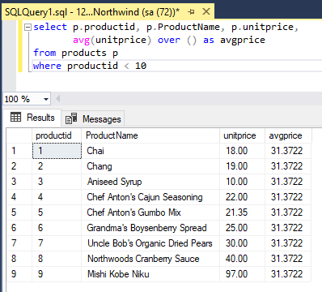
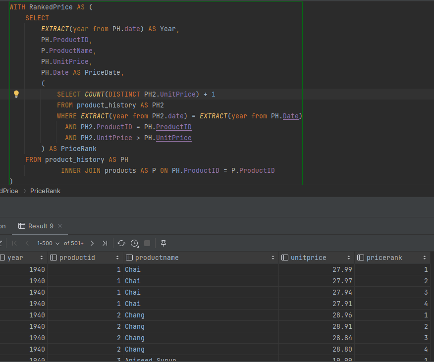

# SQL - Funkcje okna (Window functions)

# Lab 1-2

---

**Imię i nazwisko:**

- **Szymon Budziak**
- **Piotr Ludynia**

---

Celem ćwiczenia jest zapoznanie się z działaniem funkcji okna (window functions) w SQL, analiza wydajności zapytań i
porównanie z rozwiązaniami przy wykorzystaniu "tradycyjnych" konstrukcji SQL

Swoje odpowiedzi wpisuj w miejsca oznaczone jako:

```sql
-- wyniki ...
```

Ważne/wymagane są komentarze.

Zamieść kod rozwiązania oraz zrzuty ekranu pokazujące wyniki, (dołącz kod rozwiązania w formie tekstowej/źródłowej)

Zwróć uwagę na formatowanie kodu

---

## Oprogramowanie - co jest potrzebne?

Do wykonania ćwiczenia potrzebne jest następujące oprogramowanie:

- MS SQL Server - wersja 2019, 2022
- PostgreSQL - wersja 15/16
- SQLite
- Narzędzia do komunikacji z bazą danych
  - SSMS - Microsoft SQL Managment Studio
  - DtataGrip lub DBeaver
- Przykładowa baza Northwind
  - W wersji dla każdego z wymienionych serwerów

Oprogramowanie dostępne jest na przygotowanej maszynie wirtualnej

## Dokumentacja/Literatura

- Kathi Kellenberger, Clayton Groom, Ed Pollack, Expert T-SQL Window Functions in SQL Server 2019, Apres 2019
- Itzik Ben-Gan, T-SQL Window Functions: For Data Analysis and Beyond, Microsoft 2020

- Kilka linków do materiałów które mogą być
  pomocne - https://learn.microsoft.com/en-us/sql/t-sql/queries/select-over-clause-transact-sql?view=sql-server-ver16

  - https://www.sqlservertutorial.net/sql-server-window-functions/
  - https://www.sqlshack.com/use-window-functions-sql-server/
  - https://www.postgresql.org/docs/current/tutorial-window.html
  - https://www.postgresqltutorial.com/postgresql-window-function/
  - https://www.sqlite.org/windowfunctions.html
  - https://www.sqlitetutorial.net/sqlite-window-functions/

- Ikonki używane w graficznej prezentacji planu zapytania w SSMS opisane są tutaj:
  - [https://docs.microsoft.com/en-us/sql/relational-databases/showplan-logical-and-physical-operators-reference](https://docs.microsoft.com/en-us/sql/relational-databases/showplan-logical-and-physical-operators-reference)

---

# Zadanie 1 - obserwacja

Wykonaj i porównaj wyniki następujących poleceń.

```sql
select avg(unitprice) avgprice
from products p;

select avg(unitprice) over () as avgprice
from products p;

select categoryid, avg(unitprice) avgprice
from products p
group by categoryid

select avg(unitprice) over (partition by categoryid) as avgprice
from products p;
```

Jaka są podobieństwa, jakie różnice pomiędzy grupowaniem danych a działaniem funkcji okna?

| Zapytanie | MS SQL                    | Postgres                   | SQLite                   |
| --------- | ------------------------- | -------------------------- | ------------------------ |
| 1         |  |  |  |
| 2         |  |  |  |
| 3         |  |  |  |
| 4         |  |  |  |

> Widzimy, że funkcje okna przypisują obliczoną wartość każdemu wierszowi danych.
> Grupowanie automatycznie agreguje wartości do grup.

> **Zapytanie 1** zwraca średnią cenę wszystkich produktów.

> **Zapytanie 2**, które używa funkcji okna, zwraca tę samą wartość liczbową co
> **Zapytanie 1**, ale dodaje te wartość dla każdego produktu.

> **Zapytanie 3** używające group by, oblicza średnią wartość dla każdej z grup,
> rozróżnianych przed categoryid.

> **Zapytanie 4** używające funkcji okna, różni się od **Zapytania 2** tym, że liczy średnią cenę na grupach produktów, które łączy top samo categoryid. Wartości są zwracane dla
> każðego produktu podobnie jak w **Zapytaniu 2**.

# Zadanie 2 - obserwacja

Wykonaj i porównaj wyniki następujących poleceń.

```sql
--1)

select p.productid,
       p.ProductName,
       p.unitprice,
       (select avg(unitprice) from products) as avgprice
from products p
where productid < 10

--2)
select p.productid,
       p.ProductName,
       p.unitprice,
       avg(unitprice) over () as avgprice
from products p
where productid < 10
```

Jaka jest różnica? Czego dotyczy warunek w każdym z przypadków? Napisz polecenie równoważne

1. z wykorzystaniem podzapytania
2. z wykorzystaniem funkcji okna. Napisz polecenie równoważne

---

> 1. Pierwsze zapytanie używa `podzapytania w klauzuli SELECT` do obliczenia średniej ceny wszystkich produktów. Warunek
>    productid < 10 jest używany do filtracji wyników na podstawie identyfikatora produktu mniejszego niż 10.
> 2. Drugie zapytanie wykorzystuje `funkcję okna avg(unitprice) over ()` do obliczenia średniej ceny wszystkich produktów,
>    ale bez potrzeby podzapytania. Warunek productid < 10 również jest używany do filtracji wyników na podstawie
>    identyfikatora produktu mniejszego niż 10.

| Zapytanie    | MS SQL Server              | Postgres                    | SQLite                    |
| ------------ | -------------------------- | --------------------------- | ------------------------- |
| 1 oryginalne |  |  |  |
| 1 równoważne |  |  |  |
| 2 oryginalne |  |  |  |
| 2 równoważne |  |  |  |

# Zadanie 3

Baza: Northwind, tabela: products

Napisz polecenie, które zwraca: id produktu, nazwę produktu, cenę produktu, średnią cenę wszystkich produktów.

Napisz polecenie z wykorzystaniem podzapytania, join'a oraz funkcji okna.

- Polecenie z wykorzystaniem podzapytania

```sql
SELECT p.ProductID,
       p.ProductName,
       p.UnitPrice,
       (SELECT AVG(p2.UnitPrice) FROM Products AS p2) AS AveragePrice
FROM Products AS p
```

- Polecenie z wykorzystaniem joina

```sql
SELECT p.ProductID,
       p.ProductName,
       p.UnitPrice,
       AVG(p2.UnitPrice) AS AveragePrice
FROM Products p
         CROSS JOIN Products p2
GROUP BY p.ProductID, p.ProductName, p.UnitPrice
```

- Polecenie z wykorzystaniem funkcji okna

```sql
SELECT p.ProductID,
       p.ProductName,
       p.UnitPrice,
       AVG(UnitPrice) OVER() AS AveragePrice
FROM Products AS p
```

---

Porównaj czasy oraz plany wykonania zapytań. Przetestuj działanie w różnych SZBD (MS SQL Server, PostgreSql, SQLite)

W SSMS włącz dwie opcje: Include Actual Execution Plan oraz Include Live Query Statistics


W DataGrip użyj opcji Explain Plan/Explain Analyze


**Porównanie planów wykonania**

| Zapytanie    | MS SQL                    | Postgres                   | SQLite                   |
| ------------ | ------------------------- | -------------------------- | ------------------------ |
| Podzapytanie |  |  |  |
| Join         |  |  |  |
| Funkcja okna |  |  |  |

**Porównanie czasów wykonania**

| Zapytanie    | MS SQL                        | Postgres                       | SQLite                       |
| ------------ | ----------------------------- | ------------------------------ | ---------------------------- |
| Podzapytanie |  |  |  |
| Join         |  |  |  |
| Funkcja okna |  |  |  |

> Sqlite nie daje pełnej możliwości zwizualizowania planu. Datagrip pozwala jednak na zrobienie tego z Postgresem.
> Ze względu na specyficzny sposób wyliczania kosztu dla każdego z SZBD nie ma sensu porównywać wyników ze względu na rodzaj SZBD. Natomiast porównując koszty ze względu na formę zapytania można zauważyć, że w przypadku zapytań dla MS SQL czasy wykonania są najszybsze, a dla PostgreSQL oraz SQLite są nieco gorsze, jednak nie sa one takie duże, aby wykonywały się w zauważalnie dłuższym czasie.

---

# Zadanie 4

Baza: Northwind, tabela products

Napisz polecenie, które zwraca: id produktu, nazwę produktu, cenę produktu, średnią cenę produktów w kategorii, do której należy dany produkt. Wyświetl tylko pozycje (produkty), których cena jest większa niż średnia cena.

Napisz polecenie z wykorzystaniem podzapytania, join'a oraz funkcji okna.

- Polecenie z wykorzystaniem podzapytania

```sql
SELECT p.ProductID,
       p.ProductName,
       p.UnitPrice,
       (SELECT AVG(p2.UnitPrice)
        FROM Products AS p2
        WHERE p2.CategoryID = p.CategoryID) AS AvgCategoryPrice
FROM Products p
WHERE p.UnitPrice > (SELECT AVG(p3.UnitPrice)
                     FROM Products p3
                     WHERE p3.CategoryID = p.CategoryID)
```

- Polecenie z wykorzystaniem joina

```sql
SELECT p.ProductID,
       p.ProductName,
       p.UnitPrice,
       AVG(p2.UnitPrice) AS AvgCategoryPrice
FROM Products p
         JOIN Products AS p2 ON p.CategoryID = p2.CategoryID
GROUP BY
    p.ProductID,
    p.ProductName,
    p.UnitPrice
HAVING p.UnitPrice > AvgCategoryPrice
```

- Polecenie z wykorzystaniem funkcji okna

```sql
WITH AvgPrices AS (SELECT ProductID,
                          ProductName,
                          UnitPrice,
                          AVG(UnitPrice) OVER (PARTITION BY CategoryID) AS AvgCategoryPrice
                   FROM Products)
SELECT ProductID,
       ProductName,
       UnitPrice,
       AvgCategoryPrice
FROM AvgPrices
WHERE UnitPrice > AvgCategoryPrice;
```

Porównaj zapytania. Porównaj czasy oraz plany wykonania zapytań. Przetestuj działanie w różnych SZBD (MS SQL Server, PostgreSql, SQLite)

**Wyniki**

| Zapytanie    | MS SQL                    | Postgres                   | SQLite                   |
| ------------ | ------------------------- | -------------------------- | ------------------------ |
| Podzapytanie |  |  |  |
| Join         |  |  |  |
| Funkcja okna |  |  |  |

**Porównanie czasów wykonania**

| Zapytanie    | MS SQL                        | Postgres                       | SQLite                       |
| ------------ | ----------------------------- | ------------------------------ | ---------------------------- |
| Podzapytanie |  |  |  |
| Join         |  |  |  |
| Funkcja okna |  |  |  |

**Porównanie planów wykonania**

| Zapytanie    | MS SQL                        | Postgres                       | SQLite                       |
| ------------ | ----------------------------- | ------------------------------ | ---------------------------- |
| Podzapytanie |  |  |  |
| Join         |  |  |  |
| Funkcja okna |  |  |  |

> Możemy zaobserwować, że operacje w przypadku PostgreSQL są liniowe oraz jest ich mniej co przekłada się na mniejszy czas wykonywania zapytań. Dla przykładu w przypadku MS SQL roaz SQLite widzimy zagnieżdżone podzapytania.

---

# Zadanie 5 - przygotowanie

Baza: Northwind

Tabela products zawiera tylko 77 wiersz. Warto zaobserwować działanie na większym zbiorze danych.

Wygeneruj tabelę zawierającą kilka milionów (kilkaset tys.) wierszy

Stwórz tabelę o następującej strukturze:

Skrypt dla SQL Srerver

```sql
create table product_history
(
    id              int identity(1,1) not null,
    productid       int,
    productname     varchar(40) not null,
    supplierid      int null,
    categoryid      int null,
    quantityperunit varchar(20) null,
    unitprice       decimal(10, 2) null,
    quantity        int,
    value           decimal(10, 2),
    date            date,
    constraint pk_product_history primary key clustered
    (id asc )
)
```

Wygeneruj przykładowe dane:

Dla 30000 iteracji, tabela będzie zawierała nieco ponad 2mln wierszy (dostostu ograniczenie do możliwości swojego
komputera)

Skrypt dla SQL Srerver

```sql
declare
@i int
set @i = 1
while @i <= 30000
begin
    insert
product_history
select productid,
       ProductName,
       SupplierID,
       CategoryID,
       QuantityPerUnit,
       round(RAND() * unitprice + 10, 2),
       cast(RAND() * productid + 10 as int),
       0,
       dateadd(day, @i, '1940-01-01')
from products set @i = @i + 1;
end;

update product_history
set value = unitprice * quantity
where 1 = 1;
```

Skrypt dla Postgresql

```sql
create table product_history
(
    id              int generated always as identity not null
        constraint pkproduct_history primary key,
    productid       int,
    productname     varchar(40)                      not null,
    supplierid      int null,
    categoryid      int null,
    quantityperunit varchar(20) null,
    unitprice       decimal(10, 2) null,
    quantity        int,
    value           decimal(10, 2),
    date            date
);
```

Wygeneruj przykładowe dane:

Skrypt dla Postgresql

```sql
do
$$
begin
for cnt in 1..30000 loop
    insert into product_history(productid, productname, supplierid,
           categoryid, quantityperunit,
           unitprice, quantity, value, date)
select productid,
       productname,
       supplierid,
       categoryid,
       quantityperunit,
       round((random() * unitprice + 10):: numeric, 2),
       cast(random() * productid + 10 as int),
       0,
       cast('1940-01-01' as date) + cnt
from products;
end loop;
end; $$;

update product_history
set value = unitprice * quantity
where 1 = 1;
```

Wykonaj polecenia: `select count(*) from product_history`, potwierdzające wykonanie zadania

| MS SQL                    | Postgres                   | SQLite                   |
| ------------------------- | -------------------------- | ------------------------ |
|  |  |  |

---

# Zadanie 6

Baza: Northwind, tabela product_history

To samo co w zadaniu 3, ale dla większego zbioru danych

Napisz polecenie, które zwraca:

- id pozycji,
- id produktu,
- nazwę produktu,
- cenę produktu,
- średnią cenę produktów w kategorii do której należy dany produkt.

Wyświetl tylko pozycje (produkty) których cena jest większa niż średnia cena.

(przykłady poniżej)

Napisz polecenie z wykorzystaniem podzapytania, join'a oraz funkcji okna.

- Polecenie z wykorzystaniem podzapytania

```sql
SELECT p.ProductID,
	   p.ProductName,
       p.UnitPrice,
	   (SELECT AVG(ph.UnitPrice)
	    FROM product_history ph
	    WHERE ph.CategoryID = p.CategoryID) as avgprice
FROM product_history as p
WHERE p.UnitPrice >
      (SELECT AVG(ph.UnitPrice)
       FROM product_history ph
       WHERE ph.CategoryID = p.CategoryID)
```

- Polecenie z wykorzystaniem joina

```sql
WITH classes as
(select categoryid, avg(unitprice) avgprice
from product_history p
group by categoryid)

SELECT p.ProductID,
	   p.ProductName,
       p.UnitPrice,
	   classes.avgprice
FROM product_history as p
	   inner JOIN classes ON p.categoryid = classes.categoryid
WHERE p.unitprice > classes.avgprice
```

- Polecenie z wykorzystaniem funkcji okna

```sql
WITH data as
(SELECT p.ProductID,
       p.ProductName,
       p.UnitPrice,
       AVG(UnitPrice) OVER(PARTITION BY p.CategoryID) AS AveragePrice
FROM product_history AS p)
SELECT * from data
WHERE UnitPrice > AveragePrice
```

Porównaj zapytania. Porównaj czasy oraz plany wykonania zapytań. Przetestuj działanie w różnych SZBD (MS SQL Server, PostgreSql, SQLite)

**Wyniki**

| Zapytanie    | MS SQL                    | Postgres                   | SQLite                   |
| ------------ | ------------------------- | -------------------------- | ------------------------ |
| Podzapytanie |  |  |  |
| Join         |  |  |  |
| Funkcja okna |  |  |  |

**Porównanie czasów wykonania**

| Zapytanie    | MS SQL                        | Postgres                       | SQLite                       |
| ------------ | ----------------------------- | ------------------------------ | ---------------------------- |
| Podzapytanie |  |  |  |
| Join         |  |  |  |
| Funkcja okna |  |  |  |

**Porównanie planów wykonania**

| Zapytanie    | MS SQL                        | Postgres                       | SQLite                       |
| ------------ | ----------------------------- | ------------------------------ | ---------------------------- |
| Podzapytanie |  |  |  |
| Join         |  |  |  |
| Funkcja okna |  |  |  |

> Możemy zaobserwować, że zapytanie z użyciem podzapytania dla postgres nie wykonało się nawet po 5 minutach od wywołania. Dla SQLite również nie uzyskaliśmy wyniku po około 5 minutach. Jednym z pomysłow, było możliwe zawieszenie się bazy. Jednak, po testowym sprawdzeniu połączenia prostym zapytaniem, zakończyło się ono suckecem co świadczyło o poprawnym działaniu bazy, a problemem było mało efektywne działanie podzapytania w takim zapytaniu. Trochę lepiej poradziło sobie zapytanie z joinem a najlepiej z funkcją okna.

> Według analizy plany dla **joina** oraz **podzapytania** wyglądają podobnie z dwoma operacjami 'Full Index Scan' kazdy. Jednak, róznia się one miejscem agregacji gdzie jedna jest przed 'Hash Join' dla **podzapytania** a druga po w przypadku **joina**.

---

# Zadanie 7

Baza: Northwind, tabela product_history

Lekka modyfikacja poprzedniego zadania

Napisz polecenie, które zwraca:

- id pozycji
- id produktu
- nazwę produktu
- cenę produktu oraz:
  - średnią cenę produktów w kategorii do której należy dany produkt.
  - łączną wartość sprzedaży produktów danej kategorii (suma dla pola value)
  - średnią cenę danego produktu w roku którego dotyczy dana pozycja

Napisz polecenie z wykorzystaniem podzapytania, join'a oraz funkcji okna. Porównaj zapytania. W przypadku funkcji okna spróbuj użyć klauzuli WINDOW.

- Polecenie z wykorzystaniem podzapytania

_MS SQL_

```sql
SELECT ph.id,
       ph.ProductID,
       ph.ProductName,
       ph.UnitPrice,
	   (select avg(ph2.unitprice) from product_history as ph2 where ph.categoryid = ph2.categoryid) as AveragePrice,
	   (select sum(ph3.value) from product_history as ph3 where ph.categoryid = ph3.categoryid) as TotalSale,
	   (select avg(ph4.unitprice) from product_history as ph4 where ph.productid = ph4.productid and YEAR(ph.date) = YEAR(ph4.date)) as AveragePriceOverYear
FROM product_history AS ph
```

_Postgres_

```sql
SELECT ph.id,
       ph.ProductID,
       ph.ProductName,
       ph.UnitPrice,
	   (select avg(ph2.unitprice) from product_history as ph2 where ph.categoryid = ph2.categoryid) as AveragePrice,
	   (select sum(ph3.value) from product_history as ph3 where ph.categoryid = ph3.categoryid) as TotalSale,
	   (select avg(ph4.unitprice) from product_history as ph4 where ph.productid = ph4.productid and EXTRACT (YEAR FROM ph.date) = EXTRACT (YEAR FROM ph4.date)) as AveragePriceOverYear
FROM product_history AS ph
```

_SQLite_

```sql
SELECT ph.id,
       ph.ProductID,
       ph.ProductName,
       ph.UnitPrice,
	   (select avg(ph2.unitprice) from product_history as ph2 where ph.categoryid = ph2.categoryid) as AveragePrice,
	   (select sum(ph3.value) from product_history as ph3 where ph.categoryid = ph3.categoryid) as TotalSale,
	   (select avg(ph4.unitprice) from product_history as ph4 where ph.productid = ph4.productid and strftime('%Y', ph.date) = strftime('%Y', ph4.date)) as AveragePriceOverYear
FROM product_history AS ph
```

- Polecenie z wykorzystaniem joina

_MS SQL_

```sql
SELECT
    ph.id,
    ph.ProductID,
    ph.ProductName,
    ph.UnitPrice,
    AVG(ph2.unitprice) AS AveragePrice,
    SUM(ph3.value) AS TotalSale,
    AVG(ph4.unitprice) AS AveragePriceOverYear
FROM
    product_history AS ph
JOIN
    product_history AS ph2 ON ph.categoryid = ph2.categoryid
JOIN
    product_history AS ph3 ON ph.categoryid = ph3.categoryid
JOIN
    product_history AS ph4 ON ph.productid = ph4.productid AND YEAR(ph.date) = YEAR(ph4.date)
GROUP BY
    ph.id,
    ph.ProductID,
    ph.ProductName,
    ph.UnitPrice;
```

_Postgres_

```sql
SELECT
    ph.id,
    ph.ProductID,
    ph.ProductName,
    ph.UnitPrice,
    AVG(ph2.unitprice) AS AveragePrice,
    SUM(ph3.value) AS TotalSale,
    AVG(ph4.unitprice) AS AveragePriceOverYear
FROM
    product_history AS ph
JOIN
    product_history AS ph2 ON ph.categoryid = ph2.categoryid
JOIN
    product_history AS ph3 ON ph.categoryid = ph3.categoryid
JOIN
    product_history AS ph4 ON ph.productid = ph4.productid AND EXTRACT (YEAR FROM ph.date) = EXTRACT (YEAR FROM ph4.date)
GROUP BY
    ph.id,
    ph.ProductID,
    ph.ProductName,
    ph.UnitPrice;
```

_SQLite_

```sql
SELECT
    ph.id,
    ph.ProductID,
    ph.ProductName,
    ph.UnitPrice,
    AVG(ph2.unitprice) AS AveragePrice,
    SUM(ph3.value) AS TotalSale,
    AVG(ph4.unitprice) AS AveragePriceOverYear
FROM
    product_history AS ph
JOIN
    product_history AS ph2 ON ph.categoryid = ph2.categoryid
JOIN
    product_history AS ph3 ON ph.categoryid = ph3.categoryid
JOIN
    product_history AS ph4 ON ph.productid = ph4.productid AND strftime('%Y', ph.date) = strftime('%Y', ph4.date)
GROUP BY
    ph.id,
    ph.ProductID,
    ph.ProductName,
    ph.UnitPrice;
```

- Polecenie z wykorzystaniem funkcji okna

_MS SQL_

```sql
SELECT ph.id,
     ph.ProductID,
     ph.ProductName,
     ph.UnitPrice,
     avg(ph.UnitPrice) over (partition by ph.categoryid) as AveragePrice,
     sum(ph.value) over (partition by ph.categoryid) as TotalSale,
     avg(ph.UnitPrice) over (partition by ph.productid, YEAR(ph.date)) as AveragePriceOverYear
FROM product_history AS ph
WINDOW w AS (partition by ph.categoryid),
     w2 AS (partition by ph.productid, YEAR(ph.date))
```

_Postgres_

```sql
SELECT ph.id,
     ph.ProductID,
     ph.ProductName,
     ph.UnitPrice,
     avg(ph.UnitPrice) over (partition by ph.categoryid) as AveragePrice,
     sum(ph.value) over (partition by ph.categoryid) as TotalSale,
     avg(ph.UnitPrice) over (partition by ph.productid, EXTRACT (YEAR FROM ph.date)) as AveragePriceOverYear
FROM product_history AS ph
WINDOW w AS (partition by ph.categoryid),
     w2 AS (partition by ph.productid, EXTRACT (YEAR FROM ph.date))
```

_SQLite_

```sql
SELECT ph.id,
     ph.ProductID,
     ph.ProductName,
     ph.UnitPrice,
     avg(ph.UnitPrice) over (partition by ph.categoryid) as AveragePrice,
     sum(ph.value) over (partition by ph.categoryid) as TotalSale,
     avg(ph.UnitPrice) over (partition by ph.productid, strftime('%Y', ph.date)) as AveragePriceOverYear
FROM product_history AS ph
WINDOW w AS (partition by ph.categoryid),
     w2 AS (partition by ph.productid, strftime('%Y', ph.date))
```

> W powyższych zapytaniach możemy zaobserwować, jakie róznice należało uwzględnić aby móc wyciągnąc date:
>
> - MS SQL: należy użyć `YEAR(ph.date)`
> - Postgres: należy użyć `EXTRACT (YEAR FROM ph.date)`
> - SQLite: należy użyć `strftime('%Y', ph.date)`

**Wyniki**

| Zapytanie    | MS SQL                    | Postgres                   | SQLite                   |
| ------------ | ------------------------- | -------------------------- | ------------------------ |
| Podzapytanie |  |  |  |
| Join         |  |  |  |
| Funkcja okna |  |  |  |

Porównaj czasy oraz plany wykonania zapytań. Przetestuj działanie w różnych SZBD (MS SQL Server, PostgreSql, SQLite).

**Porównanie czasów wykonania**

| Zapytanie    | MS SQL                        | Postgres                       | SQLite                       |
| ------------ | ----------------------------- | ------------------------------ | ---------------------------- |
| Podzapytanie |  |  |  |
| Join         |  |  |  |
| Funkcja okna |  |  |  |

**Porównanie planów wykonania**

| Zapytanie    | MS SQL                        | Postgres                         | SQLite                         |
| ------------ | ----------------------------- | -------------------------------- | ------------------------------ |
| Podzapytanie |  |    |    |
| Join         |  |  |  |
| Funkcja okna |  |  |  |

> W przypadku MS SQL oraz PostgreSQL funkcje okna wykonują się bardziej liniowo niż ich odpowiedniki join oraz podzapytanie.

> Można też zauważyc, że czas wykonywania dla PostgreSQL był znacznie dłuższy niż w przypadku innych SZBD. Może być to spowodowane tym, że PostgreSQL wykonuje znacznie więcej full scanów. Możemy również zauważyć, że w przypadku podzapytania dla SQLite oraz MS SQL nie udało się otrzymać wyniku w czasie 5 min.

---

# Zadanie 8 - obserwacja

Funkcje rankingu, `row_number()`, `rank()`, `dense_rank()`

Wykonaj polecenie, zaobserwuj wynik. Porównaj funkcje row_number(), rank(), dense_rank()

```sql
select productid,
       productname,
       unitprice,
       categoryid,
       row_number() over(partition by categoryid order by unitprice desc)
       as rowno,
       rank() over(partition by categoryid order by unitprice desc)
       as rankprice,
       dense_rank() over(partition by categoryid order by unitprice desc)
       as denserankprice
from products;
```

| MS SQL                    |
| ------------------------- |
|  |

```sql
SELECT
    p1.productid,
    p1.productname,
    p1.unitprice,
    p1.categoryid,
    (SELECT COUNT(*) + 1 FROM products p2
     WHERE p2.categoryid = p1.categoryid
         AND p2.unitprice > p1.unitprice) AS rowno,
	(SELECT COUNT(*) + 1 FROM products p2
     WHERE p2.categoryid = p1.categoryid
         AND p2.unitprice > p1.unitprice) AS rankprice,
	(SELECT COUNT(DISTINCT p2.unitprice) + 1 FROM products p2
     WHERE p2.categoryid = p1.categoryid
         AND p2.unitprice > p1.unitprice) AS denserankprice
FROM
    products p1
ORDER BY p1.categoryid, rowno;
```

| MS SQL                    |
| ------------------------- |
|  |

> Widać zasadniczą różnicę działania dla kolumny `rowno` zwiększanie wartość musiałaby rosnąć dla zbioru produktów o tej samej cenie. Podzapytania róznią się dla takich samych wartości w kolumnie.

> `row_number` sortuje po unit price i numeruje wiersze.

> `rank` sortuje po unit price i przypisuje równe wartości dla tych samych cen.

> `dense_rank` sortuje po unit price i przypisuje równe wartości dla tych samych cen, ale nie ma przerw w numeracji.

Spróbuj uzyskać ten sam wynik bez użycia funkcji okna:

```sql
SELECT
    p1.productid,
    p1.productname,
    p1.unitprice,
    p1.categoryid,
    (SELECT COUNT(*) + 1
     FROM products p2
     WHERE p2.categoryid = p1.categoryid AND p2.unitprice > p1.unitprice) as rowno,
    (SELECT COUNT(DISTINCT p3.unitprice) + 1
     FROM products p3
     WHERE p3.categoryid = p1.categoryid AND p3.unitprice > p1.unitprice) as rankprice,
    (SELECT COUNT(DISTINCT p4.unitprice) + 1
     FROM products p4
     WHERE p4.categoryid = p1.categoryid AND p4.unitprice > p1.unitprice) as denserankprice
FROM products p1
ORDER BY p1.categoryid, rowno;
```

> To zapytanie wykorzystuje podzapytania do zliczenia liczby produktów w tej samej kategorii o wyższej cenie jednostkowej, co skutecznie klasyfikuje produkty. Należy pamiętać, że to podejście może być znacznie wolniejsze niż używanie funkcji okna, zwłaszcza w przypadku dużych zbiorów danych.

---

# Zadanie 9

Baza: Northwind, tabela product_history

Dla każdego produktu, podaj 4 najwyższe ceny tego produktu w danym roku. Zbiór wynikowy powinien zawierać:

- rok
- id produktu
- nazwę produktu
- cenę
- datę (datę uzyskania przez produkt takiej ceny)
- pozycję w rankingu

Uporządkuj wynik wg roku, nr produktu, pozycji w rankingu

```sql
WITH ranked_prices AS (
  SELECT
    YEAR(date) AS year, p.productid, p.ProductName, p.unitprice, p.date,
    ROW_NUMBER() OVER(PARTITION BY p.productid, YEAR(date) ORDER BY p.unitprice DESC) AS pricerank
  FROM product_history as p
  INNER JOIN products ON p.productid = products.ProductID
)

SELECT year, productid, productname, unitprice, date, pricerank
FROM ranked_prices
WHERE pricerank <= 4
ORDER BY year, productid, pricerank;
```

| MS SQL                    |
| ------------------------- |
|  |

Spróbuj uzyskać ten sam wynik bez użycia funkcji okna, porównaj wyniki, czasy i plany zapytań. Przetestuj działanie w różnych SZBD (MS SQL Server, PostgreSql, SQLite)

```sql
WITH ranked_prices AS (
  SELECT
    YEAR(date) AS year,
    p.productid,
    p.ProductName,
    p.unitprice,
    p.date,
	(SELECT COUNT(*) + 1 FROM product_history p2
     WHERE p2.productid = p.productid
         AND p2.unitprice > p.unitprice AND YEAR(p.date) = YEAR(p2.date)) as pricerank
  FROM product_history as p
  INNER JOIN products ON p.productid = products.ProductID
)

SELECT
  year,
  productid,
  productname,
  unitprice,
  date,
  pricerank
FROM
  ranked_prices
WHERE
  pricerank <= 4
ORDER BY
  year,
  productid,
  pricerank;
```

> Czas działania dla MS SQL był bardzo długi i nie uzyskaliśmy wyniku w rozsądnym czasie. Dopiero po ograniczeniu ilości danych, otrzymaliśmy wynik w rozsądnym czasie, co pozwoliło zaobserwować dane do 10000 wierszy. Jednka pomimo takiego ogarniaczenia nie udało się

> Dla postgres musieliśmy użyć innej składni by wywołać zapytanie, jednak dalej jego czas obliczeń nie był skończony w rozsądnym czasie, co znowu zmusiło nas do ograniczenia ilości wierszy.

| Postgres                     |
| ---------------------------- |
|  |

```sql
WITH ranked_prices AS (
  SELECT
    extract ("YEAR" from (p.date)) AS year,
    p.productid,p.ProductName,p.unitprice,p.date,
	(SELECT COUNT(*) + 1 FROM product_history p2
     WHERE p2.productid = p.productid
         AND p2.unitprice > p.unitprice AND extract ("YEAR" from (p.date)) = extract ("YEAR" from (p2.date))) as pricerank
  FROM product_history as p
  INNER JOIN products ON p.productid = products.ProductID
)

SELECT
  year,
  productid,productname,unitprice,date,pricerank
FROM
  ranked_prices
WHERE
  pricerank <= 4
ORDER BY
  year,productid,pricerank;
```

| SQLite                     |
| -------------------------- |
|  |

Składnia wyboru roku różniła się również dla sqlite. Również czas nie był zadowalający i nie dostaliśmy wyniku, co również spodowało ograniczenie ilości wierszy.

```sql
WITH ranked_prices AS (
    SELECT
        strftime('%Y',p.date) AS year,
        p.productid,p.ProductName,p.unitprice,p.date,
        (SELECT COUNT(*) + 1 FROM product_history p2
         WHERE p2.productid = p.productid
           AND p2.unitprice > p.unitprice AND strftime('%Y',p.date) = strftime('%Y',p2.date)) as pricerank
    FROM product_history as p
             INNER JOIN products ON p.productid = products.ProductID
)

SELECT
    year,productid,productname,unitprice,date,pricerank
FROM
    ranked_prices
WHERE
    pricerank <= 4
ORDER BY
    year,productid,pricerank;
```

**Plan wykonania**

| MS SQL                    | Postgres                   | SQLite                   |
| ------------------------- | -------------------------- | ------------------------ |
|  |  |  |

> Możemy zauważyć, że w systemach Postgres oraz SQLite głównym kosztem jest agregowanie i odpowiednie joinowanie tablic. Co ciekawe
> analogiczne podzapytanie dla takich danych zarówno dla MS SQL Server jak i SQLite wykonało się bardzo szybko (jednak widocznie wolniej od zapytania wykorzystującego funkcje okna).

---

# Zadanie 10 - obserwacja

Funkcje `lag()`, `lead()`

Wykonaj polecenia, zaobserwuj wynik. Jak działają funkcje `lag()`, `lead()`

```sql
select productid,
       productname,
       categoryid, date, unitprice, lag(unitprice) over (partition by productid order by date)
    as previousprodprice, lead(unitprice) over (partition by productid order by date)
    as nextprodprice
from product_history
where productid = 1 and year (date) = 2022
order by date;

with t as (select productid, productname, categoryid, date, unitprice, lag(unitprice) over (partition by productid
    order by date) as previousprodprice, lead(unitprice) over (partition by productid
    order by date) as nextprodprice
from product_history
    )
select *
from t
where productid = 1 and year (date) = 2022
order by date;
```

> Funckje lag i lead pozwalają na dostęp do wartości odpowiednio z poprzednich i kolejnych wierszy. Mogą być przydatne by porównywać wartości w różnych punktach czasu

| MS SQL                     |
| -------------------------- |
|  |

Spróbuj uzyskać ten sam wynik bez użycia funkcji okna, porównaj wyniki, czasy i plany zapytań. Przetestuj działanie w różnych SZBD (MS SQL Server, PostgreSql, SQLite)

**Ten same wyniki ale bez funkcji okna**

```sql
SELECT t1.productid,
     t1.productname,
     t1.categoryid,
     t1.date,
     t1.unitprice,
     t2.unitprice AS previousprodprice,
     t3.unitprice AS nextprodprice
FROM product_history t1
    JOIN product_history t2 ON t2.productid = t1.productid AND t2.date < t1.date
    JOIN product_history t3 ON t3.productid = t1.productid AND t3.date > t1.date
WHERE t1.productid = 1 AND YEAR(t1.date) = 2022
ORDER BY t1.date;

WITH t AS (
    SELECT
        curr.productid,
        curr.productname,
        curr.categoryid,
        curr.date,
        curr.unitprice,
        prev.unitprice AS previousprodprice,
        next.unitprice AS nextprodprice
    FROM
        product_history AS curr
    JOIN
        product_history AS prev ON curr.productid = prev.productid AND prev.date = (
            SELECT MAX(date) FROM product_history WHERE productid = curr.productid AND date < curr.date
        )
    JOIN
        product_history AS next ON curr.productid = next.productid AND next.date = (
            SELECT MIN(date) FROM product_history WHERE productid = curr.productid AND date > curr.date
        )
)
SELECT *
FROM t
WHERE productid = 1 AND YEAR(date) = 2022
ORDER BY date;
```

**Wyniki**

| MS SQL                     | Postgres                    | SQLite                    |
| -------------------------- | --------------------------- | ------------------------- |
|  |  |  |

**Plan wykonania**

| MS SQL                         | Postgres                        | SQLite                          |
| ------------------------------ | ------------------------------- | ------------------------------- |
|  |  |  |

**Czasy wykonania**

| MS SQL                         | Postgres                        | SQLite                          |
| ------------------------------ | ------------------------------- | ------------------------------- |
|  |  |  |

> Zostały uzyskane takie same wyniki po wykonaniu funkcji.

> Z definicji oraz na podstawie powyższych wyników można wywnioskować, że funkcja LAG umożliwia dostęp do wartości z poprzedniego wiersza w ramach określonego zestawu danych.
> Funkcja LEAD natomiast umożliwia dostęp do wartości z następnego wiersza w ramach określonego zestawu

## danych

# Zadanie 11

Baza: Northwind, tabele customers, orders, order details

Napisz polecenie które wyświetla inf. o zamówieniach

Zbiór wynikowy powinien zawierać:

- nazwę klienta, nr zamówienia,
- datę zamówienia,
- wartość zamówienia (wraz z opłatą za przesyłkę),
- nr poprzedniego zamówienia danego klienta,
- datę poprzedniego zamówienia danego klienta,
- wartość poprzedniego zamówienia danego klienta.

```sql
WITH OrderValues AS (
  SELECT o.OrderID,
  o.CustomerID,
  o.OrderDate,
  o.Freight,
  SUM(od.UnitPrice * od.Quantity * (1 - od.Discount)) AS TotalValue
  FROM orders o
    INNER JOIN orderdetails od ON o.OrderID = od.OrderID
  GROUP BY o.OrderID, o.CustomerID, o.OrderDate, o.Freight
),
RankedOrders AS (
  SELECT c.CompanyName AS CustomerName,
  ov.OrderID,
  ov.OrderDate,
  ov.TotalValue + ov.Freight AS OrderValue,
  LAG(ov.OrderID) OVER(PARTITION BY ov.CustomerID ORDER BY ov.OrderDate)
  AS PreviousOrderID,
  LAG(ov.OrderDate) OVER(PARTITION BY ov.CustomerID ORDER BY ov.OrderDate)
  AS PreviousOrderDate,
  LAG(ov.TotalValue + ov.Freight) OVER(PARTITION BY ov.CustomerID ORDER BY ov.OrderDate)
  AS PreviousOrderValue
  FROM OrderValues ov
    INNER JOIN customers c ON ov.CustomerID = c.CustomerID
)
SELECT
  CustomerName,
  OrderID,
  OrderDate,
  OrderValue,
  PreviousOrderID,
  PreviousOrderDate,
  PreviousOrderValue
FROM RankedOrders
ORDER BY CustomerName, OrderDate;
```

**Wyniki**

| Postgres                     |
| ---------------------------- |
|  |

**Plan wykonania**

| Postgres                         |
| -------------------------------- |
|  |

**Czas wykonania**

| Postgres                         |
| -------------------------------- |
|  |

> Czasy oraz ilości wykonanych operacji w przypadku SQLite oraz PostgreSQL są zbliżone, natomiast w przypadku MS SQL Server ilość operacji (widać na planie) jest znacznie większa co przekłada się na czas który również jest zwiększony.

> W planie moża również zauważyć, że MS SQL Serwer wykonuje znacznie więcej operacji, które mogą przekładać się na tak ubogi performance.

# Zadanie 12 - obserwacja

Funkcje `first_value()`, `last_value()`

Wykonaj polecenia, zaobserwuj wynik. Jak działają funkcje `first_value()`, `last_value()`. Skomentuj uzyskane wyniki.
Czy funkcja `first_value` pokazuje w tym przypadku najdroższy produkt w danej kategorii, czy funkcja `last_value()`
pokazuje najtańszy produkt? Co jest przyczyną takiego działania funkcji `last_value`. Co trzeba zmienić żeby funkcja
last_value pokazywała najtańszy produkt w danej kategorii

```sql
select productid,
       productname,
       unitprice,
       categoryid,
       first_value(productname) over (partition by categoryid
order by unitprice desc) first,
    last_value(productname) over (partition by categoryid
order by unitprice desc) last
from products
order by categoryid, unitprice desc;
```

**Wynik**

| SQLite                      |
| --------------------------- |
|  |

> Funkcje okna mają zasięg działania (RANGE). Jeśli używamy ORDER BY i nie
> podamy RANGE to domyślne wartości to: RANGE BETWEEN UNBOUNDED PRECEDING AND CURRENT ROW. Oznacza, że wybierzemy najmniejszą wartość między pierwszym, a obecnym wierszem
> tabeli. W zadaniu mamy klauzulę: **order by categoryid, unitprice desc**, to tabela już jest posortowana po cenie, daltego otrzyujemy zawsze przedmiot z obecnego wiersza.

> Funkcja **first_value()** pokazuje najdroższy produkt w danej kategorii natomiast funkcja **last_value()** pokazuje wiersz, który posiadałby najwyższą wartość funkcji **row_number()** dla wierszy posiadających taką samą wartość funkcji **rank()** jak aktualnie badany wiersz. Zachowanie funkcji last_value() można zmienić ustawiając opcję range na between unbounded preceding and unbounded following.

Spróbuj uzyskać ten sam wynik bez użycia funkcji okna, porównaj wyniki, czasy i plany zapytań. Przetestuj działanie w różnych SZBD (MS SQL Server, PostgreSql, SQLite)

```sql
SELECT p.productid,
       p.productname,
       p.unitprice,
       p.categoryid,
       (SELECT top 1 productname
        FROM products
        WHERE categoryid = p.categoryid
        ORDER BY unitprice DESC) AS first,
       (SELECT top 1 productname
        FROM products
        WHERE categoryid = p.categoryid and unitprice = p.unitprice
        ORDER BY unitprice ASC) as last
FROM products p
ORDER BY p.categoryid, p.unitprice DESC;
```

Dla Postgresa i SQLite zamiast top 1 trzeba użyć limit 1

```sql
SELECT p.productid,
       p.productname,
       p.unitprice,
       p.categoryid,
       (SELECT  productname
        FROM products
        WHERE categoryid = p.categoryid
        ORDER BY unitprice DESC limit 1) AS first,
       (SELECT productname
        FROM products
        WHERE categoryid = p.categoryid and unitprice = p.unitprice
        ORDER BY unitprice ASC limit 1) as last
FROM products p
ORDER BY p.categoryid, p.unitprice DESC;
```

Bez użycia funkcji okna możemy uzyskać wyniki których potrzebujemy.

**Wyniki, plany i czasy wykonania**

| MS SQL                     | Postgres                    | SQLite                    |
| -------------------------- | --------------------------- | ------------------------- |
|  |  |  |
|  |  |  |
|  |  |  |

> Funkcje okna składały się z prostszych, liniowych ciągów operacji, podczas gdy zagnieżdżone zapytania wiązały się z bardziej drzewiastą strukturą planu. Wszystkie wersje zapytania na tabeli products wykonały się błyskawicznie. Ze względu na szybkość zapytania nie uwzględniono SQLite z powodu braku analizy kosztu.

---

# Zadanie 13

Baza: Northwind, tabele orders, order details

Napisz polecenie które wyświetla inf. o zamówieniach

Zbiór wynikowy powinien zawierać:

- Id klienta,
- nr zamówienia,
- datę zamówienia,
- wartość zamówienia (wraz z opłatą za przesyłkę),
- dane zamówienia klienta o najniższej wartości w danym miesiącu
  - nr zamówienia o najniższej wartości w danym miesiącu
  - datę tego zamówienia
  - wartość tego zamówienia
- dane zamówienia klienta o najwyższej wartości w danym miesiącu
  - nr zamówienia o najniższej wartości w danym miesiącu
  - datę tego zamówienia
  - wartość tego zamówienia

```sql
SELECT
    CustomerID,
    OrderID,
    OrderDate,
    TotalOrderValue,
    FIRST_VALUE(OrderID) OVER (PARTITION BY CustomerID, YEAR(OrderDate),
    MONTH(OrderDate) ORDER BY TotalOrderValue ASC) AS LowestValueOrderID,
    FIRST_VALUE(OrderDate) OVER (PARTITION BY CustomerID, YEAR(OrderDate),
    MONTH(OrderDate) ORDER BY TotalOrderValue ASC) AS LowestValueOrderDate,
    FIRST_VALUE(TotalOrderValue) OVER (PARTITION BY CustomerID,
    YEAR(OrderDate), MONTH(OrderDate) ORDER BY TotalOrderValue ASC) AS LowestValueOrderValue,
    LAST_VALUE(OrderID) OVER (PARTITION BY CustomerID, YEAR(OrderDate),
    MONTH(OrderDate) ORDER BY TotalOrderValue DESC) AS HighestValueOrderID,
    LAST_VALUE(OrderDate) OVER (PARTITION BY CustomerID, YEAR(OrderDate),
    MONTH(OrderDate) ORDER BY TotalOrderValue DESC) AS HighestValueOrderDate,
    LAST_VALUE(TotalOrderValue) OVER (PARTITION BY CustomerID,
    YEAR(OrderDate), MONTH(OrderDate) ORDER BY TotalOrderValue DESC) AS HighestValueOrderValue
FROM (
    SELECT
        Orders.CustomerID,
        Orders.OrderID,
        Orders.OrderDate,
        SUM(od.unitprice * od.quantity * (1 - od.discount)) OVER (PARTITION BY
        Orders.OrderID)) + Orders.freight AS TotalOrderValue
FROM Orders
    JOIN [Order Details] as od ON Orders.OrderID = od.OrderID AS OrderSummary
```

**Wynik**

| Postgres                     |
| ---------------------------- |
|  |

> Działanie zapytania widać dla wierszy 5 i 6 - są to zapytania złożone w tym samym miesiącu.

---

# Zadanie 14

Baza: Northwind, tabela product_history

Napisz polecenie które pokaże wartość sprzedaży każdego produktu narastająco od początku każdego miesiąca. Użyj funkcji
okna

Zbiór wynikowy powinien zawierać:

- id pozycji
- id produktu
- datę
- wartość sprzedaży produktu w danym dniu
- wartość sprzedaży produktu narastające od początku miesiąca

```sql
SELECT
    id,
    productid,
    date,
    value,
    SUM(value) OVER (PARTITION BY productid, YEAR(date), MONTH(date) ORDER BY date ROWS BETWEEN UNBOUNDED PRECEDING AND CURRENT ROW) AS cumulative_value
    from product_history
ORDER by
	productid,
    YEAR(date),
    MONTH(date),
    date;
```

**Wynik**

| Postgres                      |
| ----------------------------- |
|  |

Spróbuj wykonać zadanie bez użycia funkcji okna. Spróbuj uzyskać ten sam wynik bez użycia funkcji okna, porównaj wyniki,
czasy i plany zapytań. Przetestuj działanie w różnych SZBD (MS SQL Server, PostgreSql, SQLite)

```sql
SELECT
    ph.id,
    ph.productid,
    ph.date,
    ph.value,
    (SELECT SUM(ph_inner.value)
     FROM product_history ph_inner
     WHERE ph_inner.productid = ph.productid
     AND YEAR(ph_inner.date) = YEAR(ph.date)
     AND MONTH(ph_inner.date) = MONTH(ph.date)
     AND ph_inner.date <= ph.date) AS cumulative_value
FROM
    product_history ph
ORDER BY
    ph.productid,
    YEAR(ph.date),
    MONTH(ph.date),
    ph.date;
```

wersja dla Postgres

```sql
SELECT
    ph.id,
    ph.productid,
    ph.date,
    ph.value,
    (SELECT SUM(ph_inner.value)
     FROM product_history ph_inner
     WHERE ph_inner.productid = ph.productid
     AND extract (year from ph_inner.date) = extract (year from ph.date)
     AND extract (month from ph_inner.date) = extract (month from ph.date)
     AND ph_inner.date <= ph.date) AS cumulative_value
FROM
    product_history ph
ORDER BY
    ph.productid,
    extract (year from ph.date),
    extract (month from ph.date),
    ph.date;
```

Wersja dla SQLite

```sql
SELECT
    ph.id,
    ph.productid,
    ph.date,
    ph.value,
    (SELECT SUM(ph_inner.value)
     FROM product_history ph_inner
     WHERE ph_inner.productid = ph.productid
       AND strftime('%Y',ph_inner.date) = strftime('%Y',ph.date)
       AND strftime('%M',ph_inner.date) = strftime('%M',ph.date)
       AND ph_inner.date <= ph.date) AS cumulative_value
FROM
    product_history ph
ORDER BY
    ph.productid,
    strftime('%Y',ph.date),
    strftime('%M',ph.date),
    ph.date;
```

> Dla żadnego SZBD zapytanie nie skończyło się w rozsądnym czasie, więc byliśmy zmuszeni do ogranizcenia ilości danych do 1000 wierszy. Brak wyników spowodowany jest użyciem bardzo dużego subquery.

**Wyniki**

| MS SQL                     | Postgres                    | SQLite                    |
| -------------------------- | --------------------------- | ------------------------- |
|  |  |  |

**Plany wykonania**

| MS SQL                         | Postgres                        | SQLite                        |
| ------------------------------ | ------------------------------- | ----------------------------- |
|  |  |  |

> Jak widzimy plan wykonania dla MS SQL jest znacznie bardziej rozbudowany niż dla SQLite czy Postgres. Można tez zauważyć różnicę w kosztach zapytań. Podzapytania te są bardzo skomplikowane, przez co ich koszt jest bardzo duży. Operacja filtrowania nie może być uproszczona i to powoduje wolne działanie całego zapytania.

---

# Zadanie 15

Wykonaj kilka "własnych" przykładowych analiz. Czy są jeszcze jakieś ciekawe/przydatne funkcje okna (z których nie
korzystałeś w ćwiczeniu)? Spróbuj ich użyć w zaprezentowanych przykładach.

Napisz polecenie które pokaże id produktu, nazwę produktu, cenę produktu, kategorię produktu, oraz maksymalną cenę produktu w danej kategori.

Napisz polecenie z wykorzystaniem podzapytania, join'a oraz funkcji okna.

Przetestuj działanie w różnych SZBD (MS SQL Server, PostgreSql, SQLite).

**1. Funkcje agregujące + order by**

- Polecenie z wykorzystaniem podzapytania

```sql
SELECT p.productid, p.productname, p.unitprice, p.categoryid,
       (SELECT MAX(p2.unitprice) FROM products p2 WHERE p2.categoryid = p.categoryid) AS maxprice
FROM products p
ORDER BY p.categoryid, p.unitprice;
```

- Polecenie z wykorzystaniem join

```sql
with max_price as (
    select categoryid, max(unitprice) as MaxCategoryPrice
    from products
    group by categoryid
)

SELECT p.productid, p.productname, p.unitprice, p.categoryid, MaxCategoryPrice
FROM products p
         JOIN max_prices ON p.categoryid = max_price.categoryid
ORDER BY p.categoryid, p.unitprice;
```

- Polecenie z wykorzystaniem funkcji okna

```sql
SELECT productid, productname, unitprice, categoryid,
       max(unitprice) OVER (PARTITION BY categoryid) AS MaxCategoryPrice
FROM products
ORDER BY categoryid, unitprice;
```

**Wyniki**

| Zapytanie    | MS SQL                     | Postgres                    | SQLite                    |
| ------------ | -------------------------- | --------------------------- | ------------------------- |
| Podzapytanie |  |  |  |
| Join         |  |  |  |
| Funkcja okna |  |  |  |

**Plany wykonania**

| Zapytanie    | MS SQL                         | Postgres                        | SQLite                        |
| ------------ | ------------------------------ | ------------------------------- | ----------------------------- |
| Podzapytanie |  |  |  |
| Funkcja okna |  |  |  |

**Czasy wykonania**

| Zapytanie    | MS SQL                         | Postgres                        | SQLite                        |
| ------------ | ------------------------------ | ------------------------------- | ----------------------------- |
| Podzapytanie |  |  |  |
| Funkcja okna |  |  |  |

**2. Funkcja okna z `ROWS BETWEEN 2 PRECEDING AND CURRENT ROW` pozwalająca skuteczenie liczyć średnie kroczące.**

```sql
WITH MonthlySales AS (
  SELECT
  productId,
  date_trunc('month', orderdate) as OrderMonth,
  SUM(Quantity * UnitPrice) AS TotalSales
  FROM Orders
    JOIN orderdetails ON Orders.OrderID = orderdetails.OrderID
  GROUP BY ProductID, OrderMonth
)
SELECT
  ProductID,
  TO_CHAR(OrderMonth, 'YYYY-MM'),
  TotalSales,
  AVG(TotalSales) OVER(PARTITION BY ProductID ORDER BY OrderMonth
  ROWS BETWEEN 2 PRECEDING AND CURRENT ROW) AS MovingAvgSales
FROM MonthlySales
  WHERE productid = 1
ORDER BY ProductID, OrderMonth;
```

**Wynik**

| Postgres                      |
| ----------------------------- |
|  |

**Plan wykonania**

| Postgres                          |
| --------------------------------- |
|  |

**Czas wykonania**

| Postgres                          |
| --------------------------------- |
|  |

Punktacja

|         |     |
| ------- | --- |
| zadanie | pkt |
| 1       | 0,5 |
| 2       | 0,5 |
| 3       | 1   |
| 4       | 1   |
| 5       | 0,5 |
| 6       | 2   |
| 7       | 2   |
| 8       | 0,5 |
| 9       | 2   |
| 10      | 1   |
| 11      | 2   |
| 12      | 1   |
| 13      | 2   |
| 14      | 2   |
| 15      | 2   |
| razem   | 20  |
