# SQL - Funkcje okna (Window functions)

# Lab 1-2

---

**Imię i nazwisko:**

---

Celem ćwiczenia jest zapoznanie się z działaniem funkcji okna (window functions) w SQL, analiza wydajności zapytań i
porównanie z rozwiązaniami przy wykorzystaniu "tradycyjnych" konstrukcji SQL

Swoje odpowiedzi wpisuj w miejsca oznaczone jako:

```sql
-- wyniki ...
```

Ważne/wymagane są komentarze.

Zamieść kod rozwiązania oraz zrzuty ekranu pokazujące wyniki, (dołącz kod rozwiązania w formie tekstowej/źródłowej)

Zwróć uwagę na formatowanie kodu

---

## Oprogramowanie - co jest potrzebne?

Do wykonania ćwiczenia potrzebne jest następujące oprogramowanie:

- MS SQL Server - wersja 2019, 2022
- PostgreSQL - wersja 15/16
- SQLite
- Narzędzia do komunikacji z bazą danych
    - SSMS - Microsoft SQL Managment Studio
    - DtataGrip lub DBeaver
- Przykładowa baza Northwind
    - W wersji dla każdego z wymienionych serwerów

Oprogramowanie dostępne jest na przygotowanej maszynie wirtualnej

## Dokumentacja/Literatura

- Kathi Kellenberger, Clayton Groom, Ed Pollack, Expert T-SQL Window Functions in SQL Server 2019, Apres 2019
- Itzik Ben-Gan, T-SQL Window Functions: For Data Analysis and Beyond, Microsoft 2020

- Kilka linków do materiałów które mogą być
  pomocne - https://learn.microsoft.com/en-us/sql/t-sql/queries/select-over-clause-transact-sql?view=sql-server-ver16

    - https://www.sqlservertutorial.net/sql-server-window-functions/
    - https://www.sqlshack.com/use-window-functions-sql-server/
    - https://www.postgresql.org/docs/current/tutorial-window.html
    - https://www.postgresqltutorial.com/postgresql-window-function/
    - https://www.sqlite.org/windowfunctions.html
    - https://www.sqlitetutorial.net/sqlite-window-functions/

- Ikonki używane w graficznej prezentacji planu zapytania w SSMS opisane są tutaj:
    - [https://docs.microsoft.com/en-us/sql/relational-databases/showplan-logical-and-physical-operators-reference](https://docs.microsoft.com/en-us/sql/relational-databases/showplan-logical-and-physical-operators-reference)

---

# Zadanie 1 - obserwacja

Wykonaj i porównaj wyniki następujących poleceń.

```sql
select avg(unitprice) avgprice
from products p;

select avg(unitprice) over () as avgprice
from products p;

select categoryid, avg(unitprice) avgprice
from products p
group by categoryid

select avg(unitprice) over (partition by categoryid) as avgprice
from products p;
```

Jaka są podobieństwa, jakie różnice pomiędzy grupowaniem danych a działaniem funkcji okna?

Widzimy, że funkcje okna przypisują obliczoną wartość każdemu wierszowi danych.
Grupowanie automatycznie agreguje wartości do grup.

| Zapytanie | MySQL                     | Postgres                   | SQLite                   |
|---------|---------------------------|----------------------------|--------------------------|
| 1       |  |  |  |
| 2       |  |  |  |
| 3       |  |  |  |
| 4       |  |  |  |

# Zadanie 2 - obserwacja

Wykonaj i porównaj wyniki następujących poleceń.

```sql
--1)

select p.productid,
       p.ProductName,
       p.unitprice,
       (select avg(unitprice) from products) as avgprice
from products p
where productid < 10

--2)
select p.productid,
       p.ProductName,
       p.unitprice,
       avg(unitprice) over () as avgprice
from products p
where productid < 10
```

Jaka jest różnica? Czego dotyczy warunek w każdym z przypadków? Napisz polecenie równoważne

1. z wykorzystaniem podzapytania
2. z wykorzystaniem funkcji okna. Napisz polecenie równoważne

---

1. Pierwsze zapytanie używa `podzapytania w klauzuli SELECT` do obliczenia średniej ceny wszystkich produktów. Warunek
   productid < 10 jest używany do filtracji wyników na podstawie identyfikatora produktu mniejszego niż 10.
2. Drugie zapytanie wykorzystuje `funkcję okna avg(unitprice) over ()` do obliczenia średniej ceny wszystkich produktów,
   ale bez potrzeby podzapytania. Warunek productid < 10 również jest używany do filtracji wyników na podstawie
   identyfikatora produktu mniejszego niż 10.

| Zapytanie    | MySQL                      | Postgres                    | SQLite                    |
|--------------|----------------------------|-----------------------------|---------------------------|
| 1 oryginalne |  |  |  |
| 1 równoważne |  |  |  |
| 2 oryginalne |  |  |  |
| 2 równoważne |  |  | 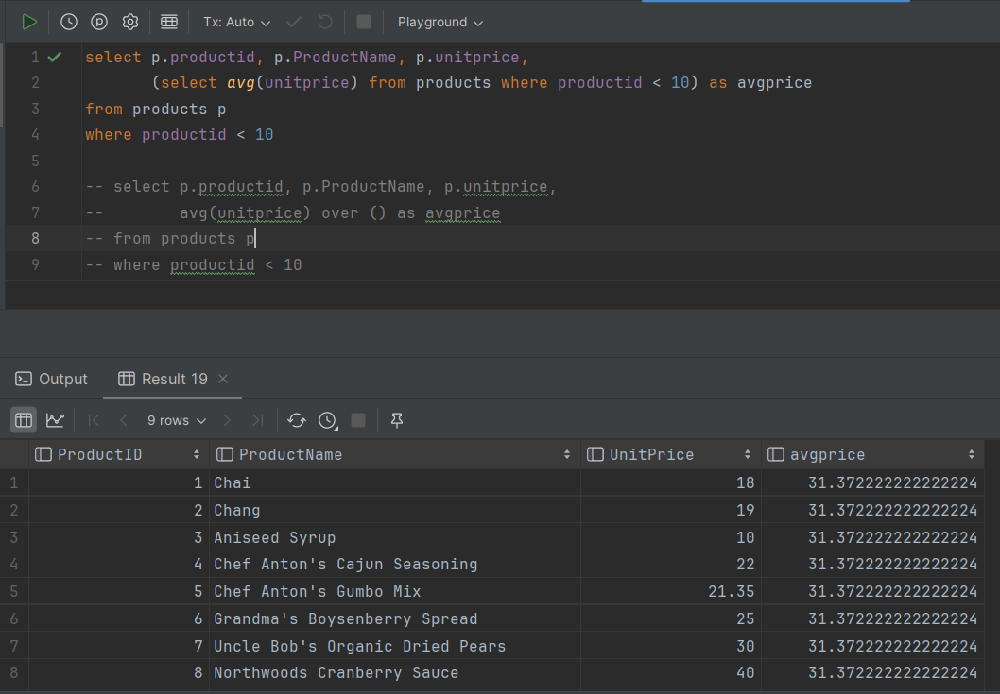 |

# Zadanie 3

Baza: Northwind, tabela: products

Napisz polecenie, które zwraca: id produktu, nazwę produktu, cenę produktu, średnią cenę wszystkich produktów.

Napisz polecenie z wykorzystaniem podzapytania, join'a oraz funkcji okna. Porównaj czasy oraz plany
   wykonania zapytań.

- Polecenie z wykorzystaniem podzapytania

```sql
SELECT p.ProductID,
       p.ProductName,
       p.UnitPrice,
       (SELECT AVG(p2.UnitPrice) FROM Products AS p2) AS AveragePrice
FROM Products AS p
```

- Polecenie z wykorzystaniem joina

```sql
SELECT p.ProductID,
       p.ProductName,
       p.UnitPrice,
       AVG(p2.UnitPrice) AS AveragePrice
FROM Products p
         JOIN Products p2 ON 1 = 1
GROUP BY p.ProductID, p.ProductName, p.UnitPrice
```

- Polecenie z wykorzystaniem funkcji okna

```sql
SELECT p.ProductID,
       p.ProductName,
       p.UnitPrice,
       AVG(UnitPrice) OVER() AS AveragePrice
FROM Products AS p
```

---

Przetestuj działanie w różnych SZBD (MS SQL Server, PostgreSql, SQLite)

W SSMS włącz dwie opcje: Include Actual Execution Plan oraz Include Live Query Statistics


W DataGrip użyj opcji Explain Plan/Explain Analyze


| Zapytanie    | MySQL                     | Postgres                   | SQLite                   |
|--------------|---------------------------|----------------------------|--------------------------|
| Podzapytanie |  | 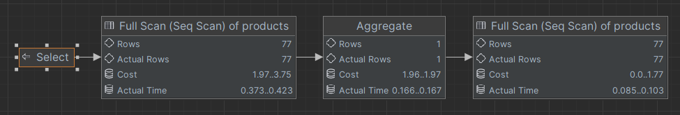 | 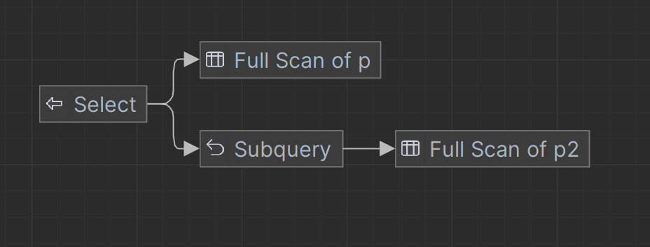 |
| Join         |  | 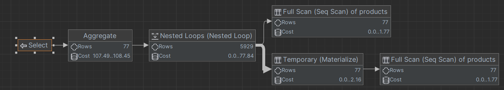 | 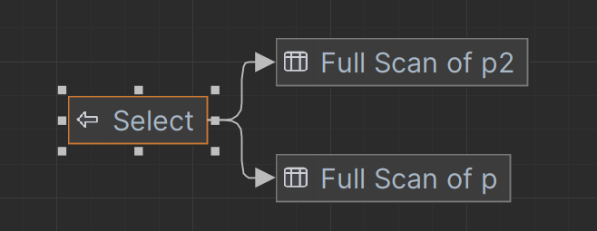 |
| Funkcja okna | 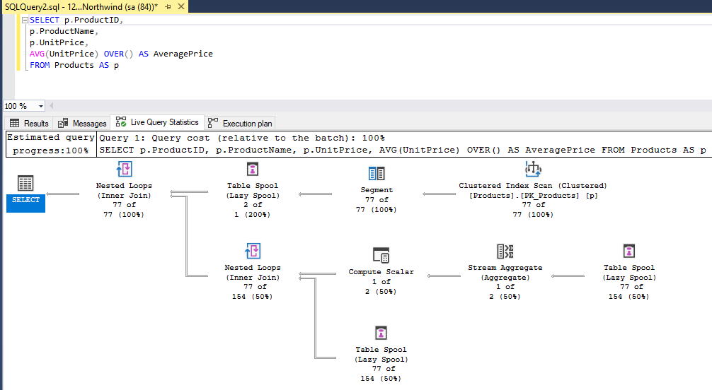 | 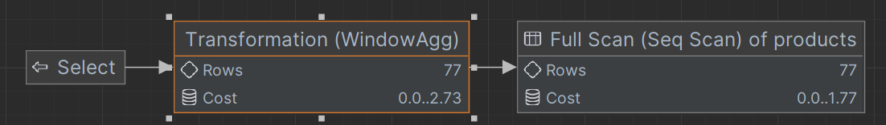 |  |

**Porównanie czasów wykonania**

| Zapytanie    | MySQL                         | Postgres                       | SQLite                   |
|--------------|-------------------------------|--------------------------------|--------------------------|
| Podzapytanie | 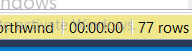 |  |  |
| Join         | 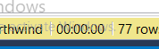 |  |  |
| Funkcja okna |  |  |  |

---

# Zadanie 4

Baza: Northwind, tabela products

Napisz polecenie, które zwraca: id produktu, nazwę produktu, cenę produktu, średnią cenę produktów w kategorii, do której należy dany produkt. Wyświetl tylko pozycje (produkty), których cena jest większa niż średnia cena.

Napisz polecenie z wykorzystaniem podzapytania, join'a oraz funkcji okna. Porównaj zapytania. Porównaj czasy oraz
   plany wykonania zapytań.

- Polecenie z wykorzystaniem podzapytania

```sql
SELECT p.ProductID,
       p.ProductName,
       p.UnitPrice,
       (SELECT AVG(p2.UnitPrice)
        FROM Products AS p2
        WHERE p2.CategoryID = p.CategoryID) AS AvgCategoryPrice
FROM Products p
WHERE p.UnitPrice > (SELECT AVG(p3.UnitPrice)
                     FROM Products p3
                     WHERE p3.CategoryID = p.CategoryID)
```

- Polecenie z wykorzystaniem joina

```sql
SELECT p.ProductID,
       p.ProductName,
       p.UnitPrice,
       AVG(p2.UnitPrice) AS AvgCategoryPrice
FROM Products p
         JOIN
     Products p2 ON p.CategoryID = p2.CategoryID
WHERE p.UnitPrice > AVG(p2.UnitPrice)
```

- Polecenie z wykorzystaniem funkcji okna

```sql
WITH AvgPrices AS (SELECT ProductID,
                          ProductName,
                          UnitPrice,
                          AVG(UnitPrice) OVER (PARTITION BY CategoryID) AS AvgCategoryPrice
                   FROM Products)
SELECT ProductID,
       ProductName,
       UnitPrice,
       AvgCategoryPrice
FROM AvgPrices
WHERE UnitPrice > AvgCategoryPrice;
```

Przetestuj działanie w różnych SZBD (MS SQL Server, PostgreSql, SQLite)

| Zapytanie    | MySQL                     | Postgres                   | SQLite                   |
|--------------|---------------------------|----------------------------|--------------------------|
| Podzapytanie |  |  |  |
| Join         |  |  |  |
| Funkcja okna | 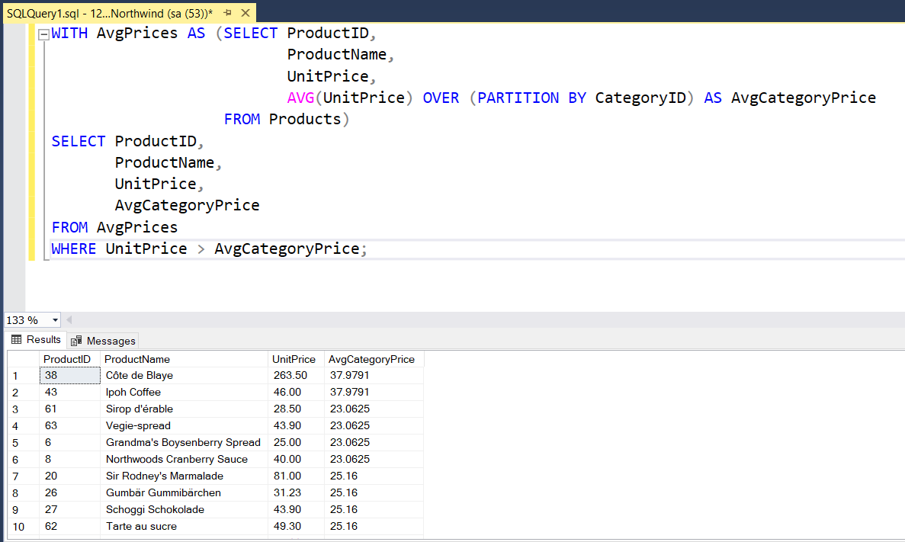 |  |  |

---

# Zadanie 5 - przygotowanie

Baza: Northwind

Tabela products zawiera tylko 77 wiersz. Warto zaobserwować działanie na większym zbiorze danych.

Wygeneruj tabelę zawierającą kilka milionów (kilkaset tys.) wierszy

Stwórz tabelę o następującej strukturze:

Skrypt dla SQL Srerver

```sql
create table product_history
(
    id              int identity(1,1) not null,
    productid       int,
    productname     varchar(40) not null,
    supplierid      int null,
    categoryid      int null,
    quantityperunit varchar(20) null,
    unitprice       decimal(10, 2) null,
    quantity        int,
    value           decimal(10, 2),
    date            date,
    constraint pk_product_history primary key clustered
    (id asc )
)
```

Wygeneruj przykładowe dane:

Dla 30000 iteracji, tabela będzie zawierała nieco ponad 2mln wierszy (dostostu ograniczenie do możliwości swojego
komputera)

Skrypt dla SQL Srerver

```sql
declare
@i int
set @i = 1
while @i <= 30000
begin
    insert
product_history
select productid,
       ProductName,
       SupplierID,
       CategoryID,
       QuantityPerUnit,
       round(RAND() * unitprice + 10, 2),
       cast(RAND() * productid + 10 as int),
       0,
       dateadd(day, @i, '1940-01-01')
from products set @i = @i + 1;
end;

update product_history
set value = unitprice * quantity
where 1 = 1;
```

Skrypt dla Postgresql

```sql
create table product_history
(
    id              int generated always as identity not null
        constraint pkproduct_history primary key,
    productid       int,
    productname     varchar(40)                      not null,
    supplierid      int null,
    categoryid      int null,
    quantityperunit varchar(20) null,
    unitprice       decimal(10, 2) null,
    quantity        int,
    value           decimal(10, 2),
    date            date
);
```

Wygeneruj przykładowe dane:

Skrypt dla Postgresql

```sql
do
$$
begin
for cnt in 1..30000 loop
    insert into product_history(productid, productname, supplierid,
           categoryid, quantityperunit,
           unitprice, quantity, value, date)
select productid,
       productname,
       supplierid,
       categoryid,
       quantityperunit,
       round((random() * unitprice + 10):: numeric, 2),
       cast(random() * productid + 10 as int),
       0,
       cast('1940-01-01' as date) + cnt
from products;
end loop;
end; $$;

update product_history
set value = unitprice * quantity
where 1 = 1;
```

Wykonaj polecenia: `select count(*) from product_history`, potwierdzające wykonanie zadania

| MySQL                     | Postgres                   | SQLite                   |
|---------------------------|----------------------------|--------------------------|
|  |  |  |

---

# Zadanie 6

Baza: Northwind, tabela product_history

To samo co w zadaniu 3, ale dla większego zbioru danych

Napisz polecenie, które zwraca: id pozycji, id produktu, nazwę produktu, cenę produktu, średnią cenę produktów w
   kategorii do której należy dany produkt. Wyświetl tylko pozycje (produkty) których cena jest większa niż średnia
   cena. Napisz polecenie z wykorzystaniem podzapytania, join'a oraz funkcji okna. Porównaj zapytania. Porównaj czasy oraz
   plany
   wykonania zapytań.

- Polecenie z wykorzystaniem podzapytania

```sql
SELECT ph.id,
       ph.productid,
       ph.productname,
       ph.unitpricde
    
       (SELECT AVG(p2.UnitPrice) FROM Products AS p2) AS AveragePrice
FROM product_history AS ph
```

- Polecenie z wykorzystaniem joina

```sql
SELECT p.ProductID,
       p.ProductName,
       p.UnitPrice,
       AVG(p2.UnitPrice) AS AveragePrice
FROM product_history p
         JOIN product_history p2 ON 1 = 1
GROUP BY p.ProductID, p.ProductName, p.UnitPrice
```

- Polecenie z wykorzystaniem funkcji okna

```sql
SELECT p.ProductID,
       p.ProductName,
       p.UnitPrice,
       AVG(UnitPrice) OVER() AS AveragePrice
FROM product_history AS p
```

Przetestuj działanie w różnych SZBD (MS SQL Server, PostgreSql, SQLite)

| Zadanie | MySQL                     | Postgres                   | SQLite                   |
|---------|---------------------------|----------------------------|--------------------------|
| 1       | 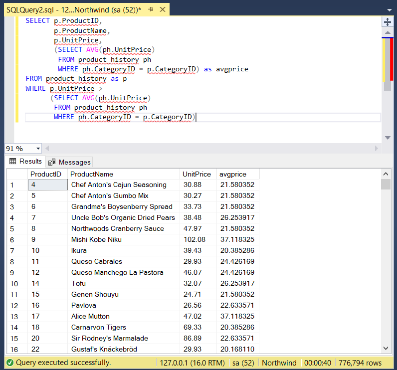 |  |  |
| 2       |  | 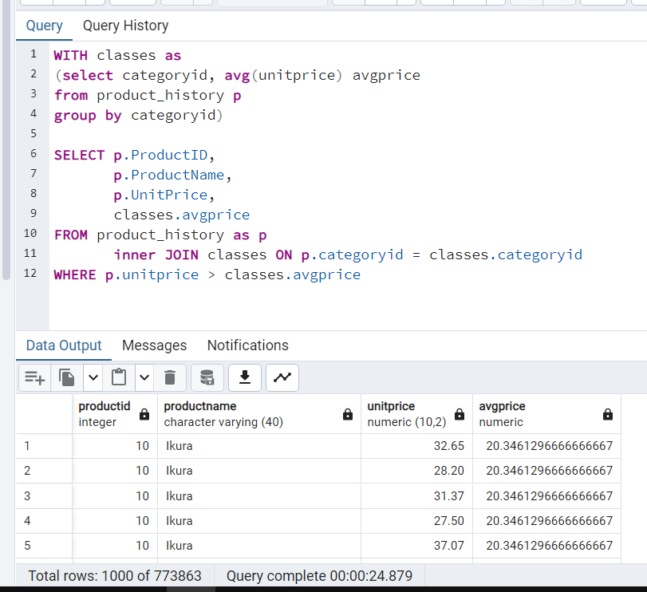 |  |
| 3       | 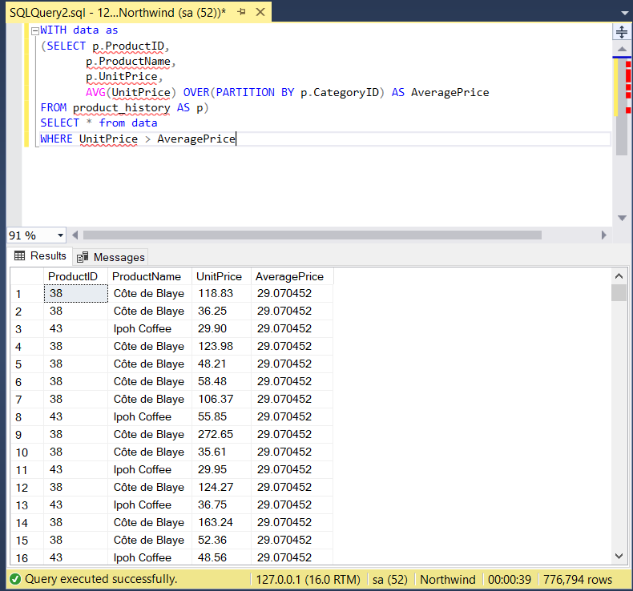 | 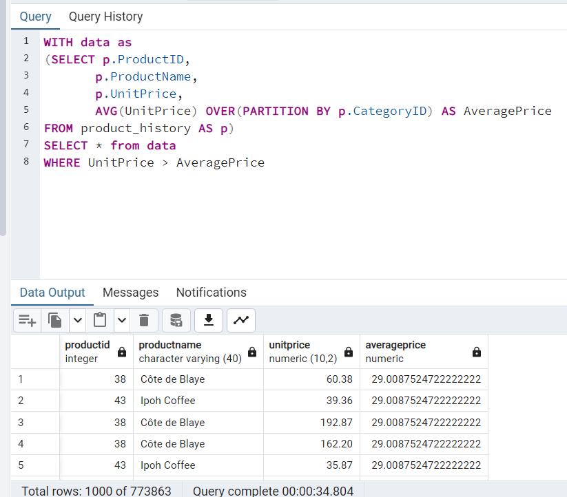 |  |

Możemy zaobserwować, że zapytanie z użyciem joina dla postgres nie wykonało się nawet po 8 minutach od wywołania.
SSMS dla MySQL nie rozpoznaje nowo utworzonej tabeli, ale potrafi wykonać na niej zapytanie

---

# Zadanie 7

Baza: Northwind, tabela product_history

Lekka modyfikacja poprzedniego zadania

Napisz polecenie, które zwraca: id pozycji, id produktu, nazwę produktu, cenę produktu oraz:
- średnią cenę produktów w kategorii do której należy dany produkt.
- łączną wartość sprzedaży produktów danej kategorii (suma dla pola value)
- średnią cenę danego produktu w roku którego dotyczy dana pozycja
- łączną wartość sprzedaży produktów danej kategorii (suma dla pola value) (powtórzone???)


Napisz polecenie z wykorzystaniem podzapytania, join'a oraz funkcji okna. Porównaj zapytania. W przypadku funkcji
   okna spróbuj użyć klauzuli WINDOW.

```sql
SELECT ph.id,
       ph.ProductID,
       ph.ProductName,
       ph.UnitPrice,
	   (select avg(ph2.unitprice) from product_history as ph2 where ph.categoryid = ph2.categoryid) as AveragePrice,
	   (select sum(ph3.value) from product_history as ph3 where ph.categoryid = ph3.categoryid) as TotalSale,
	   (select avg(ph4.unitprice) from product_history as ph4 where ph.productid = ph4.productid and YEAR(ph.date) = YEAR(ph4.date)) as AveragePriceOverYear
FROM product_history AS ph
```


Porównaj czasy oraz plany wykonania zapytań.

Przetestuj działanie w różnych SZBD (MS SQL Server, PostgreSql, SQLite)

| Zadanie | MySQL                     | Postgres                   | SQLite                   |
|---------|---------------------------|----------------------------|--------------------------|
| 1       |  |  |  |
| 2       |  |  |  |

---

# Zadanie 8 - obserwacja

Funkcje rankingu, `row_number()`, `rank()`, `dense_rank()`

Wykonaj polecenie, zaobserwuj wynik. Porównaj funkcje row_number(), rank(), dense_rank()

```sql
select productid,
       productname,
       unitprice,
       categoryid,
       row_number() over(partition by categoryid order by unitprice desc) as rowno, rank() over(partition by categoryid order by unitprice desc) as rankprice, dense_rank() over(partition by categoryid order by unitprice desc) as denserankprice
from products;
```

| MySQL                     | Postgres                   | SQLite                   |
|---------------------------|----------------------------|--------------------------|
|  |  |  |

**Zadanie**

Spróbuj uzyskać ten sam wynik bez użycia funkcji okna

| MySQL                     | Postgres                   | SQLite                   |
|---------------------------|----------------------------|--------------------------|
|  |  |  |

---

# Zadanie 9

Baza: Northwind, tabela product_history

Dla każdego produktu, podaj 4 najwyższe ceny tego produktu w danym roku. Zbiór wynikowy powinien zawierać:

- rok
- id produktu
- nazwę produktu
- cenę
- datę (datę uzyskania przez produkt takiej ceny)
- pozycję w rankingu

Uporządkuj wynik wg roku, nr produktu, pozycji w rankingu

| MySQL                     | Postgres                   | SQLite                   |
|---------------------------|----------------------------|--------------------------|
|  |  |  |

Spróbuj uzyskać ten sam wynik bez użycia funkcji okna, porównaj wyniki, czasy i plany zapytań. Przetestuj działanie w
różnych SZBD (MS SQL Server, PostgreSql, SQLite)

| MySQL                     | Postgres                   | SQLite                   |
|---------------------------|----------------------------|--------------------------|
|  |  |  |

---

# Zadanie 10 - obserwacja

Funkcje `lag()`, `lead()`

Wykonaj polecenia, zaobserwuj wynik. Jak działają funkcje `lag()`, `lead()`

```sql
select productid,
       productname,
       categoryid, date, unitprice, lag(unitprice) over (partition by productid order by date)
    as previousprodprice, lead(unitprice) over (partition by productid order by date)
    as nextprodprice
from product_history
where productid = 1 and year (date) = 2022
order by date;

with t as (select productid, productname, categoryid, date, unitprice, lag(unitprice) over (partition by productid
    order by date) as previousprodprice, lead(unitprice) over (partition by productid
    order by date) as nextprodprice
from product_history
    )
select *
from t
where productid = 1 and year (date) = 2022
order by date;
```

| Funkcje | MySQL                      | Postgres                    | SQLite                    |
|---------|----------------------------|-----------------------------|---------------------------|
| 1   |  |  |  |
| 2  |  |  |  |

**Zadanie**

Spróbuj uzyskać ten sam wynik bez użycia funkcji okna, porównaj wyniki, czasy i plany zapytań. Przetestuj działanie w
różnych SZBD (MS SQL Server, PostgreSql, SQLite)

```sql
-- wyniki ...
```

| Polecenie | MySQL                      | Postgres                    | SQLite                    |
|---------|----------------------------|-----------------------------|---------------------------|
| 1       |  |  |  |
| 2       |  |  |  |

---

# Zadanie 11

Baza: Northwind, tabele customers, orders, order details

Napisz polecenie które wyświetla inf. o zamówieniach

Zbiór wynikowy powinien zawierać:

- nazwę klienta, nr zamówienia,
- datę zamówienia,
- wartość zamówienia (wraz z opłatą za przesyłkę),
- nr poprzedniego zamówienia danego klienta,
- datę poprzedniego zamówienia danego klienta,
- wartość poprzedniego zamówienia danego klienta.

```sql
SELECT 
```

---

# Zadanie 12 - obserwacja

Funkcje `first_value()`, `last_value()`

Wykonaj polecenia, zaobserwuj wynik. Jak działają funkcje `first_value()`, `last_value()`. Skomentuj uzyskane wyniki.
Czy funkcja `first_value` pokazuje w tym przypadku najdroższy produkt w danej kategorii, czy funkcja `last_value()`
pokazuje najtańszy produkt? Co jest przyczyną takiego działania funkcji `last_value`. Co trzeba zmienić żeby funkcja
last_value pokazywała najtańszy produkt w danej kategorii

```sql
select productid,
       productname,
       unitprice,
       categoryid,
       first_value(productname) over (partition by categoryid
order by unitprice desc) first,
    last_value(productname) over (partition by categoryid
order by unitprice desc) last
from products
order by categoryid, unitprice desc;
```

```sql
-- wyniki ...
```

**Zadanie**

Spróbuj uzyskać ten sam wynik bez użycia funkcji okna, porównaj wyniki, czasy i plany zapytań. Przetestuj działanie w
różnych SZBD (MS SQL Server, PostgreSql, SQLite)

```sql
-- wyniki ...
```

| MySQL                      | Postgres                    | SQLite                    |
|----------------------------|-----------------------------|---------------------------|
|  |  |  |

---

# Zadanie 13

Baza: Northwind, tabele orders, order details

Napisz polecenie które wyświetla inf. o zamówieniach

Zbiór wynikowy powinien zawierać:

- Id klienta,
- nr zamówienia,
- datę zamówienia,
- wartość zamówienia (wraz z opłatą za przesyłkę),
- dane zamówienia klienta o najniższej wartości w danym miesiącu
    - nr zamówienia o najniższej wartości w danym miesiącu
    - datę tego zamówienia
    - wartość tego zamówienia
- dane zamówienia klienta o najwyższej wartości w danym miesiącu
    - nr zamówienia o najniższej wartości w danym miesiącu
    - datę tego zamówienia
    - wartość tego zamówienia

```sql
--- wyniki ...
```

---

# Zadanie 14

Baza: Northwind, tabela product_history

Napisz polecenie które pokaże wartość sprzedaży każdego produktu narastająco od początku każdego miesiąca. Użyj funkcji
okna

Zbiór wynikowy powinien zawierać:

- id pozycji
- id produktu
- datę
- wartość sprzedaży produktu w danym dniu
- wartość sprzedaży produktu narastające od początku miesiąca

```sql
-- wyniki ...
```

Spróbuj wykonać zadanie bez użycia funkcji okna. Spróbuj uzyskać ten sam wynik bez użycia funkcji okna, porównaj wyniki,
czasy i plany zapytań. Przetestuj działanie w różnych SZBD (MS SQL Server, PostgreSql, SQLite)

```sql
-- wyniki ...
```

| MySQL                      | Postgres                    | SQLite                    |
|----------------------------|-----------------------------|---------------------------|
|  |  |  |

---

# Zadanie 15

Wykonaj kilka "własnych" przykładowych analiz. Czy są jeszcze jakieś ciekawe/przydatne funkcje okna (z których nie
korzystałeś w ćwiczeniu)? Spróbuj ich użyć w zaprezentowanych przykładach.

```sql
-- wyniki ...
```

Punktacja

|         |     |
|---------|-----|
| zadanie | pkt |
| 1       | 0,5 |
| 2       | 0,5 |
| 3       | 1   |
| 4       | 1   |
| 5       | 0,5 |
| 6       | 2   |
| 7       | 2   |
| 8       | 0,5 |
| 9       | 2   |
| 10      | 1   |
| 11      | 2   |
| 12      | 1   |
| 13      | 2   |
| 14      | 2   |
| 15      | 2   |
| razem   | 20  |
