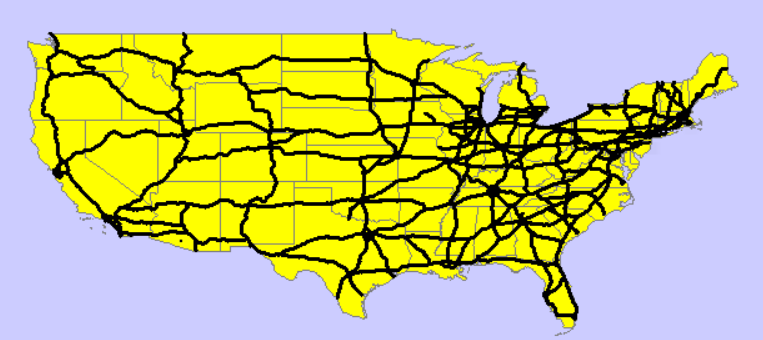
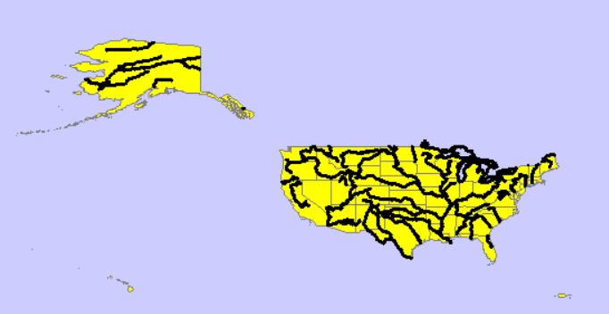
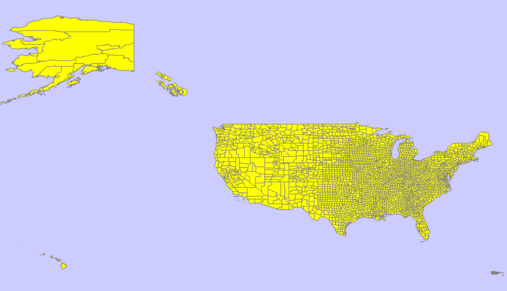
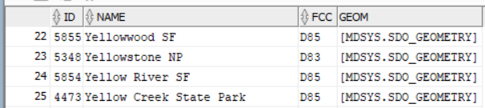
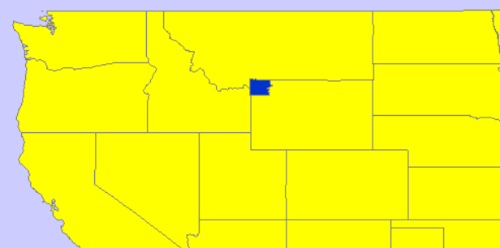
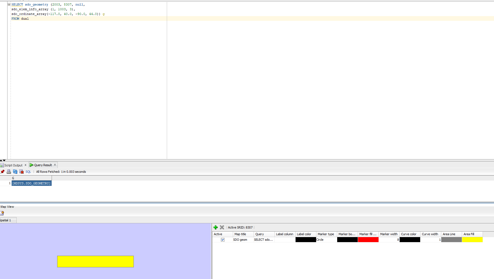
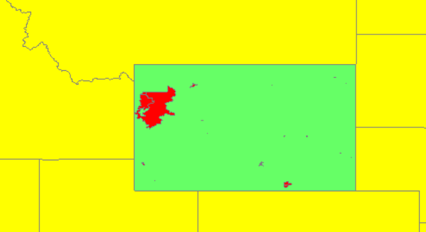
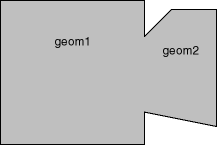

# Raport

# Przetwarzanie i analiza danych przestrzennych 
# Oracle spatial


---

**Imiona i nazwiska:**

--- 

Celem ćwiczenia jest zapoznanie się ze sposobem przechowywania, przetwarzania i analizy danych przestrzennych w bazach danych
(na przykładzie systemu Oracle spatial)

Swoje odpowiedzi wpisuj w miejsca oznaczone jako:

---
> Wyniki, zrzut ekranu, komentarz

```sql
--  ...
```

---

Do wykonania ćwiczenia (zadania 1 – 7) i wizualizacji danych wykorzystaj Oracle SQL Develper. Alternatywnie możesz wykonać analizy w środowisku Python/Jupyter Notebook

Do wykonania zadania 8 wykorzystaj środowisko Python/Jupyter Notebook

Raport należy przesłać w formacie pdf.

Należy też dołączyć raport zawierający kod w formacie źródłowym.

Np.
- plik tekstowy .sql z kodem poleceń
- plik .md zawierający kod wersji tekstowej
- notebook programu jupyter – plik .ipynb

Zamieść kod rozwiązania oraz zrzuty ekranu pokazujące wyniki, (dołącz kod rozwiązania w formie tekstowej/źródłowej)

Zwróć uwagę na formatowanie kodu

<div style="page-break-after: always;"></div>

# Zadanie 1

Zwizualizuj przykładowe dane

US_STATES


> Wyniki, zrzut ekranu, komentarz

```sql
select * from world_countries;
select * from us_states;
```


US_INTERSTATES


> Wyniki, zrzut ekranu, komentarz

```sql
select * from us_states;
select * from us_interstates;
```

Widzimy, że narzędzie nie wyświetla dróg poprawnie. Szybkie przybliżenie i oddalenie wizualizacji przy pomocy myszy odświeża obraz i artefakty znikają.





US_CITIES


> Wyniki, zrzut ekranu, komentarz

```sql
select * from us_states;
select * from us_cities;
```

Można zauważyć, że markery są bardzo duże. Niestety próby zmiany parametru `Marker width` nie wpływają na rozmiar widocznych markerów.


`Marker fill color` oraz `Marker border color` działają poprawnie.


US_RIVERS


> Wyniki, zrzut ekranu, komentarz

```sql
select * from us_states;
select * from us_rivers;
```



Możemy zaobserwować, że jeziora na północnym wschodzie są oznaczone na czarno mimo, że nie są rzekami. Są to linie w których jeziora te stykają się z granicą Kanady.


US_COUNTIES


> Wyniki, zrzut ekranu, komentarz

```sql
select * from us_states;
select * from us_counties;
```



US_PARKS


> Wyniki, zrzut ekranu, komentarz

```sql
select * from us_states;
select * from us_parks
where id < 50;
```


Przez ograniczenie wartości ID do mniejszych niż 50, esteśmy w stanie zaobserwować głównie parki w stanie Alabama. Domyślnie narzędzie ustawia ich kolor jako żółty, stają się one lepiej widoczne po zmianie koloru.


Parki nie są jednak dobrze widoczne na skali całego kraju. 

Możemy sprwadzić w tabeli nazwę parku Yellowstone i w ten sposób stworzyć zapytanie, które pozwoli wyświetlić go na mapie

```sql
select * from us_parks
order by NAME;
```

ID Yellowstone to 5348



```sql
select * from us_states;
select * from us_parks
where ID = 5348;
```




# Zadanie 2

Znajdź wszystkie stany (us_states) których obszary mają część wspólną ze wskazaną geometrią (prostokątem)

Pokaż wynik na mapie.

prostokąt

```sql
SELECT  sdo_geometry (2003, 8307, null,
        sdo_elem_info_array (1,1003,3),
        sdo_ordinate_array ( -117.0, 40.0, -90., 44.0)) g
FROM dual
```

> Wyniki, zrzut ekranu, komentarz

> Wyświetlenie geometrii razem z wynikiem:



> Jest to zwykły prostokat.

Użyj funkcji SDO_FILTER

```sql
SELECT state, geom FROM us_states
WHERE sdo_filter (geom,
    sdo_geometry (2003, 8307, null,
    sdo_elem_info_array (1,1003,3),
    sdo_ordinate_array ( -117.0, 40.0, -90., 44.0))
) = 'TRUE';
```

Zwróć uwagę na liczbę zwróconych wierszy (16)

> Wyniki, zrzut ekranu, komentarz


> Wyswietlenie geometrii z sdo_filter razem z wczesniejsza oraz z wynikiem:


> Mozemy zauwazyc, ze rzeczywiscie zostalo zwrocone 16 wierszy. 2 stany zostały błędnie zakwalifikowane jako pokrywające się z prostokątem. Dokumentacja wskazuje, że funkcja SDO_FILTER, w przeciwieństwie do SDO_ANYINTERACT, służy do szybkiego filtrowania danych, a nie do dokładnego sprawdzania pokrywania się geometrii.

Użyj funkcji  SDO_ANYINTERACT

```sql
SELECT state, geom FROM us_states
WHERE sdo_anyinteract (geom,
    sdo_geometry (2003, 8307, null,
    sdo_elem_info_array (1,1003,3),
    sdo_ordinate_array ( -117.0, 40.0, -90., 44.0))
) = 'TRUE';
```

Porównaj wyniki sdo_filter i sdo_anyinteract

Pokaż wynik na mapie

> Wyniki, zrzut ekranu, komentarz


> Wyswietlenie geometrii otrzymanej z sdo_anyinteract razem z wczesniejszymi oraz z wynikiem:


> Zapytanie to zwróciło 14 stanów, co jest poprawna liczbą.

> Porownanie wynikow obu zapytań, sdo_filter na zolto i sdo_anyinteract na czerwono: 


**Analiza wynikow:**
 - Zapytanie z użyciem sdo_filter zwróciło 16 wierszy, co jest o 2 więcej niż w przypadku zapytania z użyciem sdo_anyinteract
 - W obu wynikach zapytań pokrywa się 14 stanów.
 - Patrząc na mapę wyświetloną w Oracle SQL Developer, wydaje się, że 2 dodatkowe stany zwrócone przez sdo_filter nie mają punktów wspólnych z geometrią (prostokątem).
 - Różnica ta wynika z tego, że funkcja sdo_filter korzysta z **Minimum Bounding Rectangle (MBR)**, czyli wyznacza najmniejszy prostokąt, w który można wpisać daną figurę niebędącą prostokątem, i dopiero na tych prostokątach sprawdza, czy się przecinają. Zaletą tego podejścia jest prostsze i mniej kosztowne obliczanie (szczególnie dla skomplikowanych kształtów), dlatego jest stosowane do wstępnego filtrowania danych. Wadą jest zwracanie fałszywie pozytywnych wyników, tak jak w naszym przypadku z dwoma dodatkowymi stanami.

# Zadanie 3

Znajdź wszystkie parki (us_parks) których obszary znajdują się wewnątrz stanu Wyoming

Użyj funkcji SDO_INSIDE

```sql
SELECT p.name, p.geom
FROM us_parks p,
     us_states s
WHERE s.state = 'Wyoming'
     AND SDO_INSIDE (p.geom, s.geom ) = 'TRUE';
```

W przypadku wykorzystywania narzędzia SQL Developer, w celu wizualizacji na mapie użyj podzapytania

```sql
SELECT pp.name, pp.geom  FROM us_parks pp
WHERE id IN
(
    SELECT p.id
    FROM us_parks p, us_states s
    WHERE s.state = 'Wyoming'
    and SDO_INSIDE (p.geom, s.geom ) = 'TRUE'
)
```

> Wyniki, zrzut ekranu, komentarz

Same parki z podzapytania nie dają nam dużo informacji.


Wyświetlmy je na mapie USA.

```sql
select * from us_states;
```


Dodajmy stan Wyoming i zaznaczmy go innym kolorem w celu rozróżnienia.

```sql
SELECT state, geom FROM us_states
WHERE state = 'Wyoming'
```

> Wyniki, zrzut ekranu, komentarz




Porównaj wynik z:

```sql
SELECT p.name, p.geom
FROM us_parks p, us_states s
WHERE s.state = 'Wyoming'
AND SDO_ANYINTERACT (p.geom, s.geom ) = 'TRUE';
```

W celu wizualizacji użyj podzapytania

> Wyniki, zrzut ekranu, komentarz

Podzapytanie umożliwiające wizualizację:

```sql
SELECT pp.name, pp.geom FROM us_parks pp
WHERE id IN
(
    SELECT p.id
    FROM us_parks p, us_states s
    WHERE s.state = 'Wyoming'
    AND SDO_ANYINTERACT (p.geom, s.geom ) = 'TRUE'
)
```

Widzimy, dużo więcej parków. Na przykład widoczny park Yellowstone wcześniej nie był widoczny na mapie. Można wyciągnąć wniosek, że funkcja `SDO_INSIDE` pozwala na wyodrębnienie tylko tych elementów geometrycznych, które w całości znajdują się wewnątrz wybranego obszaru i nie dotykają jego granic. Za to `SDO_ANYINTERACT` wyodrębnia też obszary częściowo nachodzące na wybrany oraz te przyległe do niego.


# Zadanie 4

Znajdź wszystkie jednostki administracyjne (us_counties) wewnątrz stanu New Hampshire

```sql
SELECT c.county, c.state_abrv, c.geom
FROM us_counties c, us_states s
WHERE s.state = 'New Hampshire'
AND SDO_RELATE ( c.geom,s.geom, 'mask=INSIDE+COVEREDBY') = 'TRUE';

SELECT c.county, c.state_abrv, c.geom
FROM us_counties c, us_states s
WHERE s.state = 'New Hampshire'
AND SDO_RELATE ( c.geom,s.geom, 'mask=INSIDE') = 'TRUE';

SELECT c.county, c.state_abrv, c.geom
FROM us_counties c, us_states s
WHERE s.state = 'New Hampshire'
AND SDO_RELATE ( c.geom,s.geom, 'mask=COVEREDBY') = 'TRUE';
```

W przypadku wykorzystywania narzędzia SQL Developer, w celu wizualizacji danych na mapie należy użyć podzapytania (podobnie jak w poprzednim zadaniu)

> Wyniki, zrzut ekranu, komentarz

Mapa z fragmentem na którym widać New Hampshire.

```sql
Select * from us_states
WHERE state = 'New Hampshire';
```


Zobaczmy jak wygląda wynik pierwszego zapytania - z maską `INSIDE+COVEREDBY`

```sql
SELECT cc.county, cc.state_abrv, cc.geom FROM us_counties cc
WHERE id IN
(
    SELECT c.id
    FROM us_counties c, us_states s
    WHERE s.state = 'New Hampshire'
    AND SDO_RELATE ( c.geom,s.geom, 'mask=INSIDE+COVEREDBY') = 'TRUE'
);
```

Widzimy, że cały stan jest pokryty fragmentami - hrabstwami. 


Sprwadźmy drugie zapytanie - maskę `INSIDE`.

```sql
SELECT cc.county, cc.state_abrv, cc.geom FROM us_counties cc
WHERE id IN
(
    SELECT c.id
    FROM us_counties c, us_states s
    WHERE s.state = 'New Hampshire'
    AND SDO_RELATE ( c.geom,s.geom, 'mask=INSIDE') = 'TRUE'
);
```

`INSIDE` powoduje wybranie tylko tych hrabstw które w całości znajdują się w stanie.


Trzecie zapytanie - maska `COVEREDBY`

```sql
SELECT cc.county, cc.state_abrv, cc.geom FROM us_counties cc
WHERE id IN
(
    SELECT c.id
    FROM us_counties c, us_states s
    WHERE s.state = 'New Hampshire'
    AND SDO_RELATE ( c.geom,s.geom, 'mask=COVEREDBY') = 'TRUE'
);
```

Widzimy, że tylko te hrabstwa które stykają się z granicą stanu zostają wybrane


Z obserwacji można wyciągnąć wnioski o masce `COVEREDBY` - nie uwzględnia ona elementów całkowicie zawartych wewnątrz stanu New Hampshire. Oznacza to, że żeby coś zostało przez nią uwzględnione musi mieć część wspólną z obszarem na zewnątrz stanu. W tym przypadku tą częścią wspólną jest granica.


# Zadanie 5

Znajdź wszystkie miasta w odległości 50 mili od drogi (us_interstates) I4

Pokaż wyniki na mapie

```sql
SELECT * FROM us_interstates
WHERE interstate = 'I4'

SELECT * FROM us_states
WHERE state_abrv = 'FL'

SELECT c.city, c.state_abrv, c.location 
FROM us_cities c
WHERE ROWID IN 
( 
SELECT c.rowid
FROM us_interstates i, us_cities c 
WHERE i.interstate = 'I4'
AND sdo_within_distance (c.location, i.geom,'distance=50 unit=mile'
)
```


> Wyniki, zrzut ekranu, komentarz

Musieliśmy zmodyfikować ostatnie zapytanie:
```sql
SELECT c.city, c.state_abrv, c.location 
FROM us_cities c
WHERE ROWID IN(
SELECT c.rowid
FROM us_interstates i, us_cities c
WHERE i.interstate = 'I4'
 AND sdo_within_distance(c.location, i.geom, 'distance=50 unit=mile') = 'TRUE')
```
Na wizualizacji możemy zobaczyć wyraźnie drogę i trzy miasta w odpowiedniej odległości


Dodatkowo:

a)     Znajdz wszystkie jednostki administracyjne przez które przechodzi droga I4

W celu określienia wszystkich jednostek administracyjnych przez które przechodzi droga wystarczy zmniejszyć dystans do wartości 0.

```sql
SELECT c.county, c.geom
FROM us_counties c
WHERE c.state_abrv = 'FL' 
and c.id IN(
SELECT c.id
FROM us_interstates i, us_counties c
WHERE i.interstate = 'I4'
AND sdo_within_distance(c.geom, i.geom, 'distance=0 unit=mile') = 'TRUE'
)
```


b)    Znajdz wszystkie jednostki administracyjne w pewnej odległości od I4

```sql
SELECT c.county, c.geom
FROM us_counties c
WHERE c.state_abrv = 'FL' 
and c.id IN(
SELECT c.id
FROM us_interstates i, us_counties c
WHERE i.interstate = 'I4'
AND sdo_within_distance(c.geom, i.geom, 'distance=50 unit=mile') = 'TRUE'
)
```


c)     Znajdz rzeki które przecina droga I4

Możemy zastosować podejście z podpunktu a)

```SQL
SELECT r.name, r.geom
FROM us_rivers r
WHERE r.id IN(
SELECT r.id
FROM us_interstates i, us_rivers r
WHERE i.interstate = 'I4'
AND sdo_within_distance(r.geom, i.geom, 'distance=0 unit=mile') = 'TRUE'
)
```

St. Jones jest jedyną rzeką która przecina się z drogą I4


d)    Znajdz wszystkie drogi które przecinają rzekę Mississippi

W wyborze stanów do wizualizacji pomijamy Alaskę.

```sql
SELECT * FROM us_states
where state != 'Alaska';

SELECT * FROM us_rivers
WHERE name = 'Mississippi';

SELECT i.interstate, i.geom
FROM us_interstates i
WHERE i.id IN(
SELECT i.id
FROM us_interstates i, us_rivers r
WHERE r.name = 'Mississippi'
AND sdo_within_distance(r.geom, i.geom, 'distance=0 unit=mile') = 'TRUE'
);
```
Widzimy, że drogi które przecinają Mississippi rozciągają się na całą szerokość kraju.


Niektóre drogi wyglądają jakby nie przecinały się z rzeką, ale kiedy najedziemy myszą na taką drogę możemy zobaczyć, że jest to poprostu nieciągłość między jej odcinkami.


e)    Znajdz wszystkie miasta w odlegości od 15 do 30 mil od drogi 'I275'

Funkcji `sdo_within_distance` nie można użyć z opcją `'FALSE'` więc poprostu zaprzeczamy jej użycie z `'TRUE'`

```sql
SELECT c.city, c.state_abrv, c.location 
FROM us_cities c
WHERE ROWID IN(
SELECT c.rowid
FROM us_interstates i, us_cities c
WHERE i.interstate = 'I275'
 AND sdo_within_distance(c.location, i.geom, 'distance=30 unit=mile') = 'TRUE'
 AND not sdo_within_distance(c.location, i.geom, 'distance=15 unit=mile') = 'TRUE'
 )
```

Widzimy, że droga I275 ma więcej niż jeden fragment, ale tylko przy północnym możemy znaleźć miasta o zadanych odległościach


f)Sprawdźmy czy znajdziemy więcej miast dla podpunktu e) ustawiając inną odległość od drogi.

```sql
SELECT c.city, c.state_abrv, c.location 
FROM us_cities c
WHERE ROWID IN(
SELECT c.rowid
FROM us_interstates i, us_cities c
WHERE i.interstate = 'I275'
AND sdo_within_distance(c.location, i.geom, 'distance=60 unit=mile') = 'TRUE'
 )
```

Okazuje się, że na florydzie też jest fragment drogi I275


g) Wszystkie drogi które przechodzą przez stan Wyoming

```sql
select * from us_states
where state_abrv = 'WY';

SELECT i.interstate, i.geom
FROM us_interstates i
WHERE i.id IN(
SELECT i.id
FROM us_interstates i, us_states s
WHERE s.state_abrv = 'WY'
AND sdo_within_distance(s.geom, i.geom, 'distance=0 unit=mile') = 'TRUE'
);
```


# Zadanie 6

Znajdz 5 miast najbliższych drogi I4

```sql
SELECT c.city, c.state_abrv, c.location
FROM us_interstates i, us_cities c 
WHERE i.interstate = 'I4'
AND sdo_nn(c.location, i.geom, 'sdo_num_res=5') = 'TRUE';
```

>Wyniki, zrzut ekranu, komentarz

```sql
select * from us_states
where state_abrv = 'FL';

select * from us_interstates
where interstate = 'I4';

SELECT c.city, c.state_abrv, c.location
FROM us_cities c
WHERE c.id in (
select c.id
FROM us_interstates i, us_cities c 
WHERE i.interstate = 'I4'
AND sdo_nn(c.location, i.geom, 'sdo_num_res=5') = 'TRUE'
);
```


Dodatkowo:

a)    Znajdz kilka miast najbliższych rzece Mississippi

```sql
select * from us_states
where state_abrv != 'AK';

select * from us_rivers
where name = 'Mississippi';

SELECT c.city, c.state_abrv, c.location
FROM us_cities c
WHERE c.id in (
select c.id
FROM us_rivers r, us_cities c 
WHERE r.name = 'Mississippi'
AND sdo_nn(c.location, r.geom, 'sdo_num_res=5') = 'TRUE'
);
```

Na pierwszy rzut oka wygląda na to, że są tylko 4 miasta. Czy to błąd?


Nie! 2 z miast leżą poprostu blisko siebie


Znalezione miasta to St Paul, Memphis, St Louis, Minneapolis oraz Baton Rouge


b)    Znajdz 3 miasta najbliżej Nowego Jorku

Należy wyświetlić wszystkie stany - część z najbliższych miast znajduje się już poza 

```sql
select * from us_states
where state_abrv != 'AK';

select * from us_cities
where city = 'New York';

SELECT c.city, c.state_abrv, c.location
FROM us_cities c
WHERE c.id in (
select c2.id
FROM us_cities c, 
(select * from us_cities
where city != 'New York') c2 
WHERE c.city = 'New York'
AND sdo_nn(c.location, c2.location, 'sdo_num_res=5') = 'TRUE'
);
```

Nowy Jork zaznaczyliśmy innym kolorem dla lepszego rozróżnienia


c)    Znajdz kilka jednostek administracyjnych (us_counties) z których jest najbliżej do Nowego Jorku

```sql
select * from us_states
where state_abrv != 'AK';

select * from us_cities
where city = 'New York';

SELECT cn.county, cn.geom
FROM us_counties cn
WHERE cn.id in (
select cn.id
FROM us_counties cn, 
us_cities c 
WHERE c.city = 'New York'
AND sdo_nn(cn.geom, c.location, 'sdo_num_res=5') = 'TRUE'
);
```

Oczywiście jednostka administracyjna Nowy Jork jest najbliżej miasta Nowy Jork


d)    Znajdz 5 najbliższych miast od drogi 'I170', podaj odległość do tych miast


```sql
select * from us_states
where state_abrv != 'AK';

select * from us_interstates
where interstate = 'I170';

SELECT c.city, c.location
FROM us_cities c
WHERE c.id in (
select c.id 
FROM us_interstates i, us_cities c 
WHERE i.interstate = 'I170'
AND sdo_nn(c.location, i.geom, 'sdo_num_res=5') = 'TRUE'
);

SELECT c.city, c.location, 
       SDO_GEOM.SDO_DISTANCE(c.location, i.geom, 0.005,'unit=MILE') AS distance
FROM us_cities c, us_interstates i
WHERE c.id IN (
    SELECT c.id
    FROM us_interstates i, us_cities c
    WHERE i.interstate = 'I170'
    AND SDO_NN(c.location, i.geom, 'sdo_num_res=5') = 'TRUE'
)
AND i.interstate = 'I170';
)
```

znalezione odległości dla miast to:


| city        | distance in miles |
|-------------|-------------------|
| Evansvillee | 158.224219737852  |
| Peoria      | 78.7997463714433  |
| Springfield | 78.7997463714433  |
| St Louis    | 5.36297295124004  |
| Springfield | 188.508631077882  |

Znaleźliśmy dwa miasta o nazwie Springfield!


Z początku nie widzieliśmy drogi, jednak po zbliżeniu udało się zobaczyć jej krótki fragment


e)    Znajdz 5 najbliższych dużych miast (o populacji powyżej 300 tys) od drogi 'I170'

```sql
select * from us_states
where state_abrv != 'AK';

select * from us_interstates
where interstate = 'I170';

SELECT c2.city, c2.location
FROM us_cities c2
WHERE c2.id in (
SELECT c.id 
FROM (select * from us_cities where pop90 > 300000) c, us_interstates i
WHERE i.interstate = 'I170'
AND SDO_NN(c.location, i.geom, 'sdo_num_res=5') = 'TRUE'
);
```

Rozwiązanie nie jest w pełni poprawne. Wygląda na to, że pomimo specyfikowania nowej tabeli c przy pomocy podzapytania `SDO_NN` dalej operuje wyłącznie na tabeli `us_cities` zamiast na efekcie podzapytania. Zwracane jest tylko jedno miasto z 5 najbliższych miast - St Louis - jedyne które spełnia warunek o populacji. Zamiast 5 najbliższych spełniających warunek. 


Przykład udało się poprawić zmianą podzapytania

```sql
SELECT c2.city, c2.location
FROM us_cities c2
WHERE c2.id in (
SELECT c.id 
FROM (select * from us_cities where pop90 > 300000) c, us_interstates i
WHERE i.interstate = 'I170'
AND SDO_NN(c.location, i.geom) = 'TRUE'
AND rownum <= 5
);
```


f) 5 jednostek administracyjnych o populacji większej niż 1 300 000 najbliżej Nowego Jorku

```sql
select * from us_states
where state_abrv != 'AK';

select * from us_cities
where city = 'New York';

SELECT cn.county, cn.totpop, cn.geom
FROM us_counties cn
WHERE cn.id in (
select cn.id
FROM (select * from us_counties where totpop > 1300000 and county != 'New York') cn, us_cities c 
WHERE c.city = 'New York'
AND sdo_nn(cn.geom, c.location) = 'TRUE'
AND rownum <= 5
);
```

W zapytaniu zawarto filtrację która upewnia się, żeby nie został wybrany stan `New York` jednak punkt będący współrzędnymi miasta Nowy Jork znajduje się w jednym ze zwróconych obszarów. Jest to duże miasto które obejmuje kilka obszarów administracyjnych więc punkt określający jego współrzędne znalazł się na obszarze innego hrabstwa


# Zadanie 7

Oblicz długość drogi I4

```sql
SELECT SDO_GEOM.SDO_LENGTH (geom, 0.5,'unit=kilometer') length
FROM us_interstates
WHERE interstate = 'I4';
```


>Wyniki, zrzut ekranu, komentarz


Dodatkowo:

a)     Oblicz długość rzeki Mississippi

```sql
SELECT SDO_GEOM.SDO_LENGTH (geom, 0.5,'unit=kilometer') length
FROM us_rivers
WHERE name = 'Mississippi';
```


> Długość rzeki Mississippi to 3860 km.

b)    Która droga jest najdłuższa/najkrótsza
 - droga najdłuższa

```sql
SELECT interstate, SDO_GEOM.SDO_LENGTH (geom, 0.5,'unit=kilometer') length
FROM us_interstates
ORDER BY length DESC
FETCH FIRST ROW ONLY;
```


> Najdłuższa droga ma 4290.64 km i jest nią I90.

 - droga najkrótsza

```sql
SELECT interstate, SDO_GEOM.SDO_LENGTH (geom, 0.5,'unit=kilometer') length
FROM us_interstates
ORDER BY length
FETCH FIRST ROW ONLY;
```


> Najkrótsza droga to I564 i ma 0.46 km.

c)     Która rzeka jest najdłuższa/najkrótsza

 - rzeka najdłuższa

```sql
SELECT name, SDO_GEOM.SDO_LENGTH (geom, 0.5,'unit=kilometer') length
FROM us_rivers
ORDER BY length DESC
FETCH FIRST ROW ONLY;
```


> Najdłuższa rzeka ma długość 6950.91 km i jest nią St. Clair.

 - rzeka najkrótsza

```sql
SELECT name, SDO_GEOM.SDO_LENGTH (geom, 0.5,'unit=kilometer') length
FROM us_rivers
ORDER BY length
FETCH FIRST ROW ONLY;
```


> Najkrótsza rzeka to Richelieu i ma długość 1.16 km.

> Wniosek: W przypadku dróg rezultat był stosunkowo poprawny, natomiast rzeki w używanej bazie danych nie zawsze są przedstawione jako prosta linia, lecz czasami mają bardziej skomplikowany kształt, przez co otrzymany wynik (długość krzywej) nie do końca zgadza się z długością rzeki podawaną w innych źródłach.

d)    Które stany mają najdłuższą granicę

```sql
SELECT
    state,
    SDO_GEOM.SDO_LENGTH(geom, 0.5, 'unit=kilometer') AS border_length
FROM
    us_states
ORDER BY
    border_length DESC
FETCH FIRST 5 ROWS ONLY
```


> Mozemy zauwazyc, ze 3 stany, które posiadaja najdluzsze granice to:
> - Alaska
> - Texas
> - California 

e)    Itp. (własne przykłady)

> Wyniki, zrzut ekranu, komentarz
> (dla każdego z podpunktów)

 - 5 najdłuszych granic (w kilometrach):

```sql
SELECT cntry_name, SDO_GEOM.SDO_LENGTH(geometry, 0.01, 'unit=kilometer') as country_length
FROM world_countries
ORDER BY country_length desc;
```


 - 10 największych parków (w milach):

```sql
SELECT name, SDO_GEOM.SDO_LENGTH(geom, 0.01, 'unit=mile') as length
FROM us_parks
ORDER BY length desc;
```


---
Oblicz odległość między miastami Buffalo i Syracuse

```sql
SELECT SDO_GEOM.SDO_DISTANCE ( c1.location, c2.location, 0.5) distance
FROM us_cities c1, us_cities c2
WHERE c1.city = 'Buffalo' and c2.city = 'Syracuse';
```

> Wyniki, zrzut ekranu, komentarz


> Odległość między miastami Buffalo i Syracuse wynosi 222.18 km.

Dodatkowo:

a)     Oblicz odległość między miastem Tampa a drogą I4

```sql
SELECT SDO_GEOM.SDO_DISTANCE ( c1.location, i.geom, 0.5, 'unit=kilometer') distance
FROM us_cities c1, us_interstates i
WHERE c1.city = 'Tampa' and i.interstate = 'I4';
```


> Odleglosc miedzy miastem Tampa a drogą I4 to 3.10 km.

b)    Jaka jest odległość między stanem Nowy Jork a  Florydą

```sql
SELECT SDO_GEOM.SDO_DISTANCE (s1.geom, s2.geom, 0.5, 'unit=kilometer') distance
FROM us_states s1, us_states s2
WHERE s1.state = 'New York' and s2.state = 'Florida';
```


> Odległość między stanem Nowy Jork a Florydą wynosi 1256.58 km.

c)     Jaka jest odległość między miastem Nowy Jork a Florydą

```sql
SELECT SDO_GEOM.SDO_DISTANCE (c1.location, s2.geom, 0.5, 'unit=kilometer') distance
FROM us_cities c1, us_states s2
WHERE c1.city = 'New York' and s2.state = 'Florida';
```


> Odległość między miastem Nowy Jork a Florydą to 1296.59 km.

d)    Podaj 3 parki narodowe do których jest najbliżej z Nowego Jorku, oblicz odległości do tych parków

```sql
SELECT p.name,
    SDO_GEOM.SDO_DISTANCE(c.location, p.geom, 0.5, 'unit=mile') AS distance
FROM us_parks p,
     us_cities c
WHERE c.city = 'New York'
AND SDO_NN(p.geom, c.location, 'sdo_num_res=3') = 'TRUE'
ORDER BY distance
```


> Trzy najbliższe parki to Institute Park, Prospect Park oraz Thompkins Park.

e)    Przetestuj działanie funkcji

    a.     sdo_intersection, sdo_union, sdo_difference

**sdo_intersection**

```sql
SELECT SDO_GEOM.SDO_INTERSECTION(a.geom, b.geom, 0.005) AS intersection_geom
FROM geometry_table a, geometry_table b
WHERE a.id = 1 AND b.id = 2;
```


> Wniosek: Funkcja SDO_INTERSECTION zwraca część wspólna dwoch podanych geometrii. Zwraca nowy obiekt geometryczny, który reprezentuje wspólną część obu wejściowych geometrii.

**sdo_union**

```sql
SELECT SDO_GEOM.SDO_UNION(a.geom, b.geom, 0.005) AS union_geom
FROM geometry_table a, geometry_table b
WHERE a.id = 1 AND b.id = 2;
```



> Wniosek: Funkcja SDO_UNION zwraca sumę dwóch podanych geometrii. Zwraca nowy obiekt geometryczny, który obejmuje obszar obu wejściowych geometrii.

**sdo_difference**

```sql
SELECT SDO_GEOM.SDO_DIFFERENCE(a.geom, b.geom, 0.005) AS difference_geom
FROM geometry_table a, geometry_table b
WHERE a.id = 1 AND b.id = 2;
```


> Wniosek: Funkcja SDO_DIFFERENCE róznice miedzy dwoma podanymi geometriami. Zwraca nowy obiekt geometryczny, który reprezentuje obszar pierwszej geometrii, z którego usunięto obszar drugiej geometrii.

    b.     sdo_buffer

**sdo_buffer**

```sql
SELECT SDO_GEOM.SDO_BUFFER(geom, 0.1, 0.005) AS buffer_geom
FROM geometry_table
WHERE id = 1;
```

> Wniosek: Funkcja SDO_BUFFER tworzy bufer wokol podanej geometrii. Zwraca nową geometrię, która reprezentuje obszar w określonej odległości od wejściowej geometrii.

    c.     sdo_centroid, sdo_mbr, sdo_convexhull, sdo_simplify

**sdo_centroid**

```sql
SELECT SDO_GEOM.SDO_CENTROID(geom, 0.005) AS centroid_geom
FROM geometry_table
WHERE id = 1;
```

> Wniosek: Funkcja SDO_CENTROID oblicza centroid dla podanej geometrii. Zwraca punkt geometryczny, który jest środkiem ciężkości wejściowej geometrii.

**sdo_mbr**

```sql
SELECT SDO_GEOM.SDO_MBR(geom) AS mbr_geom
FROM geometry_table
WHERE id = 1;
```

> Wniosek: Funkcja SDO_MBR zwraca minimalny zewnętrzny prostokąt dla podanej geometrii. Zwraca prostokątną geometrię, która całkowicie obejmuje wejściowy obiekt geometryczny.

**sdo_convexhull**

```sql
SELECT SDO_GEOM.SDO_CONVEXHULL(geom, 0.005) AS convexhull_geom
FROM geometry_table
WHERE id = 1;
```

> Wniosek: Funkcja SDO_CONVEXHULL tworzy otoczkę wypukłą wokół podanej geometrii. Zwraca najmniejszy wypukły wielokąt, który obejmuje wszystkie punkty wejściowej geometrii.

**sdo_simplify**

```sql
SELECT SDO_GEOM.SDO_SIMPLIFY(geom, 0.005) AS simplified_geom
FROM geometry_table
WHERE id = 1;
```

> Wniosek: Funkcja SDO_SIMPLIFY upraszcza podaną geometrię. Zwraca uproszczoną wersję wejściowej geometrii, zachowującą jej ogólny kształt i cechy, ale z mniejszą liczbą punktów.

f)      Itp. (własne przykłady)

> Wyniki, zrzut ekranu, komentarz (dla każdego z podpunktów)

 - Pola powierzchni stanów od największego do najmniejszego w kilometrach kwadratowych (5 przykładów)

```sql
SELECT state, SDO_GEOM.SDO_AREA(geom, 0.5,'unit=SQ_KM') as area
FROM us_states
ORDER BY area DESC
```

('Alaska', 1501593.16)
('Texas', 687005.67)
('California', 410033.45)
('Montana', 380815.66)
('New Mexico', 314906.25)


e) Wykresy na mapie USA

```sql
ALTER SESSION SET CURRENT_SCHEMA = US_SPAT;

select * from us_states
where state_abrv != 'AK';

SELECT sdo_geom.sdo_buffer(c.geom, 100000, 0.5) AS buffer_geom
FROM us_states c
WHERE c.state = 'Wyoming';

SELECT sdo_geom.sdo_centroid(c.geom, 0.5) as centroid
FROM us_states c 
WHERE c.state = 'New York';

SELECT sdo_geom.sdo_convexhull(c.geom) as hull
FROM us_states c WHERE c.state = 'New York';

SELECT sdo_util.simplify(c.geom, 100000) as simplify
FROM us_states c WHERE c.state = 'Texas';

SELECT sdo_geom.sdo_mbr(c.geom) as mbr
FROM us_states c WHERE c.state = 'California';
```


# Zadanie 8

Wykonaj kilka własnych przykładów/analiz


> Wyniki, zrzut ekranu, komentarz

1. Analiza przykładu najdłuższej rzeki przy użyciu narzędzi dostarczanych przez język
Python (folium, geojson)

**Skrypt w Pythonie**

```python
# Initialize an empty folium map
m = folium.Map()

# Define the SQL query to find the longest river and counties that intersect with it
query = """
WITH LongestRiver AS (
SELECT r.geom
FROM us_rivers as r
ORDER BY SDO_GEOM.SDO_LENGTH(r.geom, 0.005) DESC
FETCH FIRST 1 ROWS ONLY)

SELECT sdo_util.to_wktgeometry(c.geom)
FROM us_counties as c, LongestRiver as lr
WHERE SDO_ANYINTERACT (c.geom, lr.geom) =
'TRUE'
"""

# Execute the SQL query and fetch all results
# This returns the geometries of counties that intersect with the longest river in WKT format
results = cursor.execute(query).fetchall()

# Define the style for the GeoJSON features
style = {"fillColor": "blue", "color": "red"}

l = []
for row in results:
    # Create a GeoJSON feature with the geometry and empty properties and add to list
    g = geojson.Feature(geometry=row[0], properties={})
    l.append(g)

# Create a GeoJSON FeatureCollection from the list of features
feature_collection = geojson.FeatureCollection(l)

# Add the GeoJSON data to the folium map with the specified style
folium.GeoJson(feature_collection, style_function=lambda x: style).add_to(m)
```

**Wynik**


> **Wniosek**

> Wynik uzyskany przy pomocy języka Python jest taki sam jak przy pomocy narzędzi postgresa. W obydwu jednak przypdkach, mozemy zauwazyc, ze ksztalt ktory jest przedstawiony nie wyglada jak rzeka a bardziej jezioro. Mamy ewidentnie do czynienia z bledem w danych. Po sprawdzeniu wyglada na to, ze rzeka St. Clair to niewielka kreska w okolicach Detroit. Mozemy to lepiej zaobserwoac na przyblizonym zdjeciu:


2. Stany w postaci minimalnych pokrywajacych sie prostokatow

**Skrypt w Pythonie**

```python
# Initialize map
m = folium.Map()

# New query to get the MBR of each state geometry
query = """
SELECT SDO_UTIL.TO_WKTGEOMETRY(SDO_GEOM.SDO_MBR(c.geom))
FROM us_states c
"""

# Execute the query and fetch results
results = cursor.execute(query).fetchall()

# Define style for GeoJson
style = {"fillColor": "blue", "color": "red"}

# Process the query results into GeoJSON features
features = []
for row in results:
    # Convert WKT to GeoJSON geometry
    geom = wkt.loads(row[0])
    geojson_geom = geojson.Feature(geometry=shape(geom), properties={})
    features.append(geojson_geom)

# Create a GeoJSON FeatureCollection
feature_collection = geojson.FeatureCollection(features)

# Add the GeoJSON data to the map with styling
folium.GeoJson(feature_collection, style_function=lambda x: style).add_to(m)
```

**Wynik**


> Wniosek: W tym przypadku, udało się zaobserwować pewną anomalię ze stanem Alaska. Mozemy zaobserwowac, ze prostakt ktory jest powiazany z Alaską, nawet jej nie dotyka.


3. Najdłusza rzeka w przeplywajaca przez stan Texas:

**Skrypt w Pythonie**

```python
# Initialize the map centered on Texas
m = folium.Map(location=[31.0, -100.0], zoom_start=6)

# Query to get the longest river in Texas
query_longest_river_in_texas = """
SELECT r.name, SDO_GEOM.SDO_LENGTH(r.geom, 0.005, 'unit=KM') as length, SDO_UTIL.TO_WKTGEOMETRY(r.geom)
FROM us_rivers r, us_states s
WHERE s.state = 'Texas' AND SDO_ANYINTERACT(r.geom, s.geom) = 'TRUE'
ORDER BY length DESC
FETCH FIRST ROW ONLY
"""

# Execute the query and fetch the result
result = cursor.execute(query_longest_river_in_texas).fetchone()

# Extract river name, length, and geometry
river_name = result[0]
river_length = result[1]
river_geom_wkt = result[2]

# Convert WKT to GeoJSON geometry
river_geom = wkt.loads(river_geom_wkt)
river_geojson_geom = geojson.Feature(
    geometry=shape(river_geom),
    properties={"name": river_name, "length_km": river_length},
)

# Define style for the river
style = {"fillColor": "blue", "color": "red"}

# Create a GeoJSON FeatureCollection
feature_collection = geojson.FeatureCollection([river_geojson_geom])

# Add the GeoJSON data to the map with styling
folium.GeoJson(feature_collection, style_function=lambda x: style).add_to(m)

# Add a popup with the river name and length
popup_content = f"<strong>{river_name}</strong><br>Length: {river_length} km"
folium.Popup(popup_content).add_to(m)
```

**Wynik**


> Wniosek: W tym przyładzie podajemy zapytanie, które zwraca i umożliwia wyświetlenie najdłuzszej rzeki przepływającą przez stan Texas (Rio Grande, 2397.13 km).

4. 5 parków narodowych najblizej Los Angeles

**Skrypt w Pythonie**

```python
# Query to get the nearest parks to Los Angeles
query_nearest_parks_to_la = """
SELECT p.name, SDO_GEOM.SDO_DISTANCE(p.geom, c.location, 0.005, 'unit=KM') as distance, SDO_UTIL.TO_WKTGEOMETRY(p.geom)
FROM us_parks p, us_cities c
WHERE c.city = 'Los Angeles'
ORDER BY distance
FETCH FIRST 5 ROWS ONLY
"""

# Execute the query and fetch the results
results = cursor.execute(query_nearest_parks_to_la).fetchall()

# Initialize the map centered on Los Angeles
m = folium.Map(location=[34.0522, -118.2437], zoom_start=12)

# Define style for the parks
style = {"fillColor": "green", "color": "darkgreen"}

# Initialize an empty list to store GeoJSON features
features = []

# Process the query results
for row in results:
    park_name = row[0]
    park_distance = row[1]
    park_geom_wkt = row[2]

    # Convert WKT to Shapely geometry
    park_geom = loads(park_geom_wkt)

    # Create a GeoJSON feature with the park's geometry and properties
    park_geojson_geom = geojson.Feature(
        geometry=park_geom, properties={"name": park_name, "distance_km": park_distance}
    )

    # Add the feature to the list
    features.append(park_geojson_geom)

    # Add a marker to the map for each park with a popup showing its name and distance
    folium.Marker(
        location=[park_geom.centroid.y, park_geom.centroid.x],
        popup=f"<strong>{park_name}</strong><br>Distance: {park_distance:.2f} km",
        icon=folium.Icon(color="green"),
    ).add_to(m)

# Create a GeoJSON FeatureCollection
feature_collection = geojson.FeatureCollection(features)

# Add the GeoJSON data to the map with styling
folium.GeoJson(feature_collection, style_function=lambda x: style).add_to(m)
```

**Wynik**


> Wniosek: Zapytanie to zwraca i umoliwia nam wyświetlenie na mapie 5 parków narodowych najbliższych Los Angeles (Santa Monica, Mountains NRA, Angeles NF, Los Padres NF, Kenney
Grove Park, Toland Park), bez wykorzystania funkcji `SDO_NN`.

Punktacja

|   |   |
|---|---|
|zad|pkt|
|1|0,5|
|2|1|
|3|1|
|4|1|
|5|3|
|6|3|
|7|6|
|8|4|
|razem|20|
