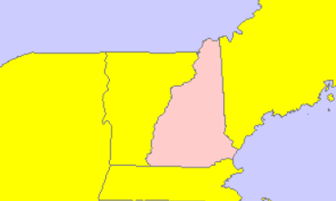
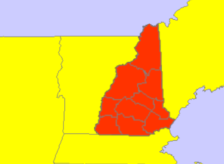
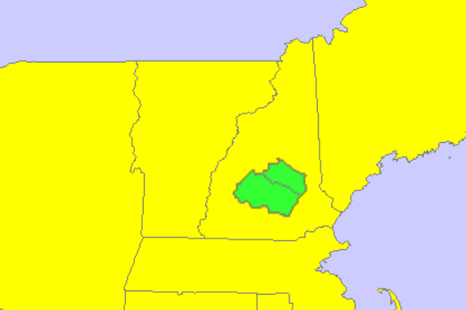
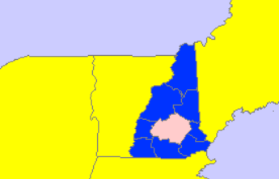
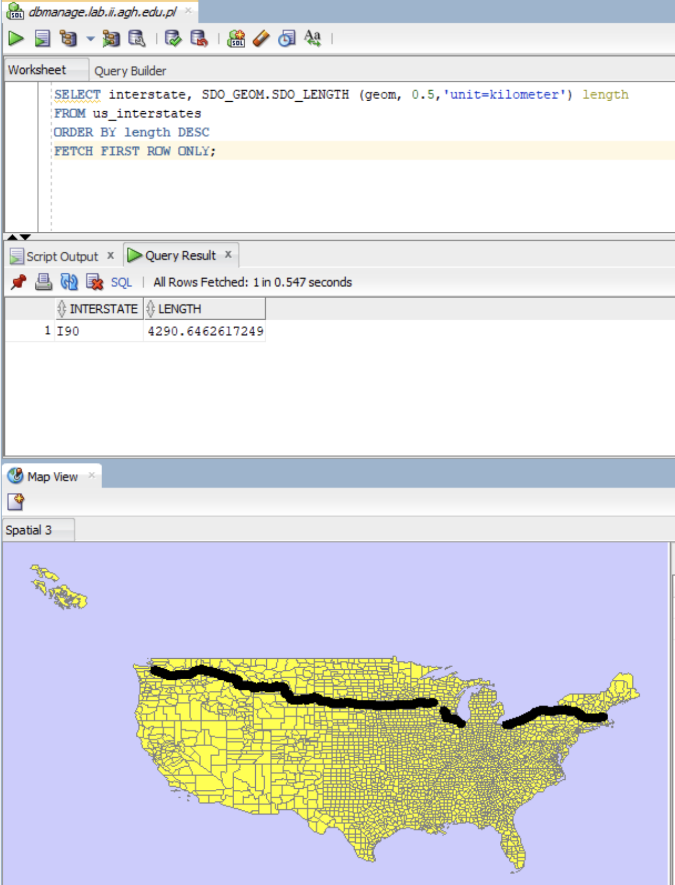
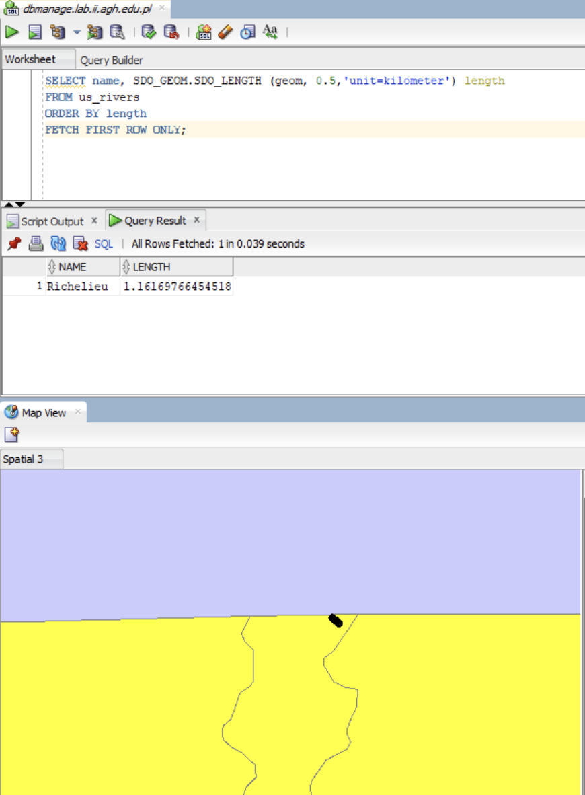
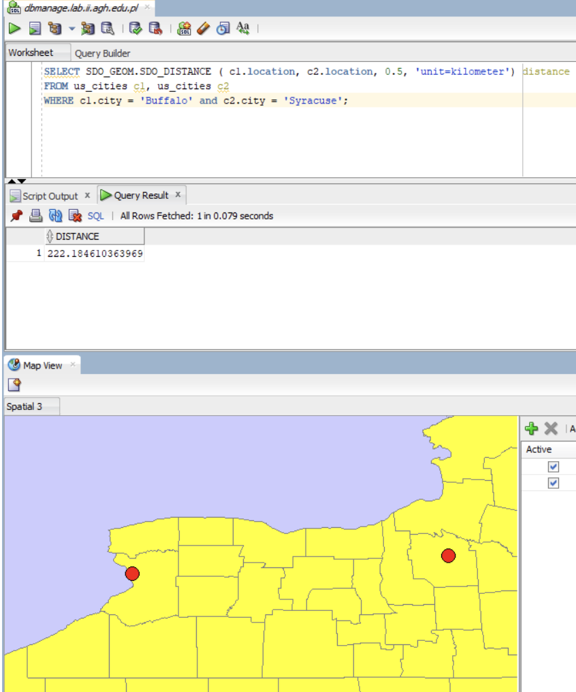
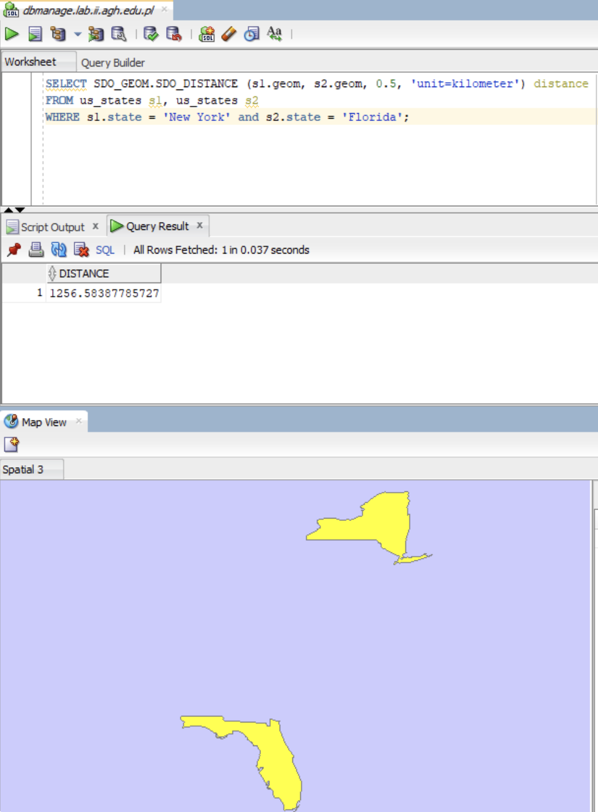

# Raport

# Przetwarzanie i analiza danych przestrzennych 
# Oracle spatial


---

**Imiona i nazwiska:**

--- 

Celem ćwiczenia jest zapoznanie się ze sposobem przechowywania, przetwarzania i analizy danych przestrzennych w bazach danych
(na przykładzie systemu Oracle spatial)

Swoje odpowiedzi wpisuj w miejsca oznaczone jako:

---
> Wyniki, zrzut ekranu, komentarz

```sql
--  ...
```

---

Do wykonania ćwiczenia (zadania 1 – 7) i wizualizacji danych wykorzystaj Oracle SQL Develper. Alternatywnie możesz wykonać analizy w środowisku Python/Jupyter Notebook

Do wykonania zadania 8 wykorzystaj środowisko Python/Jupyter Notebook

Raport należy przesłać w formacie pdf.

Należy też dołączyć raport zawierający kod w formacie źródłowym.

Np.
- plik tekstowy .sql z kodem poleceń
- plik .md zawierający kod wersji tekstowej
- notebook programu jupyter – plik .ipynb

Zamieść kod rozwiązania oraz zrzuty ekranu pokazujące wyniki, (dołącz kod rozwiązania w formie tekstowej/źródłowej)

Zwróć uwagę na formatowanie kodu

<div style="page-break-after: always;"></div>

# Zadanie 1

Zwizualizuj przykładowe dane

US_STATES


> Wyniki, zrzut ekranu, komentarz

```sql
select * from world_countries;
select * from us_states;
```


US_INTERSTATES


> Wyniki, zrzut ekranu, komentarz

```sql
select * from us_states;
select * from us_interstates;
```

Widzimy, że narzędzie nie wyświetla dróg poprawnie. Szybkie przybliżenie i oddalenie wizualizacji przy pomocy myszy odświeża obraz i artefakty znikają.


US_CITIES


> Wyniki, zrzut ekranu, komentarz

```sql
select * from us_states;
select * from us_cities;
```

Można zauważyć, że markery są bardzo duże. Niestety próby zmiany parametru `Marker width` nie wpływają na rozmiar widocznych markerów.


`Marker fill color` oraz `Marker border color` działają poprawnie.


US_RIVERS


> Wyniki, zrzut ekranu, komentarz

```sql
select * from us_states;
select * from us_rivers;
```


Możemy zaobserwować, że jeziora na północnym wschodzie są oznaczone na czarno mimo, że nie są rzekami. Są to linie w których jeziora te stykają się z granicą Kanady.


US_COUNTIES


> Wyniki, zrzut ekranu, komentarz

```sql
select * from us_states;
select * from us_counties;
```


US_PARKS


> Wyniki, zrzut ekranu, komentarz

```sql
select * from us_states;
select * from us_parks
where id < 50;
```


Przez ograniczenie wartości ID do mniejszych niż 50, esteśmy w stanie zaobserwować głównie parki w stanie Alabama. Domyślnie narzędzie ustawia ich kolor jako żółty, stają się one lepiej widoczne po zmianie koloru.


Parki nie są jednak dobrze widoczne na skali całego kraju. 

Możemy sprwadzić w tabeli nazwę parku Yellowstone i w ten sposób stworzyć zapytanie, które pozwoli wyświetlić go na mapie

```sql
select * from us_parks
order by NAME;
```

ID Yellowstone to 5348


```sql
select * from us_states;
select * from us_parks
where ID = 5348;
```


# Zadanie 2

Znajdź wszystkie stany (us_states) których obszary mają część wspólną ze wskazaną geometrią (prostokątem)

Pokaż wynik na mapie.

prostokąt

```sql
SELECT  sdo_geometry (2003, 8307, null,
        sdo_elem_info_array (1,1003,3),
        sdo_ordinate_array ( -117.0, 40.0, -90., 44.0)) g
FROM dual
```

> Wyniki, zrzut ekranu, komentarz

> Wyświetlenie geometrii razem z wynikiem:


> Jest to zwykły prostokat.

Użyj funkcji SDO_FILTER

```sql
SELECT state, geom FROM us_states
WHERE sdo_filter (geom,
    sdo_geometry (2003, 8307, null,
    sdo_elem_info_array (1,1003,3),
    sdo_ordinate_array ( -117.0, 40.0, -90., 44.0))
) = 'TRUE';
```

Zwróć uwagę na liczbę zwróconych wierszy (16)

> Wyniki, zrzut ekranu, komentarz


> Wyswietlenie geometrii z sdo_filter razem z wczesniejsza oraz z wynikiem:


> Mozemy zauwazyc, ze rzeczywiscie zostalo zwrocone 16 wierszy. 2 stany zostały błędnie zakwalifikowane jako pokrywające się z prostokątem. Dokumentacja wskazuje, że funkcja SDO_FILTER, w przeciwieństwie do SDO_ANYINTERACT, służy do szybkiego filtrowania danych, a nie do dokładnego sprawdzania pokrywania się geometrii.

Użyj funkcji  SDO_ANYINTERACT

```sql
SELECT state, geom FROM us_states
WHERE sdo_anyinteract (geom,
    sdo_geometry (2003, 8307, null,
    sdo_elem_info_array (1,1003,3),
    sdo_ordinate_array ( -117.0, 40.0, -90., 44.0))
) = 'TRUE';
```

Porównaj wyniki sdo_filter i sdo_anyinteract

Pokaż wynik na mapie

> Wyniki, zrzut ekranu, komentarz


> Wyswietlenie geometrii otrzymanej z sdo_anyinteract razem z wczesniejszymi oraz z wynikiem:


> Zapytanie to zwróciło 14 stanów, co jest poprawna liczbą.

> Porownanie wynikow obu zapytań, sdo_filter na zolto i sdo_anyinteract na czerwono: 


**Analiza wynikow:**
 - Zapytanie z użyciem sdo_filter zwróciło 16 wierszy, co jest o 2 więcej niż w przypadku zapytania z użyciem sdo_anyinteract
 - W obu wynikach zapytań pokrywa się 14 stanów.
 - Patrząc na mapę wyświetloną w Oracle SQL Developer, wydaje się, że 2 dodatkowe stany zwrócone przez sdo_filter nie mają punktów wspólnych z geometrią (prostokątem).
 - Różnica ta wynika z tego, że funkcja sdo_filter korzysta z **Minimum Bounding Rectangle (MBR)**, czyli wyznacza najmniejszy prostokąt, w który można wpisać daną figurę niebędącą prostokątem, i dopiero na tych prostokątach sprawdza, czy się przecinają. Zaletą tego podejścia jest prostsze i mniej kosztowne obliczanie (szczególnie dla skomplikowanych kształtów), dlatego jest stosowane do wstępnego filtrowania danych. Wadą jest zwracanie fałszywie pozytywnych wyników, tak jak w naszym przypadku z dwoma dodatkowymi stanami.

# Zadanie 3

Znajdź wszystkie parki (us_parks) których obszary znajdują się wewnątrz stanu Wyoming

Użyj funkcji SDO_INSIDE

```sql
SELECT p.name, p.geom
FROM us_parks p,
     us_states s
WHERE s.state = 'Wyoming'
     AND SDO_INSIDE (p.geom, s.geom ) = 'TRUE';
```

W przypadku wykorzystywania narzędzia SQL Developer, w celu wizualizacji na mapie użyj podzapytania

```sql
SELECT pp.name, pp.geom  FROM us_parks pp
WHERE id IN
(
    SELECT p.id
    FROM us_parks p, us_states s
    WHERE s.state = 'Wyoming'
    and SDO_INSIDE (p.geom, s.geom ) = 'TRUE'
)
```

> Wyniki, zrzut ekranu, komentarz

Same parki z podzapytania nie dają nam dużo informacji.


Wyświetlmy je na mapie USA.

```sql
select * from us_states;
```


Dodajmy stan Wyoming i zaznaczmy go innym kolorem w celu rozróżnienia.

```sql
SELECT state, geom FROM us_states
WHERE state = 'Wyoming'
```

> Wyniki, zrzut ekranu, komentarz


Porównaj wynik z:

```sql
SELECT p.name, p.geom
FROM us_parks p, us_states s
WHERE s.state = 'Wyoming'
AND SDO_ANYINTERACT (p.geom, s.geom ) = 'TRUE';
```

W celu wizualizacji użyj podzapytania

> Wyniki, zrzut ekranu, komentarz

Podzapytanie umożliwiające wizualizację:

```sql
SELECT pp.name, pp.geom FROM us_parks pp
WHERE id IN
(
    SELECT p.id
    FROM us_parks p, us_states s
    WHERE s.state = 'Wyoming'
    AND SDO_ANYINTERACT (p.geom, s.geom ) = 'TRUE'
)
```

Widzimy, dużo więcej parków. Na przykład widoczny park Yellowstone wcześniej nie był widoczny na mapie. Można wyciągnąć wniosek, że funkcja `SDO_INSIDE` pozwala na wyodrębnienie tylko tych elementów geometrycznych, które w całości znajdują się wewnątrz wybranego obszaru i nie dotykają jego granic. Za to `SDO_ANYINTERACT` wyodrębnia też obszary częściowo nachodzące na wybrany oraz te przyległe do niego.


# Zadanie 4

Znajdź wszystkie jednostki administracyjne (us_counties) wewnątrz stanu New Hampshire

```sql
SELECT c.county, c.state_abrv, c.geom
FROM us_counties c, us_states s
WHERE s.state = 'New Hampshire'
AND SDO_RELATE ( c.geom,s.geom, 'mask=INSIDE+COVEREDBY') = 'TRUE';

SELECT c.county, c.state_abrv, c.geom
FROM us_counties c, us_states s
WHERE s.state = 'New Hampshire'
AND SDO_RELATE ( c.geom,s.geom, 'mask=INSIDE') = 'TRUE';

SELECT c.county, c.state_abrv, c.geom
FROM us_counties c, us_states s
WHERE s.state = 'New Hampshire'
AND SDO_RELATE ( c.geom,s.geom, 'mask=COVEREDBY') = 'TRUE';
```

W przypadku wykorzystywania narzędzia SQL Developer, w celu wizualizacji danych na mapie należy użyć podzapytania (podobnie jak w poprzednim zadaniu)

> Wyniki, zrzut ekranu, komentarz

Mapa z fragmentem na którym widać New Hampshire.

```sql
Select * from us_states
WHERE state = 'New Hampshire';
```




Zobaczmy jak wygląda wynik pierwszego zapytania - z maską `INSIDE+COVEREDBY`

```sql
SELECT cc.county, cc.state_abrv, cc.geom FROM us_counties cc
WHERE id IN
(
    SELECT c.id
    FROM us_counties c, us_states s
    WHERE s.state = 'New Hampshire'
    AND SDO_RELATE ( c.geom,s.geom, 'mask=INSIDE+COVEREDBY') = 'TRUE'
);
```

Widzimy, że cały stan jest pokryty fragmentami - hrabstwami. 



Sprwadźmy drugie zapytanie - maskę `INSIDE`.

```sql
SELECT cc.county, cc.state_abrv, cc.geom FROM us_counties cc
WHERE id IN
(
    SELECT c.id
    FROM us_counties c, us_states s
    WHERE s.state = 'New Hampshire'
    AND SDO_RELATE ( c.geom,s.geom, 'mask=INSIDE') = 'TRUE'
);
```

`INSIDE` powoduje wybranie tylko tych hrabstw które w całości znajdują się w stanie.



Trzecie zapytanie - maska `COVEREDBY`

```sql
SELECT cc.county, cc.state_abrv, cc.geom FROM us_counties cc
WHERE id IN
(
    SELECT c.id
    FROM us_counties c, us_states s
    WHERE s.state = 'New Hampshire'
    AND SDO_RELATE ( c.geom,s.geom, 'mask=COVEREDBY') = 'TRUE'
);
```

Widzimy, że tylko te hrabstwa które stykają się z granicą stanu zostają wybrane



Z obserwacji można wyciągnąć wnioski o masce `COVEREDBY` - nie uwzględnia ona elementów całkowicie zawartych wewnątrz stanu New Hampshire. Oznacza to, że żeby coś zostało przez nią uwzględnione musi mieć część wspólną z obszarem na zewnątrz stanu. W tym przypadku tą częścią wspólną jest granica.


# Zadanie 5

Znajdź wszystkie miasta w odległości 50 mili od drogi (us_interstates) I4

Pokaż wyniki na mapie

```sql
SELECT * FROM us_interstates
WHERE interstate = 'I4'

SELECT * FROM us_states
WHERE state_abrv = 'FL'

SELECT c.city, c.state_abrv, c.location 
FROM us_cities c
WHERE ROWID IN 
( 
SELECT c.rowid
FROM us_interstates i, us_cities c 
WHERE i.interstate = 'I4'
AND sdo_within_distance (c.location, i.geom,'distance=50 unit=mile'
)
```


> Wyniki, zrzut ekranu, komentarz

```sql
--  ...
```


Dodatkowo:

a)     Znajdz wszystkie jednostki administracyjne przez które przechodzi droga I4

b)    Znajdz wszystkie jednostki administracyjne w pewnej odległości od I4

c)     Znajdz rzeki które przecina droga I4

d)    Znajdz wszystkie drogi które przecinają rzekę Mississippi

e)    Znajdz wszystkie miasta w odlegości od 15 do 30 mil od drogi 'I275'

f)      Itp. (własne przykłady)


> Wyniki, zrzut ekranu, komentarz
> (dla każdego z podpunktów)

```sql
--  ...
```

# Zadanie 6

Znajdz 5 miast najbliższych drogi I4

```sql
SELECT c.city, c.state_abrv, c.location
FROM us_interstates i, us_cities c 
WHERE i.interstate = 'I4'
AND sdo_nn(c.location, i.geom, 'sdo_num_res=5') = 'TRUE';
```

>Wyniki, zrzut ekranu, komentarz

```sql
--  ...
```


Dodatkowo:

a)     Znajdz kilka miast najbliższych rzece Mississippi

b)    Znajdz 3 miasta najbliżej Nowego Jorku

c)     Znajdz kilka jednostek administracyjnych (us_counties) z których jest najbliżej do Nowego Jorku

d)    Znajdz 5 najbliższych miast od drogi  'I170', podaj odległość do tych miast

e)    Znajdz 5 najbliższych dużych miast (o populacji powyżej 300 tys) od drogi  'I170'

f)      Itp. (własne przykłady)


> Wyniki, zrzut ekranu, komentarz
> (dla każdego z podpunktów)

```sql
--  ...
```


# Zadanie 7

Oblicz długość drogi I4

```sql
SELECT SDO_GEOM.SDO_LENGTH (geom, 0.5,'unit=kilometer') length
FROM us_interstates
WHERE interstate = 'I4';
```


>Wyniki, zrzut ekranu, komentarz


Dodatkowo:

a)     Oblicz długość rzeki Mississippi

```sql
SELECT SDO_GEOM.SDO_LENGTH (geom, 0.5,'unit=kilometer') length
FROM us_rivers
WHERE name = 'Mississippi';
```


> Długość rzeki Mississippi to 3860 km.

b)    Która droga jest najdłuższa/najkrótsza
 - droga najdłuższa

```sql
SELECT interstate, SDO_GEOM.SDO_LENGTH (geom, 0.5,'unit=kilometer') length
FROM us_interstates
ORDER BY length DESC
FETCH FIRST ROW ONLY;
```



> Najdłuższa droga ma 4290.64 km.

 - droga najkrótsza

```sql
SELECT interstate, SDO_GEOM.SDO_LENGTH (geom, 0.5,'unit=kilometer') length
FROM us_interstates
ORDER BY length
FETCH FIRST ROW ONLY;
```


> Najkrótsza droga ma 0.46 km.

c)     Która rzeka jest najdłuższa/najkrótsza

 - rzeka najdłuższa

```sql
SELECT name, SDO_GEOM.SDO_LENGTH (geom, 0.5,'unit=kilometer') length
FROM us_rivers
ORDER BY length DESC
FETCH FIRST ROW ONLY;
```


> Najdłuższa rzeka ma długość 6950.91 km.

 - rzeka najkrótsza

```sql
SELECT name, SDO_GEOM.SDO_LENGTH (geom, 0.5,'unit=kilometer') length
FROM us_rivers
ORDER BY length
FETCH FIRST ROW ONLY;
```



> Najkrótsza rzeka ma długość 1.16 km.

d)    Które stany mają najdłuższą granicę

```sql
SELECT
    state,
    SDO_GEOM.SDO_LENGTH(geom, 0.5, 'unit=kilometer') AS border_length
FROM
    us_states
ORDER BY
    border_length DESC
FETCH FIRST 5 ROWS ONLY
```


> Mozemy zauwazyc, ze 3 stany, które posiadaja najdluzsze granice to:
> - Alaska
> - Texas
> - California 

e)    Itp. (własne przykłady)

# TODO

> Wyniki, zrzut ekranu, komentarz
> (dla każdego z podpunktów)

```sql
--  ...
```

Oblicz odległość między miastami Buffalo i Syracuse

```sql
SELECT SDO_GEOM.SDO_DISTANCE ( c1.location, c2.location, 0.5) distance
FROM us_cities c1, us_cities c2
WHERE c1.city = 'Buffalo' and c2.city = 'Syracuse';
```

> Wyniki, zrzut ekranu, komentarz



> Odległość między miastami Buffalo i Syracuse wynosi 222.18 km.

Dodatkowo:

a)     Oblicz odległość między miastem Tampa a drogą I4

```sql
SELECT SDO_GEOM.SDO_DISTANCE ( c1.location, i.geom, 0.5, 'unit=kilometer') distance
FROM us_cities c1, us_interstates i
WHERE c1.city = 'Tampa' and i.interstate = 'I4';
```


> Odleglosc miedzy miastem Tampa a drogą I4 to 3.10 km.

b)    Jaka jest odległość między stanem Nowy Jork a  Florydą

```sql
SELECT SDO_GEOM.SDO_DISTANCE (s1.geom, s2.geom, 0.5, 'unit=kilometer') distance
FROM us_states s1, us_states s2
WHERE s1.state = 'New York' and s2.state = 'Florida';
```



> Odległość między stanem Nowy Jork a Florydą wynosi 1256.58 km.

c)     Jaka jest odległość między miastem Nowy Jork a Florydą

```sql
SELECT SDO_GEOM.SDO_DISTANCE (c1.location, s2.geom, 0.5, 'unit=kilometer') distance
FROM us_cities c1, us_states s2
WHERE c1.city = 'New York' and s2.state = 'Florida';
```


> Odległość między miastem Nowy Jork a Florydą to 1296.59 km.

d)    Podaj 3 parki narodowe do których jest najbliżej z Nowego Jorku, oblicz odległości do tych parków

```sql
SELECT p.name,
    SDO_GEOM.SDO_DISTANCE(c.location, p.geom, 0.5, 'unit=mile') AS distance
FROM us_parks p,
     us_cities c
WHERE c.city = 'New York'
AND SDO_NN(p.geom, c.location, 'sdo_num_res=3') = 'TRUE'
ORDER BY distance
```


> Trzy najbliższe parki to Institute Park, Prospect Park oraz Thompkins Park.

e)    Przetestuj działanie funkcji

    a.     sdo_intersection, sdo_union, sdo_difference

    b.     sdo_buffer

    c.     sdo_centroid, sdo_mbr, sdo_convexhull, sdo_simplify

# TODO

f)      Itp. (własne przykłady)

> Wyniki, zrzut ekranu, komentarz (dla każdego z podpunktów)

```sql
--  ...
```

# TODO


Zadanie 8

Wykonaj kilka własnych przykładów/analiz


>Wyniki, zrzut ekranu, komentarz

```sql
--  ...
```

Punktacja

|   |   |
|---|---|
|zad|pkt|
|1|0,5|
|2|1|
|3|1|
|4|1|
|5|3|
|6|3|
|7|6|
|8|4|
|razem|20|
