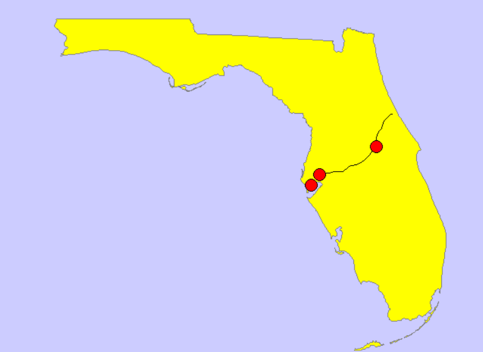
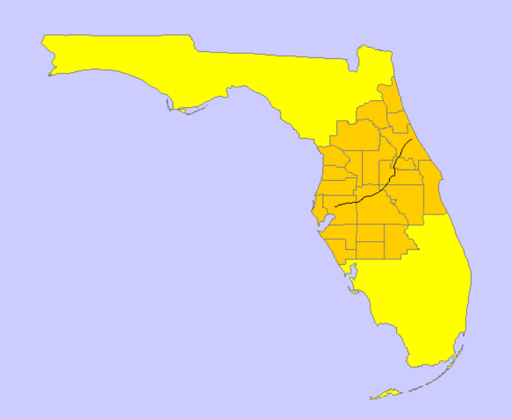
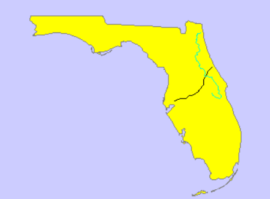
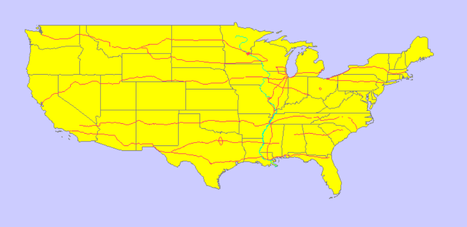
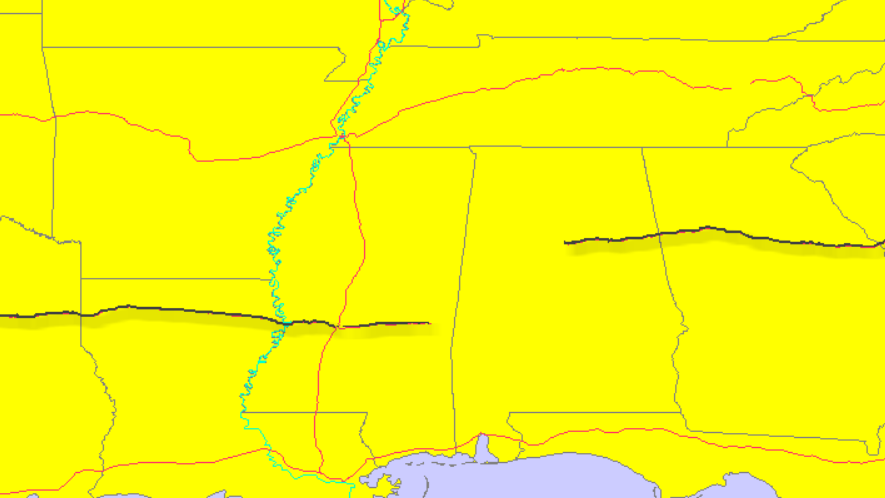
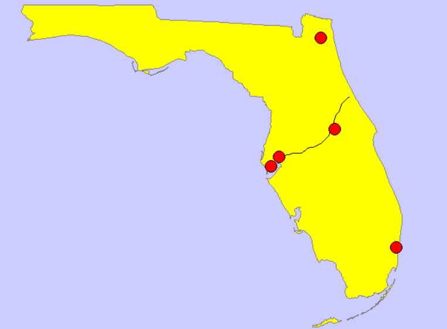
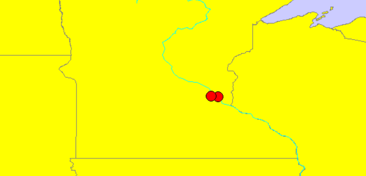
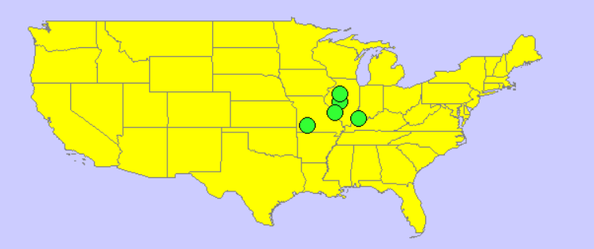
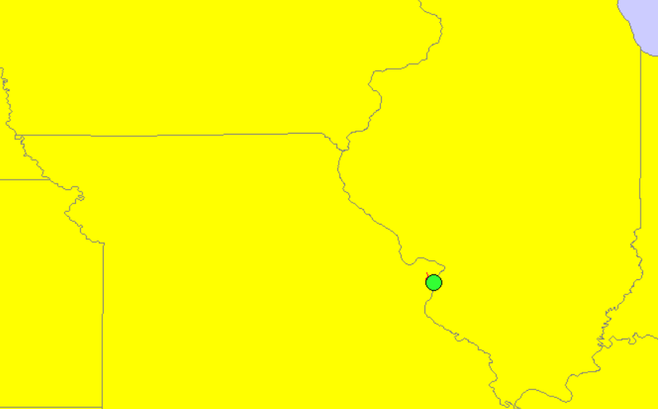

# Raport

# Przetwarzanie i analiza danych przestrzennych 
# Oracle spatial


---

**Imiona i nazwiska:**

--- 

Celem ćwiczenia jest zapoznanie się ze sposobem przechowywania, przetwarzania i analizy danych przestrzennych w bazach danych
(na przykładzie systemu Oracle spatial)

Swoje odpowiedzi wpisuj w miejsca oznaczone jako:

---
> Wyniki, zrzut ekranu, komentarz

```sql
--  ...
```

---

Do wykonania ćwiczenia (zadania 1 – 7) i wizualizacji danych wykorzystaj Oracle SQL Develper. Alternatywnie możesz wykonać analizy w środowisku Python/Jupyter Notebook

Do wykonania zadania 8 wykorzystaj środowisko Python/Jupyter Notebook

Raport należy przesłać w formacie pdf.

Należy też dołączyć raport zawierający kod w formacie źródłowym.

Np.
- plik tekstowy .sql z kodem poleceń
- plik .md zawierający kod wersji tekstowej
- notebook programu jupyter – plik .ipynb

Zamieść kod rozwiązania oraz zrzuty ekranu pokazujące wyniki, (dołącz kod rozwiązania w formie tekstowej/źródłowej)

Zwróć uwagę na formatowanie kodu

<div style="page-break-after: always;"></div>

# Zadanie 1

Zwizualizuj przykładowe dane

US_STATES


> Wyniki, zrzut ekranu, komentarz

```sql
select * from world_countries;
select * from us_states;
```


US_INTERSTATES


> Wyniki, zrzut ekranu, komentarz

```sql
select * from us_states;
select * from us_interstates;
```

Widzimy, że narzędzie nie wyświetla dróg poprawnie. Szybkie przybliżenie i oddalenie wizualizacji przy pomocy myszy odświeża obraz i artefakty znikają.


US_CITIES


> Wyniki, zrzut ekranu, komentarz

```sql
select * from us_states;
select * from us_cities;
```

Można zauważyć, że markery są bardzo duże. Niestety próby zmiany parametru `Marker width` nie wpływają na rozmiar widocznych markerów.


`Marker fill color` oraz `Marker border color` działają poprawnie.


US_RIVERS


> Wyniki, zrzut ekranu, komentarz

```sql
select * from us_states;
select * from us_rivers;
```


Możemy zaobserwować, że jeziora na północnym wschodzie są oznaczone na czarno mimo, że nie są rzekami. Są to linie w których jeziora te stykają się z granicą Kanady.


US_COUNTIES


> Wyniki, zrzut ekranu, komentarz

```sql
select * from us_states;
select * from us_counties;
```


US_PARKS


> Wyniki, zrzut ekranu, komentarz

```sql
select * from us_states;
select * from us_parks
where id < 50;
```


Przez ograniczenie wartości ID do mniejszych niż 50, esteśmy w stanie zaobserwować głównie parki w stanie Alabama. Domyślnie narzędzie ustawia ich kolor jako żółty, stają się one lepiej widoczne po zmianie koloru.


Parki nie są jednak dobrze widoczne na skali całego kraju. 

Możemy sprwadzić w tabeli nazwę parku Yellowstone i w ten sposób stworzyć zapytanie, które pozwoli wyświetlić go na mapie

```sql
select * from us_parks
order by NAME;
```

ID Yellowstone to 5348


```sql
select * from us_states;
select * from us_parks
where ID = 5348;
```


# Zadanie 2

Znajdź wszystkie stany (us_states) których obszary mają część wspólną ze wskazaną geometrią (prostokątem)

Pokaż wynik na mapie.

prostokąt

```sql
SELECT  sdo_geometry (2003, 8307, null,
        sdo_elem_info_array (1,1003,3),
        sdo_ordinate_array ( -117.0, 40.0, -90., 44.0)) g
FROM dual
```

> Wyniki, zrzut ekranu, komentarz

> Wyświetlenie geometrii razem z wynikiem:


> Jest to zwykły prostokat.

Użyj funkcji SDO_FILTER

```sql
SELECT state, geom FROM us_states
WHERE sdo_filter (geom,
    sdo_geometry (2003, 8307, null,
    sdo_elem_info_array (1,1003,3),
    sdo_ordinate_array ( -117.0, 40.0, -90., 44.0))
) = 'TRUE';
```

Zwróć uwagę na liczbę zwróconych wierszy (16)

> Wyniki, zrzut ekranu, komentarz


> Wyswietlenie geometrii z sdo_filter razem z wczesniejsza oraz z wynikiem:


> Mozemy zauwazyc, ze rzeczywiscie zostalo zwrocone 16 wierszy. 2 stany zostały błędnie zakwalifikowane jako pokrywające się z prostokątem. Dokumentacja wskazuje, że funkcja SDO_FILTER, w przeciwieństwie do SDO_ANYINTERACT, służy do szybkiego filtrowania danych, a nie do dokładnego sprawdzania pokrywania się geometrii.

Użyj funkcji  SDO_ANYINTERACT

```sql
SELECT state, geom FROM us_states
WHERE sdo_anyinteract (geom,
    sdo_geometry (2003, 8307, null,
    sdo_elem_info_array (1,1003,3),
    sdo_ordinate_array ( -117.0, 40.0, -90., 44.0))
) = 'TRUE';
```

Porównaj wyniki sdo_filter i sdo_anyinteract

Pokaż wynik na mapie

> Wyniki, zrzut ekranu, komentarz


> Wyswietlenie geometrii otrzymanej z sdo_anyinteract razem z wczesniejszymi oraz z wynikiem:


> Zapytanie to zwróciło 14 stanów, co jest poprawna liczbą.

> Porownanie wynikow obu zapytań, sdo_filter na zolto i sdo_anyinteract na czerwono: 


**Analiza wynikow:**
 - Zapytanie z użyciem sdo_filter zwróciło 16 wierszy, co jest o 2 więcej niż w przypadku zapytania z użyciem sdo_anyinteract
 - W obu wynikach zapytań pokrywa się 14 stanów.
 - Patrząc na mapę wyświetloną w Oracle SQL Developer, wydaje się, że 2 dodatkowe stany zwrócone przez sdo_filter nie mają punktów wspólnych z geometrią (prostokątem).
 - Różnica ta wynika z tego, że funkcja sdo_filter korzysta z **Minimum Bounding Rectangle (MBR)**, czyli wyznacza najmniejszy prostokąt, w który można wpisać daną figurę niebędącą prostokątem, i dopiero na tych prostokątach sprawdza, czy się przecinają. Zaletą tego podejścia jest prostsze i mniej kosztowne obliczanie (szczególnie dla skomplikowanych kształtów), dlatego jest stosowane do wstępnego filtrowania danych. Wadą jest zwracanie fałszywie pozytywnych wyników, tak jak w naszym przypadku z dwoma dodatkowymi stanami.

# Zadanie 3

Znajdź wszystkie parki (us_parks) których obszary znajdują się wewnątrz stanu Wyoming

Użyj funkcji SDO_INSIDE

```sql
SELECT p.name, p.geom
FROM us_parks p,
     us_states s
WHERE s.state = 'Wyoming'
     AND SDO_INSIDE (p.geom, s.geom ) = 'TRUE';
```

W przypadku wykorzystywania narzędzia SQL Developer, w celu wizualizacji na mapie użyj podzapytania

```sql
SELECT pp.name, pp.geom  FROM us_parks pp
WHERE id IN
(
    SELECT p.id
    FROM us_parks p, us_states s
    WHERE s.state = 'Wyoming'
    and SDO_INSIDE (p.geom, s.geom ) = 'TRUE'
)
```

> Wyniki, zrzut ekranu, komentarz

Same parki z podzapytania nie dają nam dużo informacji.


Wyświetlmy je na mapie USA.

```sql
select * from us_states;
```


Dodajmy stan Wyoming i zaznaczmy go innym kolorem w celu rozróżnienia.

```sql
SELECT state, geom FROM us_states
WHERE state = 'Wyoming'
```

> Wyniki, zrzut ekranu, komentarz


Porównaj wynik z:

```sql
SELECT p.name, p.geom
FROM us_parks p, us_states s
WHERE s.state = 'Wyoming'
AND SDO_ANYINTERACT (p.geom, s.geom ) = 'TRUE';
```

W celu wizualizacji użyj podzapytania

> Wyniki, zrzut ekranu, komentarz

Podzapytanie umożliwiające wizualizację:

```sql
SELECT pp.name, pp.geom FROM us_parks pp
WHERE id IN
(
    SELECT p.id
    FROM us_parks p, us_states s
    WHERE s.state = 'Wyoming'
    AND SDO_ANYINTERACT (p.geom, s.geom ) = 'TRUE'
)
```

Widzimy, dużo więcej parków. Na przykład widoczny park Yellowstone wcześniej nie był widoczny na mapie. Można wyciągnąć wniosek, że funkcja `SDO_INSIDE` pozwala na wyodrębnienie tylko tych elementów geometrycznych, które w całości znajdują się wewnątrz wybranego obszaru i nie dotykają jego granic. Za to `SDO_ANYINTERACT` wyodrębnia też obszary częściowo nachodzące na wybrany oraz te przyległe do niego.


# Zadanie 4

Znajdź wszystkie jednostki administracyjne (us_counties) wewnątrz stanu New Hampshire

```sql
SELECT c.county, c.state_abrv, c.geom
FROM us_counties c, us_states s
WHERE s.state = 'New Hampshire'
AND SDO_RELATE ( c.geom,s.geom, 'mask=INSIDE+COVEREDBY') = 'TRUE';

SELECT c.county, c.state_abrv, c.geom
FROM us_counties c, us_states s
WHERE s.state = 'New Hampshire'
AND SDO_RELATE ( c.geom,s.geom, 'mask=INSIDE') = 'TRUE';

SELECT c.county, c.state_abrv, c.geom
FROM us_counties c, us_states s
WHERE s.state = 'New Hampshire'
AND SDO_RELATE ( c.geom,s.geom, 'mask=COVEREDBY') = 'TRUE';
```

W przypadku wykorzystywania narzędzia SQL Developer, w celu wizualizacji danych na mapie należy użyć podzapytania (podobnie jak w poprzednim zadaniu)

> Wyniki, zrzut ekranu, komentarz

Mapa z fragmentem na którym widać New Hampshire.

```sql
Select * from us_states
WHERE state = 'New Hampshire';
```


Zobaczmy jak wygląda wynik pierwszego zapytania - z maską `INSIDE+COVEREDBY`

```sql
SELECT cc.county, cc.state_abrv, cc.geom FROM us_counties cc
WHERE id IN
(
    SELECT c.id
    FROM us_counties c, us_states s
    WHERE s.state = 'New Hampshire'
    AND SDO_RELATE ( c.geom,s.geom, 'mask=INSIDE+COVEREDBY') = 'TRUE'
);
```

Widzimy, że cały stan jest pokryty fragmentami - hrabstwami. 


Sprwadźmy drugie zapytanie - maskę `INSIDE`.

```sql
SELECT cc.county, cc.state_abrv, cc.geom FROM us_counties cc
WHERE id IN
(
    SELECT c.id
    FROM us_counties c, us_states s
    WHERE s.state = 'New Hampshire'
    AND SDO_RELATE ( c.geom,s.geom, 'mask=INSIDE') = 'TRUE'
);
```

`INSIDE` powoduje wybranie tylko tych hrabstw które w całości znajdują się w stanie.


Trzecie zapytanie - maska `COVEREDBY`

```sql
SELECT cc.county, cc.state_abrv, cc.geom FROM us_counties cc
WHERE id IN
(
    SELECT c.id
    FROM us_counties c, us_states s
    WHERE s.state = 'New Hampshire'
    AND SDO_RELATE ( c.geom,s.geom, 'mask=COVEREDBY') = 'TRUE'
);
```

Widzimy, że tylko te hrabstwa które stykają się z granicą stanu zostają wybrane


Z obserwacji można wyciągnąć wnioski o masce `COVEREDBY` - nie uwzględnia ona elementów całkowicie zawartych wewnątrz stanu New Hampshire. Oznacza to, że żeby coś zostało przez nią uwzględnione musi mieć część wspólną z obszarem na zewnątrz stanu. W tym przypadku tą częścią wspólną jest granica.


# Zadanie 5

Znajdź wszystkie miasta w odległości 50 mili od drogi (us_interstates) I4

Pokaż wyniki na mapie

```sql
SELECT * FROM us_interstates
WHERE interstate = 'I4'

SELECT * FROM us_states
WHERE state_abrv = 'FL'

SELECT c.city, c.state_abrv, c.location 
FROM us_cities c
WHERE ROWID IN 
( 
SELECT c.rowid
FROM us_interstates i, us_cities c 
WHERE i.interstate = 'I4'
AND sdo_within_distance (c.location, i.geom,'distance=50 unit=mile'
)
```


> Wyniki, zrzut ekranu, komentarz

Musieliśmy zmodyfikować ostatnie zapytanie:
```sql
SELECT c.city, c.state_abrv, c.location 
FROM us_cities c
WHERE ROWID IN(
SELECT c.rowid
FROM us_interstates i, us_cities c
WHERE i.interstate = 'I4'
 AND sdo_within_distance(c.location, i.geom, 'distance=50 unit=mile') = 'TRUE')
```
Na wizualizacji możemy zobaczyć wyraźnie drogę i trzy miasta w odpowiedniej odległości




Dodatkowo:

a)     Znajdz wszystkie jednostki administracyjne przez które przechodzi droga I4

W celu określienia wszystkich jednostek administracyjnych przez które przechodzi droga wystarczy zmniejszyć dystans do wartości 0.

```sql
SELECT c.county, c.geom
FROM us_counties c
WHERE c.state_abrv = 'FL' 
and c.id IN(
SELECT c.id
FROM us_interstates i, us_counties c
WHERE i.interstate = 'I4'
AND sdo_within_distance(c.geom, i.geom, 'distance=0 unit=mile') = 'TRUE'
)
```


b)    Znajdz wszystkie jednostki administracyjne w pewnej odległości od I4

```sql
SELECT c.county, c.geom
FROM us_counties c
WHERE c.state_abrv = 'FL' 
and c.id IN(
SELECT c.id
FROM us_interstates i, us_counties c
WHERE i.interstate = 'I4'
AND sdo_within_distance(c.geom, i.geom, 'distance=50 unit=mile') = 'TRUE'
)
```



c)     Znajdz rzeki które przecina droga I4

Możemy zastosować podejście z podpunktu a)

```SQL
SELECT r.name, r.geom
FROM us_rivers r
WHERE r.id IN(
SELECT r.id
FROM us_interstates i, us_rivers r
WHERE i.interstate = 'I4'
AND sdo_within_distance(r.geom, i.geom, 'distance=0 unit=mile') = 'TRUE'
)
```

St. Jones jest jedyną rzeką która przecina się z drogą I4



d)    Znajdz wszystkie drogi które przecinają rzekę Mississippi

W wyborze stanów do wizualizacji pomijamy Alaskę.

```sql
SELECT * FROM us_states
where state != 'Alaska';

SELECT * FROM us_rivers
WHERE name = 'Mississippi';

SELECT i.interstate, i.geom
FROM us_interstates i
WHERE i.id IN(
SELECT i.id
FROM us_interstates i, us_rivers r
WHERE r.name = 'Mississippi'
AND sdo_within_distance(r.geom, i.geom, 'distance=0 unit=mile') = 'TRUE'
);
```
Widzimy, że drogi które przecinają Mississippi rozciągają się na całą szerokość kraju.



Niektóre drogi wyglądają jakby nie przecinały się z rzeką, ale kiedy najedziemy myszą na taką drogę możemy zobaczyć, że jest to poprostu nieciągłość między jej odcinkami.



e)    Znajdz wszystkie miasta w odlegości od 15 do 30 mil od drogi 'I275'

Funkcji `sdo_within_distance` nie można użyć z opcją `'FALSE'` więc poprostu zaprzeczamy jej użycie z `'TRUE'`

```sql
SELECT c.city, c.state_abrv, c.location 
FROM us_cities c
WHERE ROWID IN(
SELECT c.rowid
FROM us_interstates i, us_cities c
WHERE i.interstate = 'I275'
 AND sdo_within_distance(c.location, i.geom, 'distance=30 unit=mile') = 'TRUE'
 AND not sdo_within_distance(c.location, i.geom, 'distance=15 unit=mile') = 'TRUE'
 )
```

Widzimy, że droga I275 ma więcej niż jeden fragment, ale tylko przy północnym możemy znaleźć miasta o zadanych odległościach


f)Sprawdźmy czy znajdziemy więcej miast dla podpunktu e) ustawiając inną odległość od drogi.

```sql
SELECT c.city, c.state_abrv, c.location 
FROM us_cities c
WHERE ROWID IN(
SELECT c.rowid
FROM us_interstates i, us_cities c
WHERE i.interstate = 'I275'
AND sdo_within_distance(c.location, i.geom, 'distance=60 unit=mile') = 'TRUE'
 )
```

Okazuje się, że na florydzie też jest fragment drogi I275


g) Wszystkie drogi które przechodzą przez stan Wyoming

```sql
select * from us_states
where state_abrv = 'WY';

SELECT i.interstate, i.geom
FROM us_interstates i
WHERE i.id IN(
SELECT i.id
FROM us_interstates i, us_states s
WHERE s.state_abrv = 'WY'
AND sdo_within_distance(s.geom, i.geom, 'distance=0 unit=mile') = 'TRUE'
);
```


# Zadanie 6

Znajdz 5 miast najbliższych drogi I4

```sql
SELECT c.city, c.state_abrv, c.location
FROM us_interstates i, us_cities c 
WHERE i.interstate = 'I4'
AND sdo_nn(c.location, i.geom, 'sdo_num_res=5') = 'TRUE';
```

>Wyniki, zrzut ekranu, komentarz

```sql
select * from us_states
where state_abrv = 'FL';

select * from us_interstates
where interstate = 'I4';

SELECT c.city, c.state_abrv, c.location
FROM us_cities c
WHERE c.id in (
select c.id
FROM us_interstates i, us_cities c 
WHERE i.interstate = 'I4'
AND sdo_nn(c.location, i.geom, 'sdo_num_res=5') = 'TRUE'
);
```



Dodatkowo:

a)    Znajdz kilka miast najbliższych rzece Mississippi

```sql
select * from us_states
where state_abrv != 'AK';

select * from us_rivers
where name = 'Mississippi';

SELECT c.city, c.state_abrv, c.location
FROM us_cities c
WHERE c.id in (
select c.id
FROM us_rivers r, us_cities c 
WHERE r.name = 'Mississippi'
AND sdo_nn(c.location, r.geom, 'sdo_num_res=5') = 'TRUE'
);
```

Na pierwszy rzut oka wygląda na to, że są tylko 4 miasta. Czy to błąd?


Nie! 2 z miast leżą poprostu blisko siebie



Znalezione miasta to St Paul, Memphis, St Louis, Minneapolis oraz Baton Rouge


b)    Znajdz 3 miasta najbliżej Nowego Jorku

Należy wyświetlić wszystkie stany - część z najbliższych miast znajduje się już poza 

```sql
select * from us_states
where state_abrv != 'AK';

select * from us_cities
where city = 'New York';

SELECT c.city, c.state_abrv, c.location
FROM us_cities c
WHERE c.id in (
select c2.id
FROM us_cities c, 
(select * from us_cities
where city != 'New York') c2 
WHERE c.city = 'New York'
AND sdo_nn(c.location, c2.location, 'sdo_num_res=5') = 'TRUE'
);
```

Nowy Jork zaznaczyliśmy innym kolorem dla lepszego rozróżnienia


c)    Znajdz kilka jednostek administracyjnych (us_counties) z których jest najbliżej do Nowego Jorku

```sql
select * from us_states
where state_abrv != 'AK';

select * from us_cities
where city = 'New York';

SELECT cn.county, cn.geom
FROM us_counties cn
WHERE cn.id in (
select cn.id
FROM us_counties cn, 
us_cities c 
WHERE c.city = 'New York'
AND sdo_nn(cn.geom, c.location, 'sdo_num_res=5') = 'TRUE'
);
```

Oczywiście jednostka administracyjna Nowy Jork jest najbliżej miasta Nowy Jork


d)    Znajdz 5 najbliższych miast od drogi 'I170', podaj odległość do tych miast


```sql
select * from us_states
where state_abrv != 'AK';

select * from us_interstates
where interstate = 'I170';

SELECT c.city, c.location
FROM us_cities c
WHERE c.id in (
select c.id 
FROM us_interstates i, us_cities c 
WHERE i.interstate = 'I170'
AND sdo_nn(c.location, i.geom, 'sdo_num_res=5') = 'TRUE'
);

SELECT c.city, c.location, 
       SDO_GEOM.SDO_DISTANCE(c.location, i.geom, 0.005,'unit=MILE') AS distance
FROM us_cities c, us_interstates i
WHERE c.id IN (
    SELECT c.id
    FROM us_interstates i, us_cities c
    WHERE i.interstate = 'I170'
    AND SDO_NN(c.location, i.geom, 'sdo_num_res=5') = 'TRUE'
)
AND i.interstate = 'I170';
)
```

znalezione odległości dla miast to:


| city        | distance in miles |
|-------------|-------------------|
| Evansvillee | 158.224219737852  |
| Peoria      | 78.7997463714433  |
| Springfield | 78.7997463714433  |
| St Louis    | 5.36297295124004  |
| Springfield | 188.508631077882  |

Znaleźliśmy dwa miasta o nazwie Springfield!



Z początku nie widzieliśmy drogi, jednak po zbliżeniu udało się zobaczyć jej krótki fragment


e)    Znajdz 5 najbliższych dużych miast (o populacji powyżej 300 tys) od drogi 'I170'

```sql
select * from us_states
where state_abrv != 'AK';

select * from us_interstates
where interstate = 'I170';

SELECT c2.city, c2.location
FROM us_cities c2
WHERE c2.id in (
SELECT c.id 
FROM (select * from us_cities where pop90 > 300000) c, us_interstates i
WHERE i.interstate = 'I170'
AND SDO_NN(c.location, i.geom, 'sdo_num_res=5') = 'TRUE'
);
```

Rozwiązanie nie jest w pełni poprawne. Wygląda na to, że pomimo specyfikowania nowej tabeli c przy pomocy podzapytania `SDO_NN` dalej operuje wyłącznie na tabeli `us_cities` zamiast na efekcie podzapytania. Zwracane jest tylko jedno miasto z 5 najbliższych miast - St Louis - jedyne które spełnia warunek o populacji. Zamiast 5 najbliższych spełniających warunek. 



f)      Itp. (własne przykłady)


> Wyniki, zrzut ekranu, komentarz
> (dla każdego z podpunktów)

```sql
--  ...
```


# Zadanie 7

Oblicz długość drogi I4

```sql
SELECT SDO_GEOM.SDO_LENGTH (geom, 0.5,'unit=kilometer') length
FROM us_interstates
WHERE interstate = 'I4';
```


>Wyniki, zrzut ekranu, komentarz

```sql
--  ...
```


Dodatkowo:

a)     Oblicz długość rzeki Mississippi

b)    Która droga jest najdłuższa/najkrótsza

c)     Która rzeka jest najdłuższa/najkrótsza

d)    Które stany mają najdłuższą granicę

e)    Itp. (własne przykłady)


> Wyniki, zrzut ekranu, komentarz
> (dla każdego z podpunktów)

```sql
--  ...
```

Oblicz odległość między miastami Buffalo i Syracuse

```sql
SELECT SDO_GEOM.SDO_DISTANCE ( c1.location, c2.location, 0.5) distance
FROM us_cities c1, us_cities c2
WHERE c1.city = 'Buffalo' and c2.city = 'Syracuse';
```


>Wyniki, zrzut ekranu, komentarz

```sql
--  ...
```

Dodatkowo:

a)     Oblicz odległość między miastem Tampa a drogą I4

b)    Jaka jest odległość z między stanem Nowy Jork a  Florydą

c)     Jaka jest odległość z między miastem Nowy Jork a  Florydą

d)    Podaj 3 parki narodowe do których jest najbliżej z Nowego Jorku, oblicz odległości do tych parków

e)    Przetestuj działanie funkcji

a.     sdo_intersection, sdo_union, sdo_difference

b.     sdo_buffer

c.     sdo_centroid, sdo_mbr, sdo_convexhull, sdo_simplify

f)      Itp. (własne przykłady)


> Wyniki, zrzut ekranu, komentarz
> (dla każdego z podpunktów)

```sql
--  ...
```


Zadanie 8

Wykonaj kilka własnych przykładów/analiz


>Wyniki, zrzut ekranu, komentarz

```sql
--  ...
```

Punktacja

|   |   |
|---|---|
|zad|pkt|
|1|0,5|
|2|1|
|3|1|
|4|1|
|5|3|
|6|3|
|7|6|
|8|4|
|razem|20|
