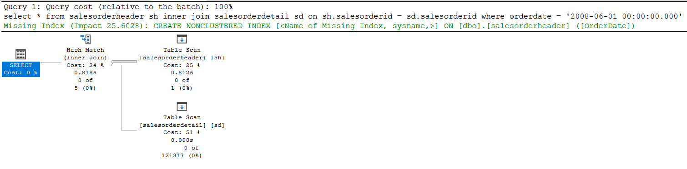
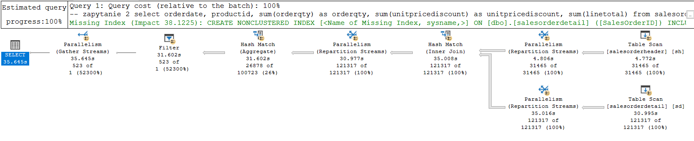
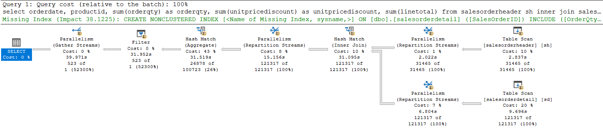
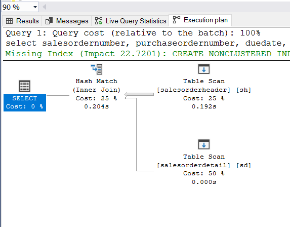
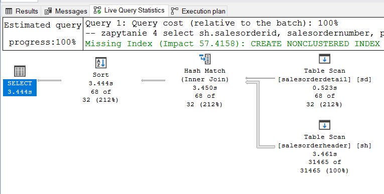
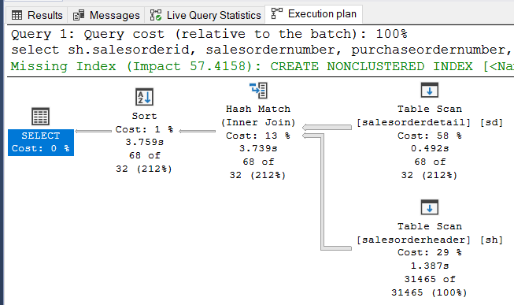
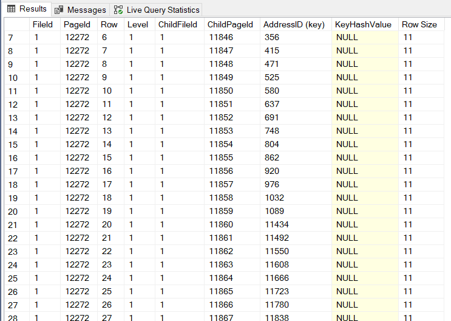
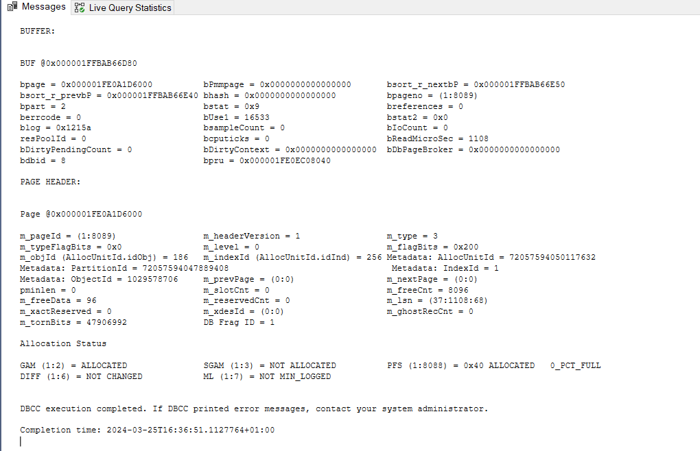

# Indeksy, optymalizator <br>Lab 4

<!-- <style scoped>
 p,li {
    font-size: 12pt;
  }
</style>  -->

<!-- <style scoped>
 pre {
    font-size: 8pt;
  }
</style>  -->

---

**Imię i nazwisko:**

- **Szymon Budziak**
- **Piotr Ludynia**

---

Celem ćwiczenia jest zapoznanie się z planami wykonania zapytań (execution plans), oraz z budową i możliwością wykorzystaniem indeksów.

Swoje odpowiedzi wpisuj w miejsca oznaczone jako:

---

> Wyniki:

```sql
--  ...
```

---

Ważne/wymagane są komentarze.

Zamieść kod rozwiązania oraz zrzuty ekranu pokazujące wyniki, (dołącz kod rozwiązania w formie tekstowej/źródłowej)

Zwróć uwagę na formatowanie kodu

## Oprogramowanie - co jest potrzebne?

Do wykonania ćwiczenia potrzebne jest następujące oprogramowanie

- MS SQL Server,
- SSMS - SQL Server Management Studio
- przykładowa baza danych AdventureWorks2017.

Oprogramowanie dostępne jest na przygotowanej maszynie wirtualnej

## Przygotowanie

Uruchom Microsoft SQL Managment Studio.

Stwórz swoją bazę danych o nazwie XYZ.

```sql
create database xyz
go

use xyz
go
```

Wykonaj poniższy skrypt, aby przygotować dane:

```sql
select * into [salesorderheader]
from [adventureworks2017].sales.[salesorderheader]
go

select * into [salesorderdetail]
from [adventureworks2017].sales.[salesorderdetail]
go
```

## Dokumentacja/Literatura

Celem tej części ćwiczenia jest zapoznanie się z planami wykonania zapytań (execution plans) oraz narzędziem do automatycznego generowania indeksów.

Przydatne materiały/dokumentacja. Proszę zapoznać się z dokumentacją:

- [https://docs.microsoft.com/en-us/sql/tools/dta/tutorial-database-engine-tuning-advisor](https://docs.microsoft.com/en-us/sql/tools/dta/tutorial-database-engine-tuning-advisor)
- [https://docs.microsoft.com/en-us/sql/relational-databases/performance/start-and-use-the-database-engine-tuning-advisor](https://docs.microsoft.com/en-us/sql/relational-databases/performance/start-and-use-the-database-engine-tuning-advisor)
- [https://www.simple-talk.com/sql/performance/index-selection-and-the-query-optimizer](https://www.simple-talk.com/sql/performance/index-selection-and-the-query-optimizer)

Ikonki używane w graficznej prezentacji planu zapytania opisane są tutaj:

- [https://docs.microsoft.com/en-us/sql/relational-databases/showplan-logical-and-physical-operators-reference](https://docs.microsoft.com/en-us/sql/relational-databases/showplan-logical-and-physical-operators-reference)

<div style="page-break-after: always;"></div>

# Zadanie 1 - Obserwacja

Wpisz do MSSQL Managment Studio (na razie nie wykonuj tych zapytań):

```sql
-- zapytanie 1
select *
from salesorderheader sh
inner join salesorderdetail sd on sh.salesorderid = sd.salesorderid
where orderdate = '2008-06-01 00:00:00.000'
go

-- zapytanie 2
select orderdate, productid, sum(orderqty) as orderqty,
       sum(unitpricediscount) as unitpricediscount, sum(linetotal)
from salesorderheader sh
inner join salesorderdetail sd on sh.salesorderid = sd.salesorderid
group by orderdate, productid
having sum(orderqty) >= 100
go

-- zapytanie 3
select salesordernumber, purchaseordernumber, duedate, shipdate
from salesorderheader sh
inner join salesorderdetail sd on sh.salesorderid = sd.salesorderid
where orderdate in ('2008-06-01','2008-06-02', '2008-06-03', '2008-06-04', '2008-06-05')
go

-- zapytanie 4
select sh.salesorderid, salesordernumber, purchaseordernumber, duedate, shipdate
from salesorderheader sh
inner join salesorderdetail sd on sh.salesorderid = sd.salesorderid
where carriertrackingnumber in ('ef67-4713-bd', '6c08-4c4c-b8')
order by sh.salesorderid
go
```

Włącz dwie opcje: **Include Actual Execution Plan** oraz **Include Live Query Statistics**:

<!-- ![[img/index1-1.png | 500]] -->


Teraz wykonaj poszczególne zapytania (najlepiej każde analizuj oddzielnie). Co można o nich powiedzieć? Co sprawdzają? Jak można je zoptymalizować?  
(Hint: aby wykonać tylko fragment kodu SQL znajdującego się w edytorze, zaznacz go i naciśnij F5)

---

> Wyniki:

### Zapytanie 1.

Zapytanie 1 nie zwraca żadnych wyników jednak po zakomentowaniu filtracji przez datę możemy zobaczyć wyniki.


Równoważny wynik możemy uzyskać używając zapytania następującej postaci

```sql
select sh.*, sd.*
from  salesorderdetail sd
inner join salesorderheader sh  on sh.salesorderid = sd.salesorderid
-- where orderdate = '2008-06-01 00:00:00.000'
go
```

Jednak plany wykonania obu zapytań również są równoważne więc nie uzyskujemy optymalizacji.



### Zapytanie 2.

Zapytanie drugie wydobywa datę zamówienia, id produktu, liczbę zamówionych produktów,zniżkę i zsumowaną wartość linetotal.
Zapytanie jest obsłużone z joinem który łączy je tabelą salesorderdetail by pogrupować zamówienia według daty oraz id produktu, a także by dostarczyć informacji o liczbie zamówionych jednostek.



Plan wykonania zapytania:



### Zapytanie 3.

Kolejne zapytanie również filtruje datę tak, że w wyniku nie dostajemy żadnych rekordów.

Ma bardzo prosty plan wykonania:


Po wykomentowaniu filtracji przez datę plan zmienia się jedynie nieznacznie.



Otrzymujemy natomiast wyniki. Zawierają one kolumny numeru sprzedaży oraz zakupu a także wymaganą i faktyczną datę dostarczenia.


### Zapytanie 4.

Zapytanie 4 jest podobne do 3. Różnice między nimi są takie, że 4 nie filtruje daty, a zamist tego wświetla rekordy które odpowiadają numerom śledzenia (carriertrackingnumber).
Kolejną różnicą jest sortowanie po nowym, pierwszym wierszu tabeli czyli id zamówienia.



Plan wykonania zapytania wygląda następująco



---

<div style="page-break-after: always;"></div>

# Zadanie 2 - Optymalizacja

Zaznacz wszystkie zapytania, i uruchom je w **Database Engine Tuning Advisor**:

<!-- ![[img/index1-12.png | 500]] -->


Sprawdź zakładkę **Tuning Options**, co tam można skonfigurować?

## 

> Wyniki: W zakładce tuning options możemy ustawić struktury PDS, strategię partycji i te struktury PDS któe mają być zachowane. Struktury fizyczne które są dostępne, to indeksy, ich widoki, indeksy bezklastrowe, filtrowane oraz typu columnstore.

---

Użyj **Start Analysis**:

<!-- ![[img/index1-3.png | 500]] -->


Zaobserwuj wyniki w **Recommendations**.


Przejdź do zakładki **Reports**. Sprawdź poszczególne raporty. Główną uwagę zwróć na koszty i ich poprawę:

<!-- ![[img/index4-1.png | 500]] -->


Zapisz poszczególne rekomendacje:


Zaproponowany przez SSMS skrypt wygląda następująco

```sql
use [xyz]
go


CREATE NONCLUSTERED INDEX [_dta_index_salesorderdetail_8_917578307__K1_2_3_4_5_6_7_8_9_10_11] ON [dbo].[salesorderdetail]
([SalesOrderID] ASC)
INCLUDE(
       [SalesOrderDetailID],
       [CarrierTrackingNumber],
       [OrderQty],
       [ProductID],
       [SpecialOfferID],
       [UnitPrice],
       [UnitPriceDiscount],
       [LineTotal],
       [rowguid],
       [ModifiedDate]) 
WITH (SORT_IN_TEMPDB = OFF, DROP_EXISTING = OFF, ONLINE = OFF) ON [PRIMARY]
go


CREATE NONCLUSTERED INDEX [_dta_index_salesorderdetail_8_917578307__K5_1_4_8_9] ON [dbo].[salesorderdetail]
([ProductID] ASC)
INCLUDE(
       [SalesOrderID],
       [OrderQty],
       [UnitPriceDiscount],
       [LineTotal]) 
WITH (SORT_IN_TEMPDB = OFF, DROP_EXISTING = OFF, ONLINE = OFF) ON [PRIMARY]
go


SET ANSI_PADDING ON
go


CREATE NONCLUSTERED INDEX [_dta_index_salesorderdetail_8_917578307__K3_K1] ON [dbo].[salesorderdetail]
([CarrierTrackingNumber] ASC, [SalesOrderID] ASC)
WITH (SORT_IN_TEMPDB = OFF, DROP_EXISTING = OFF, ONLINE = OFF) ON [PRIMARY]
go


CREATE NONCLUSTERED INDEX [_dta_index_salesorderdetail_8_917578307__K1] ON [dbo].[salesorderdetail]
([SalesOrderID] ASC)
WITH (SORT_IN_TEMPDB = OFF, DROP_EXISTING = OFF, ONLINE = OFF) ON [PRIMARY]
go


CREATE STATISTICS [_dta_stat_917578307_1_5] 
ON [dbo].[salesorderdetail]([SalesOrderID], [ProductID])
WITH AUTO_DROP = OFF
go


CREATE NONCLUSTERED INDEX [_dta_index_salesorderheader_8_901578250__K3_K1_2_4_5_6_7_8_9_10_11_12_13_14_15_16_17_18_19_20_21_22_23_24_25_26] ON [dbo].[salesorderheader]
([OrderDate] ASC,[SalesOrderID] ASC)
INCLUDE(
       [RevisionNumber],
       [DueDate],
       [ShipDate],
       [Status],
       [OnlineOrderFlag],
       [SalesOrderNumber],
       [PurchaseOrderNumber],
       [AccountNumber],
       [CustomerID],
       [SalesPersonID],
       [TerritoryID],
       [BillToAddressID],
       [ShipToAddressID],
       [ShipMethodID],
       [CreditCardID],
       [CreditCardApprovalCode],
       [CurrencyRateID],
       [SubTotal],
       [TaxAmt],
       [Freight],
       [TotalDue],
       [Comment],
       [rowguid],
       [ModifiedDate]) 
WITH (SORT_IN_TEMPDB = OFF, DROP_EXISTING = OFF, ONLINE = OFF) ON [PRIMARY]
go

       
       
CREATE NONCLUSTERED INDEX [_dta_index_salesorderheader_8_901578250__K1_4_5_8_9] ON [dbo].[salesorderheader]
([SalesOrderID] ASC)
INCLUDE(
       [DueDate],
       [ShipDate],
       [SalesOrderNumber],
       [PurchaseOrderNumber]
       ) 
WITH (SORT_IN_TEMPDB = OFF, DROP_EXISTING = OFF, ONLINE = OFF) ON [PRIMARY]
go

       
       
CREATE NONCLUSTERED INDEX [_dta_index_salesorderheader_8_901578250__K1_K3] ON [dbo].[salesorderheader]
([SalesOrderID] ASC,[OrderDate] ASC)
WITH (SORT_IN_TEMPDB = OFF, DROP_EXISTING = OFF, ONLINE = OFF) ON [PRIMARY]
go

```

Uruchom zapisany skrypt w Management Studio.

Opisz, dlaczego dane indeksy zostały zaproponowane do zapytań:

---

> Wyniki: Indeksy zostały zaproponowane by zoptymalizować czas wykonywania zapytań. Użycie indeksu pozwala na ograniczenie liczby operacji do wykonania przy przeszukiwaniu danych w tabelach.

> Na tabeli salesorderdetail tworzone są 4 indeksy: Dwa pierwsze z nich mapują ID odpowiednio sprzedaży oraz produktu na kolumny z tabeli. Pozwala to na szybkie wydobycie wartości tych kolumn na podstawie wartości ID
> Kolejny indeks sortuje wartości ID sprzedaży oraz numeru przewozowego. Pozwala to na szybkie otrzymanie uszeregowanych wartości i tym samym łatwe zdobywanie informacji o poszczególnych dostawach.
```sql
CREATE NONCLUSTERED INDEX [_dta_index_salesorderdetail_8_917578307__K1_2_3_4_5_6_7_8_9_10_11] ON [dbo].[salesorderdetail]
([SalesOrderID] ASC)
INCLUDE(
       [SalesOrderDetailID],
       [CarrierTrackingNumber],
       [OrderQty],
       [ProductID],
       [SpecialOfferID],
       [UnitPrice],
       [UnitPriceDiscount],
       [LineTotal],
       [rowguid],
       [ModifiedDate]) 
WITH (SORT_IN_TEMPDB = OFF, DROP_EXISTING = OFF, ONLINE = OFF) ON [PRIMARY]
go


CREATE NONCLUSTERED INDEX [_dta_index_salesorderdetail_8_917578307__K5_1_4_8_9] ON [dbo].[salesorderdetail]
([ProductID] ASC)
INCLUDE(
       [SalesOrderID],
       [OrderQty],
       [UnitPriceDiscount],
       [LineTotal]) 
WITH (SORT_IN_TEMPDB = OFF, DROP_EXISTING = OFF, ONLINE = OFF) ON [PRIMARY]
go


CREATE NONCLUSTERED INDEX [_dta_index_salesorderdetail_8_917578307__K3_K1] ON [dbo].[salesorderdetail]
([CarrierTrackingNumber] ASC, [SalesOrderID] ASC)
WITH (SORT_IN_TEMPDB = OFF, DROP_EXISTING = OFF, ONLINE = OFF) ON [PRIMARY]
go


CREATE NONCLUSTERED INDEX [_dta_index_salesorderdetail_8_917578307__K1] ON [dbo].[salesorderdetail]
([SalesOrderID] ASC)
WITH (SORT_IN_TEMPDB = OFF, DROP_EXISTING = OFF, ONLINE = OFF) ON [PRIMARY]
go
```

> Pozostałe trzy indeksy są tworzone dla salesorderheader. Podobnie jak w poprzednim przypadku tworzymy mapowanie sortowanej daty i ID zamówienia do pozostałych kolumn.
> Tworzony jest też indeks mapujący ID zamówienia na 4 kolumny osobno. Zawierają one pozostałe informacje o datach istotnych dla zamówienia oraz numery sprzedaży i kupna.
> OStatni indeks to sortowane ID sprzedaży oraz data zamówienia. 
> Te trzy indeksy optymalizują zapytania uwzględniające tabelę salesorderheader

```sql
CREATE NONCLUSTERED INDEX [_dta_index_salesorderheader_8_901578250__K3_K1_2_4_5_6_7_8_9_10_11_12_13_14_15_16_17_18_19_20_21_22_23_24_25_26] ON [dbo].[salesorderheader]
([OrderDate] ASC,[SalesOrderID] ASC)
INCLUDE(
       [RevisionNumber],
       [DueDate],
       [ShipDate],
       [Status],
       [OnlineOrderFlag],
       [SalesOrderNumber],
       [PurchaseOrderNumber],
       [AccountNumber],
       [CustomerID],
       [SalesPersonID],
       [TerritoryID],
       [BillToAddressID],
       [ShipToAddressID],
       [ShipMethodID],
       [CreditCardID],
       [CreditCardApprovalCode],
       [CurrencyRateID],
       [SubTotal],
       [TaxAmt],
       [Freight],
       [TotalDue],
       [Comment],
       [rowguid],
       [ModifiedDate]) 
WITH (SORT_IN_TEMPDB = OFF, DROP_EXISTING = OFF, ONLINE = OFF) ON [PRIMARY]
go

       
       
CREATE NONCLUSTERED INDEX [_dta_index_salesorderheader_8_901578250__K1_4_5_8_9] ON [dbo].[salesorderheader]
([SalesOrderID] ASC)
INCLUDE(
       [DueDate],
       [ShipDate],
       [SalesOrderNumber],
       [PurchaseOrderNumber]
       ) 
WITH (SORT_IN_TEMPDB = OFF, DROP_EXISTING = OFF, ONLINE = OFF) ON [PRIMARY]
go

       
       
CREATE NONCLUSTERED INDEX [_dta_index_salesorderheader_8_901578250__K1_K3] ON [dbo].[salesorderheader]
([SalesOrderID] ASC,[OrderDate] ASC)
WITH (SORT_IN_TEMPDB = OFF, DROP_EXISTING = OFF, ONLINE = OFF) ON [PRIMARY]
go
```

---

Sprawdź jak zmieniły się Execution Plany. Opisz zmiany:

---

### Zapytanie 1.

Stary plan:


Nowe plany:


### Zapytanie 2.


### Zapytanie 3.


### Zapytanie 4.


> Wyniki:

```sql
--  ...
```

---

<div style="page-break-after: always;"></div>

# Zadanie 3 - Kontrola "zdrowia" indeksu

## Dokumentacja/Literatura

Celem kolejnego zadania jest zapoznanie się z możliwością administracji i kontroli indeksów.

Na temat wewnętrznej struktury indeksów można przeczytać tutaj:

- [https://technet.microsoft.com/en-us/library/2007.03.sqlindex.aspx](https://technet.microsoft.com/en-us/library/2007.03.sqlindex.aspx)
- [https://docs.microsoft.com/en-us/sql/relational-databases/system-dynamic-management-views/sys-dm-db-index-physical-stats-transact-sql](https://docs.microsoft.com/en-us/sql/relational-databases/system-dynamic-management-views/sys-dm-db-index-physical-stats-transact-sql)
- [https://docs.microsoft.com/en-us/sql/relational-databases/system-dynamic-management-views/sys-dm-db-index-physical-stats-transact-sql](https://docs.microsoft.com/en-us/sql/relational-databases/system-dynamic-management-views/sys-dm-db-index-physical-stats-transact-sql)
- [https://docs.microsoft.com/en-us/sql/relational-databases/system-catalog-views/sys-indexes-transact-sql](https://docs.microsoft.com/en-us/sql/relational-databases/system-catalog-views/sys-indexes-transact-sql)

Sprawdź jakie informacje można wyczytać ze statystyk indeksu:

```sql
select *
from sys.dm_db_index_physical_stats (db_id('adventureworks2017')
,object_id('humanresources.employee')
,null -- null to view all indexes; otherwise, input index number
,null -- null to view all partitions of an index
,'detailed') -- we want all information
```


Jakie są według Ciebie najważniejsze pola?

---

> Pola które dają najwięcej informacji o indeksach to zdecydowanie avg_page_Space_used_in_percent, record_count oraz avg_record_size_in_bytes
> avg_page_space_used_in_percent określa efektywność zaalokowanej pamięci
> avg_fragmentation_in_percent oznacza jak bardzo fragmentowane są dane. Im bardziej tym gorzej. Fizyczna tabela ciągła jest optymalna
> Dodatkowo index_type_desc opisuje rodzaj indeksu co również jest istotną informacją

---

Sprawdź, które indeksy w bazie danych wymagają reorganizacji:

```sql
use adventureworks2017

select object_name([object_id]) as 'table name',
index_id as 'index id'
from sys.dm_db_index_physical_stats (db_id('adventureworks2017')
,null -- null to view all tables
,null -- null to view all indexes; otherwise, input index number
,null -- null to view all partitions of an index
,'detailed') --we want all information
where ((avg_fragmentation_in_percent > 10
and avg_fragmentation_in_percent < 15) -- logical fragmentation
or (avg_page_space_used_in_percent < 75
and avg_page_space_used_in_percent > 60)) --page density
and page_count > 8 -- we do not want indexes less than 1 extent in size
and index_id not in (0) --only clustered and nonclustered indexes
```

---

> Wyniki: Niektóre tabele trzeba zoptymalizować. Kryteria zmiany to indeksy o fragmentacji pomiędzy 10 a 15 %, 
> średnie wykorzystanie strony między 60 a 75%, dla indeksów o więcej niż 8 stronach.
> Jeśli indeksy spełniają te warunki to są odfiltrowane i zwrócone. Oznacza to, że właśnie te indeksy chcemy zmodyfikować 

> zrzut ekranu/komentarz:


> Jak widzimy jedynie 5 indeksów wmaga reorganizacji

---

Sprawdź, które indeksy w bazie danych wymagają przebudowy:

```sql
use adventureworks2017

select object_name([object_id]) as 'table name',
index_id as 'index id'
from sys.dm_db_index_physical_stats (db_id('adventureworks2017')
,null -- null to view all tables
,null -- null to view all indexes; otherwise, input index number
,null -- null to view all partitions of an index
,'detailed') --we want all information
where ((avg_fragmentation_in_percent > 15) -- logical fragmentation
or (avg_page_space_used_in_percent < 60)) --page density
and page_count > 8 -- we do not want indexes less than 1 extent in size
and index_id not in (0) --only clustered and nonclustered indexes
```

---

> Wyniki: Wcześniej odfiltrowaliśmy indeksy które warto przebudować. Teraz znajdujemy indeksy najgorsze. Te które koniecznie należy przebudować
> Tak jak poprzednio patrzymy tylko na indeksy o więcej niż 8 stronach. Tym razem wybieramy te indeksy których fragmentacja przekracza 15% albo wykorzystanie strony jest mniejsze niż 60%

> zrzut ekranu/komentarz:

## 

> Jedyne indeksy wymagające przebudowy działają na tabeli Person. ich ID to 256002, 256003, 256004

Czym się różni przebudowa indeksu od reorganizacji?

(Podpowiedź: [http://blog.plik.pl/2014/12/defragmentacja-indeksow-ms-sql.html](http://blog.plik.pl/2014/12/defragmentacja-indeksow-ms-sql.html))

---

> Wyniki: Reorganizacja przeprowadza fragmentację indeksu w miejscu. Działa na istniejącej strukturze. Przebudowa usuwa indeks i buduje go od zera.

---

Sprawdź co przechowuje tabela `sys.dm_db_index_usage_stats`:

---

> Wyniki: Tabela zawiera historię użycia indeksów. Możemy sprawdzić jak często używane są indeksy i jak są przydatne. Może być tak, że będzie stworzony niepotrzebny indeks. W takim przypakdu nie będzie on pewnie używany. Dowiemy się o tym z tej tabeli.


---

Napraw wykryte błędy z indeksami ze wcześniejszych zapytań. Możesz użyć do tego przykładowego skryptu:

```sql
use adventureworks2017

--table to hold results
declare @tablevar table(lngid int identity(1,1), objectid int,
index_id int)

insert into @tablevar (objectid, index_id)
select [object_id],index_id
from sys.dm_db_index_physical_stats (db_id('adventureworks2017')
,null -- null to view all tables
,null -- null to view all indexes; otherwise, input index number
,null -- null to view all partitions of an index
,'detailed') --we want all information
where ((avg_fragmentation_in_percent > 15) -- logical fragmentation
or (avg_page_space_used_in_percent < 60)) --page density
and page_count > 8 -- we do not want indexes less than 1 extent in size
and index_id not in (0) --only clustered and nonclustered indexes

select 'alter index ' + ind.[name] + ' on ' + sc.[name] + '.'
+ object_name(objectid) + ' rebuild'
from @tablevar tv
inner join sys.indexes ind
on tv.objectid = ind.[object_id]
and tv.index_id = ind.index_id
inner join sys.objects ob
on tv.objectid = ob.[object_id]
inner join sys.schemas sc
on sc.schema_id = ob.schema_id
```


Napisz przygotowane komendy SQL do naprawy indeksów:


---

> Wyniki: 

```sql
--reorganize
alter index PK_JobCandidate_JobCandidateID on HumanResources.JobCandidate reorganize

alter index PK_ProductModel_ProductModelID on Production.ProductModel reorganize

alter index PK_BillOfMaterials_BillOfMaterialsID on Production.BillOfMaterials reorganize

alter index IX_WorkOrder_ProductID on Production.WorkOrder reorganize

alter index IX_WorkOrderRouting_ProductID on Production.WorkOrderRouting reorganize

--rebuild
alter index XMLPATH_Person_Demographics on Person.Person rebuild;

alter index XMLPROPERTY_Person_Demographics on Person.Person rebuild;

alter index XMLVALUE_Person_Demographics on Person.Person rebuild;

```

---

<div style="page-break-after: always;"></div>

# Zadanie 4 - Budowa strony indeksu

## Dokumentacja

Celem kolejnego zadania jest zapoznanie się z fizyczną budową strony indeksu

- [https://www.mssqltips.com/sqlservertip/1578/using-dbcc-page-to-examine-sql-server-table-and-index-data/](https://www.mssqltips.com/sqlservertip/1578/using-dbcc-page-to-examine-sql-server-table-and-index-data/)
- [https://www.mssqltips.com/sqlservertip/2082/understanding-and-examining-the-uniquifier-in-sql-server/](https://www.mssqltips.com/sqlservertip/2082/understanding-and-examining-the-uniquifier-in-sql-server/)
- [http://www.sqlskills.com/blogs/paul/inside-the-storage-engine-using-dbcc-page-and-dbcc-ind-to-find-out-if-page-splits-ever-roll-back/](http://www.sqlskills.com/blogs/paul/inside-the-storage-engine-using-dbcc-page-and-dbcc-ind-to-find-out-if-page-splits-ever-roll-back/)

Wypisz wszystkie strony które są zaalokowane dla indeksu w tabeli. Użyj do tego komendy np.:

```sql
dbcc ind ('adventureworks2017', 'person.address', 1)
-- '1' oznacza nr indeksu
```


Zapisz sobie kilka różnych typów stron, dla różnych indeksów:

---

> Wyniki: Zapisaliśmy 3 strony: 13720, 11728, 12134. Widoczne w dalszej części

---

Włącz flagę 3604 zanim zaczniesz przeglądać strony:

```sql
dbcc traceon (3604);
```

Sprawdź poszczególne strony komendą DBCC PAGE. np.:

```sql
dbcc page('adventureworks2017', 1, 13720, 3);
```

Zapisz obserwacje ze stron. Co ciekawego udało się zaobserwować?

---

> Wyniki:

- Dla strony `13720`


```sql

```

- Dla strony `11728`




```sql

```

- Dla strony `12134`




```sql

```

---

Punktacja:

|         |     |
| ------- | --- |
| zadanie | pkt |
| 1       | 3   |
| 2       | 3   |
| 3       | 3   |
| 4       | 1   |
| razem   | 10  |
