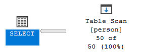

# Indeksy,  optymalizator <br>Lab 5

<!-- <style scoped>
 p,li {
    font-size: 12pt;
  }
</style>  -->

<!-- <style scoped>
 pre {
    font-size: 8pt;
  }
</style>  -->


---

**Imię i nazwisko:**

--- 

Celem ćwiczenia jest zapoznanie się z planami wykonania zapytań (execution plans), oraz z budową i możliwością wykorzystaniem indeksów (cz. 2.)

Swoje odpowiedzi wpisuj w miejsca oznaczone jako:

---
> Wyniki: 

```sql
--  ...
```

---

Ważne/wymagane są komentarze.

Zamieść kod rozwiązania oraz zrzuty ekranu pokazujące wyniki, (dołącz kod rozwiązania w formie tekstowej/źródłowej)

Zwróć uwagę na formatowanie kodu

## Oprogramowanie - co jest potrzebne?

Do wykonania ćwiczenia potrzebne jest następujące oprogramowanie
- MS SQL Server,
- SSMS - SQL Server Management Studio    
- przykładowa baza danych AdventureWorks2017.
    
Oprogramowanie dostępne jest na przygotowanej maszynie wirtualnej


## Przygotowanie  

Uruchom Microsoft SQL Managment Studio.
    
Stwórz swoją bazę danych o nazwie XYZ. 

```sql
create database lab5  
go  
  
use lab5  
go
```


## Dokumentacja/Literatura

Obowiązkowo:

- [https://docs.microsoft.com/en-us/sql/relational-databases/indexes/indexes](https://docs.microsoft.com/en-us/sql/relational-databases/indexes/indexes)
- [https://docs.microsoft.com/en-us/sql/relational-databases/sql-server-index-design-guide](https://docs.microsoft.com/en-us/sql/relational-databases/sql-server-index-design-guide)
- [https://www.simple-talk.com/sql/performance/14-sql-server-indexing-questions-you-were-too-shy-to-ask/](https://www.simple-talk.com/sql/performance/14-sql-server-indexing-questions-you-were-too-shy-to-ask/)

Materiały rozszerzające:
- [https://www.sqlshack.com/sql-server-query-execution-plans-examples-select-statement/](https://www.sqlshack.com/sql-server-query-execution-plans-examples-select-statement/)

<div style="page-break-after: always;"></div>

# Zadanie 1 - Indeksy klastrowane I nieklastrowane

Skopiuj tabelę `Customer` do swojej bazy danych:

```sql
select * into customer from adventureworks2017.sales.customer
```

Wykonaj analizy zapytań:

```sql
select * from customer where storeid = 594  
  
select * from customer where storeid between 594 and 610
```

Zanotuj czas zapytania oraz jego koszt koszt:

---
> Wyniki: 

Zapytanie 1.

*Statystyki*

 

*Plan i czas wykonania*


Zapytanie 2.

*Statystyki*

 

*Plan i czas wykonania*


> Widzimy, że całość kosztu znajduje się w skanie tabeli. Zapytanie 2 wykonuje się w podobnym czasie ponieważ skanowana jest cała tabela.

Dodaj indeks:

```sql
create  index customer_store_cls_idx on customer(storeid)
```

Jak zmienił się plan i czas? Czy jest możliwość optymalizacji?


---
> Wyniki: 

Zapytanie 1.

*Statystyki*

 

*Plan i czas wykonania*


> Czas wykonania rozłożył się na RDI lookup i przeszukanie indeksu. koszt tych operacji to po 50% kosztu całości zapytania. Sumaryczny czas nieznacznie się zwiększył! Większość czasu to operacje zagnieżdżonej pętli. Nie uzyskujemy optymalizacji dla tego zapytania.

Zapytanie 2.

*Statystyki*

 

*Plan i czas wykonania*


> Większość czasu wykonania jest wykonana w zagnieżdżonej pętli. Sam czas wykonania zmniejszył się. Uzyskaliśmy w ten sposób pewną optymalizację zapytania. 93% kosztu zapytania to RID lookup a reszta na wyszukanie w indeksie.

Dodaj indeks klastrowany:

```sql
create clustered index customer_store_cls_idx on customer(storeid)
```

Czy zmienił się plan i czas? Skomentuj dwa podejścia w wyszukiwaniu krotek.


---
> Wyniki: 

```sql
-- najpierw należy usunąć stary indeks bezklastrowy
drop index customer_store_cls_idx on customer

create clustered index customer_store_cls_idx on customer(storeid)
```

Zapytanie 1.

*Statystyki*

 

*Plan i czas wykonania*


Zapytanie 2.

*Statystyki*

 

*Plan i czas wykonania*


> Dla obu indeksów czas wyszukiwania jest niemal zerowy. Plan wykonania znacznie się upraszcza i uzyskujemy optymalizację. Jest to prostszy sposób wybierania krotki. Indeks klastrowy jest trzymany razem z danymi, a bezklastrowy jest tworzony jako osobny.


# Zadanie 2 – Indeksy zawierające dodatkowe atrybuty (dane z kolumn)

Celem zadania jest poznanie indeksów z przechowujących dodatkowe atrybuty (dane z kolumn)

Skopiuj tabelę `Person` do swojej bazy danych:

```sql
select businessentityid  
      ,persontype  
      ,namestyle  
      ,title  
      ,firstname  
      ,middlename  
      ,lastname  
      ,suffix  
      ,emailpromotion  
      ,rowguid  
      ,modifieddate  
into person  
from adventureworks2017.person.person
```
---

Wykonaj analizę planu dla trzech zapytań:

```sql
select * from [person] where lastname = 'Agbonile'  
  
select * from [person] where lastname = 'Agbonile' and firstname = 'Osarumwense'  
  
select * from [person] where firstname = 'Osarumwense'
```

Co można o nich powiedzieć?


---
> Wyniki: 

Zapytanie 1.

*Statystyki*

 

*Plan i czas wykonania*


Zapytanie 2.

*Statystyki*

 

*Plan i czas wykonania*


Zapytanie 3.

*Statystyki*

 

*Plan i czas wykonania*


> Wszystkie 3 zapytania to proste skany tabel. z Jesteśmy w stanie z nich wywnioskować, że jest w tabeli 14 osób z imieniem którego szukamy, 2 z tym nazwiskiem, ale odkładnie jedna z takim imieniem i nazwiskiem.

Przygotuj indeks obejmujący te zapytania:

```sql
create index person_first_last_name_idx  
on person(lastname, firstname)
```

Sprawdź plan zapytania. Co się zmieniło?

---
> Wyniki: 

Zapytanie 1.

*Statystyki*

 

*Plan i czas wykonania*


Zapytanie 2.

*Statystyki*

 

*Plan i czas wykonania*


Zapytanie 3.

*Statystyki*

 

*Plan i czas wykonania*


> Operacja wyszukania w tabeli została rozłożona na zagnieżdżony join, skan indeksu i RID lookup. Możemy zauważyć, że w zapytaniu 2, po 50% kosztu jest rozdzielone na RID lookup i wyszukiwanie w indeksie. Dla zapytania pierwszego większość kosztu siedzi w RID lookup, a dla trzeciego w skanie indeksu. Dodatkowo zagnieżdżone pętle biorą na siebie część kosztu z w zapytaniu 3. 


Przeprowadź ponownie analizę zapytań tym razem dla parametrów: `FirstName = ‘Angela’` `LastName = ‘Price’`. (Trzy zapytania, różna kombinacja parametrów). 

Czym różni się ten plan od zapytania o `'Osarumwense Agbonile'` . Dlaczego tak jest?


---
> Wyniki: 

Zapytanie 1.

*Statystyki*

 

*Plan i czas wykonania*


Zapytanie 2.

*Statystyki*

 

*Plan i czas wykonania*


Zapytanie 3.

*Statystyki*

 

*Plan i czas wykonania*


> Dla zapytania 1 i 3 (o samo nazwisko i samo imię) nie użyto indeksu. Stało się tak zapewne przez to, że indeks został utworzony dla party (imię,nazwisko). W poprzednim przykładzie z `'Osarumwense Agbonile'`, nazwisko to było jedynym wpisem w tabeli o takim imieniu a także jedynym o takim nazwisku przez to SZBD mógł użyć indeksu. W bazie jest jednak więcej niż jedna osoba z nazwiskiem Price i więcej niż jedna z imieniem Angela. By je wyszukać system używa zwykłego skanu tabeli. 


# Zadanie 3

Skopiuj tabelę `PurchaseOrderDetail` do swojej bazy danych:

```sql
select * into purchaseorderdetail from  adventureworks2017.purchasing.purchaseorderdetail
```

Wykonaj analizę zapytania:

```sql
select rejectedqty, ((rejectedqty/orderqty)*100) as rejectionrate, productid, duedate  
from purchaseorderdetail  
order by rejectedqty desc, productid asc
```

Która część zapytania ma największy koszt?

---
> Wyniki: 

*Statystyki*

 

*Plan i czas wykonania*


> Najbardziej kosztowne jest sortowanie. Zawiera ono 87% kosztu całego zapytania. 

Jaki indeks można zastosować aby zoptymalizować koszt zapytania? Przygotuj polecenie tworzące index.


---
> Wyniki: Jak zauważyliśmy w poprzednim punkcie największy koszt w zapytaniu ma sortowanie. Potencjalną optymalizacją jest stworzenie indeksu z posortowanymi wartościami.

```sql
create index idx_purchaseorderdetail_rejected_product
on purchaseorderdetail (rejectedqty desc, productid asc);
```

> Użycie powyższego indeksu praktycznie nie zmieniło planu i czasu wykonania. Należy uwzględnić wszystkie potrzebne kolumny.

```sql
create index idx_purchaseorderdetail_rejected_product
on purchaseorderdetail (rejectedqty desc, productid asc)
include (orderqty, duedate);
```

 Ponownie wykonaj analizę zapytania:


---
> Wyniki: 

*Statystyki*

 

*Plan i czas wykonania*


> Jak widać z planu wykonania usunięte zostało sortowanie. Zamiast skanu tabeli wykonywany jest skan indeksu. Tam jest też 98% kosztu wykonania. Pozostałe 2 to operacja matematyczna obliczania żądanej wartości. Uzyskujemy optymalizację. poprzednio 87% kosztu stanowiło sortowanie. Pozbywamy się całego tego kroku.

# Zadanie 4

Celem zadania jest porównanie indeksów zawierających wszystkie kolumny oraz indeksów przechowujących dodatkowe dane (dane z kolumn).

Skopiuj tabelę `Address` do swojej bazy danych:

```sql
select * into address from  adventureworks2017.person.address
```

W tej części będziemy analizować następujące zapytanie:

```sql
select addressline1, addressline2, city, stateprovinceid, postalcode  
from address  
where postalcode between n'98000' and n'99999'
```

```sql
create index address_postalcode_1  
on address (postalcode)  
include (addressline1, addressline2, city, stateprovinceid);  
go  
  
create index address_postalcode_2  
on address (postalcode, addressline1, addressline2, city, stateprovinceid);  
go
```


Czy jest widoczna różnica w zapytaniach? Jeśli tak to jaka? Aby wymusić użycie indeksu użyj `WITH(INDEX(Address_PostalCode_1))` po `FROM`:

> Wyniki: Musieliśmy usunąć znaki `n` z zapytania ponieważ powodowały syntax error:


```sql
select addressline1, addressline2, city, stateprovinceid, postalcode  
from address  
where postalcode between '98000' and '99999'
```

Zapytanie bez indeksu:

*Statystyki*

 

*Plan i czas wykonania*


Zapytanie z indeksem 1:

```sql
select addressline1, addressline2, city, stateprovinceid, postalcode  
from address  with(index(address_postalcode_1))
where postalcode between '98000' and '99999'
```

*Statystyki*

 

*Plan i czas wykonania*


Zapytanie z indeksem 2:

```sql
select addressline1, addressline2, city, stateprovinceid, postalcode  
from address  with(index(address_postalcode_2))
where postalcode between '98000' and '99999'
```

*Statystyki*

 

*Plan i czas wykonania*


> Oba indeksy zwracają taki sam plan zapytań. Zamieniają skan tabeli na wyszukanie indeksu. Ich efektywność jest taka sama. Wygląda na to, że w ten sposób nie możemy ich ze sobą porównać. Musimy sprawdzić ich rozmiary. 

Sprawdź rozmiar Indeksów:

```sql
select i.name as indexname, sum(s.used_page_count) * 8 as indexsizekb  
from sys.dm_db_partition_stats as s  
inner join sys.indexes as i on s.object_id = i.object_id and s.index_id = i.index_id  
where i.name = 'address_postalcode_1' or i.name = 'address_postalcode_2'  
group by i.name  
go
```


Który jest większy? Jak można skomentować te dwa podejścia do indeksowania? Które kolumny na to wpływają?


> Wyniki: Indeks drugi jest większy o około 24 kilobajty. Dzieje się tak, ponieważ w indeks drugi jest tworzony na wszystkich kolumnach. Indeks pierwszy jest tworzony na kodzie pocztowym. Kod pocztowy to wartość, która często się powtarza. Więc w indeksie 2 jest wielokrotnie kopiowana co wpływa na jego większy rozmiar.


# Zadanie 5 – Indeksy z filtrami

Celem zadania jest poznanie indeksów z filtrami.

Skopiuj tabelę `BillOfMaterials` do swojej bazy danych:

```sql
select * into billofmaterials  
from adventureworks2017.production.billofmaterials
```


W tej części analizujemy zapytanie:

```sql
select productassemblyid, componentid, startdate  
from billofmaterials  
where enddate is not null  
    and componentid = 327  
    and startdate >= '2010-08-05'
```

Zastosuj indeks:

```sql
create nonclustered index billofmaterials_cond_idx  
    on billofmaterials (componentid, startdate)  
    where enddate is not null
```

Sprawdź czy działa. 

Przeanalizuj plan dla poniższego zapytania:

Czy indeks został użyty? Dlaczego?

> Wyniki:

Zapytanie przed utworzeniem indeksu:

*Statystyki*

 

*Plan i czas wykonania*


Zapytanie z indeksem 2:

Zapytanie po utworzeniu indeksu:

*Statystyki*

 

*Plan i czas wykonania*


> Wygląda na to, że plany wyglądają tak samo, jednak z jakiegoś powodu optymalizator nie wybiera indeksu do wykonania zapytania.

Spróbuj wymusić indeks. Co się stało, dlaczego takie zachowanie?

```sql
select productassemblyid, componentid, startdate  
from billofmaterials with(index(billofmaterials_cond_idx))
where enddate is not null  
    and componentid = 327  
    and startdate >= '2010-08-05'
```

*Statystyki*

 

*Plan i czas wykonania*


> Po wymuszeniu indeksu normalnie wykonywane jest zapytanie z innym planem. Dzieje się tak zapewne ponieważ oryginalna tebela zawiera nieodfiltrowane wpisy. Z tego powodu indeks nie pokrywa całej tablicy billofmaterials i optymalizator go pomija. Jeśli wymuszamy użycie indeksu zadziała on poprawnie. 


---

Punktacja:

|         |     |
| ------- | --- |
| zadanie | pkt |
| 1       | 2   |
| 2       | 2   |
| 3       | 2   |
| 4       | 2   |
| 5       | 2   |
| razem   | 10  |
