# Indeksy, optymalizator <br>Lab 6-7

<!-- <style scoped>
 p,li {
    font-size: 12pt;
  }
</style>  -->

<!-- <style scoped>
 pre {
    font-size: 8pt;
  }
</style>  -->

---

**Imię i nazwisko:**

- **Szymon Budziak**
- **Piotr Ludynia**

---

Celem ćwiczenia jest zapoznanie się z planami wykonania zapytań (execution plans), oraz z budową i możliwością wykorzystaniem indeksów (cz. 2.)

Swoje odpowiedzi wpisuj w miejsca oznaczone jako:

---

> Wyniki:

```sql
--  ...
```

---

Ważne/wymagane są komentarze.

Zamieść kod rozwiązania oraz zrzuty ekranu pokazujące wyniki, (dołącz kod rozwiązania w formie tekstowej/źródłowej)

Zwróć uwagę na formatowanie kodu

## Oprogramowanie - co jest potrzebne?

Do wykonania ćwiczenia potrzebne jest następujące oprogramowanie

- MS SQL Server,
- SSMS - SQL Server Management Studio
- przykładowa baza danych AdventureWorks2017.

Oprogramowanie dostępne jest na przygotowanej maszynie wirtualnej

## Przygotowanie

Stwórz swoją bazę danych o nazwie lab6.

```sql
create database lab5
go

use lab5
go
```

Zamiast lab5 musieliśmy nazwać bazę lab6 ze względu na kolizję nazw z poprzednim laboratorium:

```sql
create database lab6
go

use lab6
go
```

## Dokumentacja

Obowiązkowo:

- [https://docs.microsoft.com/en-us/sql/relational-databases/indexes/indexes](https://docs.microsoft.com/en-us/sql/relational-databases/indexes/indexes)
- [https://docs.microsoft.com/en-us/sql/relational-databases/indexes/create-filtered-indexes](https://docs.microsoft.com/en-us/sql/relational-databases/indexes/create-filtered-indexes)

# Zadanie 1

Skopiuj tabelę Product do swojej bazy danych:

```sql
select * into product from adventureworks2017.production.product
```

Stwórz indeks z warunkiem przedziałowym:

```sql
create nonclustered index product_range_idx
    on product (productsubcategoryid, listprice) include (name)
where productsubcategoryid >= 27 and productsubcategoryid <= 36
```

Sprawdź, czy indeks jest użyty w zapytaniu:

```sql
select name, productsubcategoryid, listprice
from product
where productsubcategoryid >= 27 and productsubcategoryid <= 36
```

Sprawdź, czy indeks jest użyty w zapytaniu, który jest dopełnieniem zbioru:

```sql
select name, productsubcategoryid, listprice
from product
where productsubcategoryid < 27 or productsubcategoryid > 36
```

Skomentuj oba zapytania. Czy indeks został użyty w którymś zapytaniu, dlaczego? Czy indeks nie został użyty w którymś zapytaniu, dlaczego? Jak działają indeksy z warunkiem?

---

> W pierwszym zapytaniu indeks zostaje użyty. Zapytanie zwraca 17 wartości.

_Execution Plan 1_

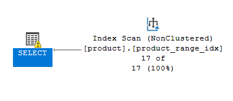

> Jednak drugie zapytanie wykonuje się bez użycia indeksu. Wybierane jest 278 wartości.

_Execution Plan 2_

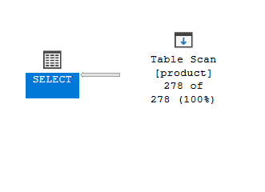

> Indeks jest użyty w zapytaniu, które zawiera warunek użyty przy tworzeniu go a w przeciwnym przypadku nie. Dzieje się tak, ponieważ optymalizator sprawdza, czy warunek z zapytania jest obecny w indeksie i na jego podstawie decyduje, czy użyje indeksu w wykonaniu zapytania. Wniosek: Tylko pierwsze zapytanie wykorzystuje indeks, drugie nie.

```sql
--  sprawdzany warunek:
--[...]
where productsubcategoryid >= 27 and productsubcategoryid <= 36
--[...]
```

> Przetestowaliśmy jeszcze jedno zapytanie. Zamieniamy koniunkcję na alternatywę. Cały zbiór będący wynikiem pierwszego zapytania jest w nim zawarty, jednak występują też tam wartości z poza niego (na przykład takie w których `productsubcategoryid` jest większe mniejsze niż 27 a `productsubcategoryid` dalej jest mniejsze bądź równe 36). W tym przypadku indeks również nie został użyty.

```sql
select name, productsubcategoryid, listprice
from product
where productsubcategoryid >= 27 or productsubcategoryid <= 36
```

_Execution Plan 3_

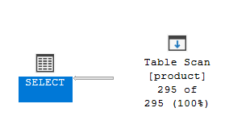

# Zadanie 2 – indeksy klastrujące

Celem zadania jest poznanie indeksów klastrujących

Skopiuj ponownie tabelę SalesOrderHeader do swojej bazy danych:

```sql
select * into salesorderheader2 from adventureworks2017.sales.salesorderheader
```

_Wynik_

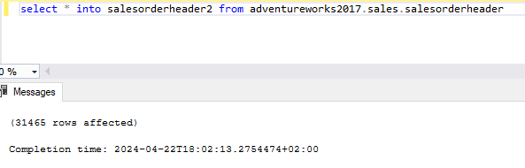

Wypisz tysiąc pierwszych zamówień:

```sql
select top 1000 * from salesorderheader2
order by orderdate
```

Stwórz indeks klastrujący według OrderDate:

```sql
create clustered index order_date2_idx on salesorderheader2(orderdate)
```

_Wynik_

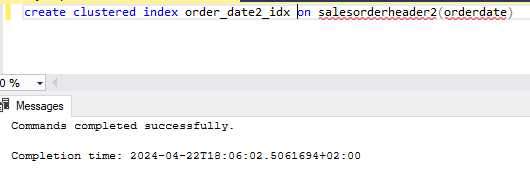

Wypisz ponownie tysiąc pierwszych zamówień. Co się zmieniło?

---

_Wyniki dla 1000 pierwszych zamówień przed stworzeniem indeksu klastrującego:_

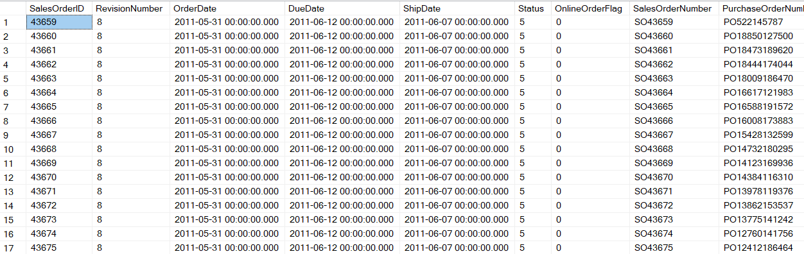

_Execution Plan_

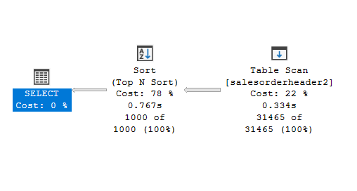

_Wyniki dla 1000 pierwszych zamówień po stworzeniu indeksu klastrującego:_

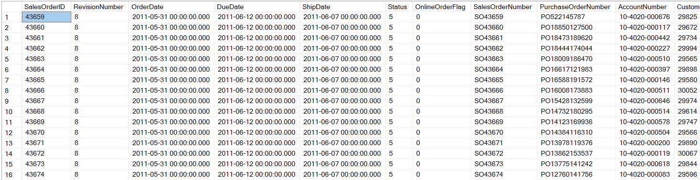

_Execution Plan_

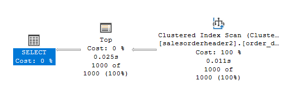

> Możemy zauważyć, że wypisane zamówenia wyglądają tak samo, co nie jest zdziwieniem, ponieważ indeks klastrujący nie zmienia kolejności wierszy w tabeli, a jedynie sposób ich przechowywania. Zmienia się jednak plan wykonania zapytania:

> Użycie indeksu w drugim zapytaniu znacząco ogranicza czas ze względu na usunięcie sortowania. Przy tworzeniu indeksu klastrującego na kolumnę, pozbywamy się konieczności sortowania, czyli najbardziej kosztownej operacji dzięki czemu koszt zapytania jest znacznie mniejszy. Można z tego wywnioskować, że domyślnie tworzony jest indeks posortowany. W przeciwieństwie, w pierwszym przypadku, gdzie nie mamy jeszcze indeksu jest realizowana kosztowna operacja sortowania, która stanowi znaczą jego część.

Sprawdź zapytanie:

```sql
select top 1000 * from salesorderheader2
where orderdate between '2010-10-01' and '2011-06-01'
```

Dodaj sortowanie według OrderDate ASC i DESC. Czy indeks działa w obu przypadkach. Czy wykonywane jest dodatkowo sortowanie?

---

> Sprawdziliśmy 3 zapytania:

```sql
--query 3
select top 1000 * from salesorderheader2
where orderdate between '2010-10-01' and '2011-06-01'

--query 4
select top 1000 * from salesorderheader2
where orderdate between '2010-10-01' and '2011-06-01'
order by orderdate asc

--query 5
select top 1000 * from salesorderheader2
where orderdate between '2010-10-01' and '2011-06-01'
order by orderdate desc
```

_Wyniki dla zapytania 3_

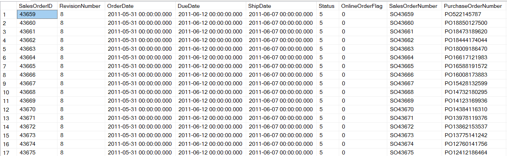

_Execution Plan dla zapytania 3_

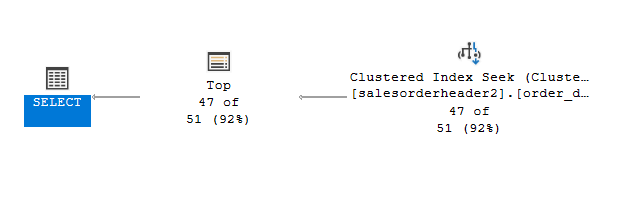

_Wyniki dla zapytania 4_

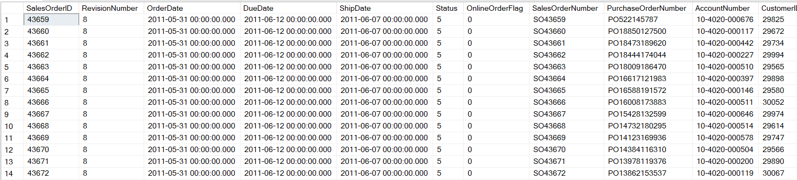

_Execution Plan dla zapytania 4_

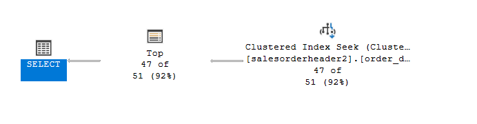

_Wyniki dla zapytania 5_

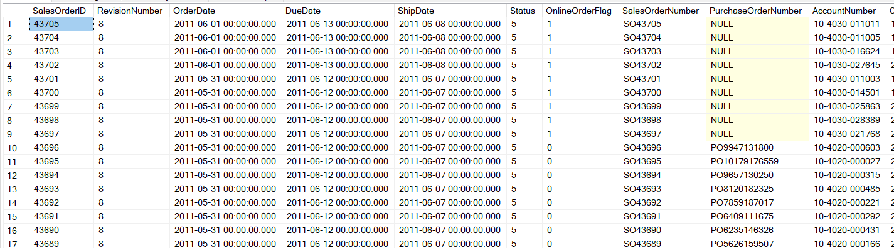

_Execution Plan dla zapytania 5_

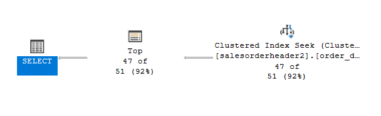

> Wyniki dwóch pierwszych zapytań wyglądają tak samo. Przy wykonywaniu zapytania pierwszego, - bez spacyfikowania kolejności, - dostajemy taki sam wynik jak przy kolejności rosnącej. Oznacza to, że właśnie w takiej kolejności posortowany jest indeks.

> Możemy zauważyć, że w drugim zapytaniu, że indeks został wykorzystany, na co wskazuje operacja `Clustered Index Seek` w _Execution Plan dla zapytania 4_, jednak żadne dodatkowe sortowanie nie zostało wykonane. Jeśli chodzi o trzeci zapytanie, to również widzimy, że indeks został wykorzystany. Wskazuje na to operacja `Clustered Index Seek` w _Execution Plan dla zapytania 5_. Nie jest wykonywane dodatkowe sortowanie. Plany wykonania wszystkich trzech zapytań wyglądają tak samo.

> Wniosek: Oba indeksy działają poprawnie, dzięki czemy w obu przypadkach unikamy koniecznośći sortowania.

# Zadanie 3 – indeksy column store

Celem zadania jest poznanie indeksów typu column store

Utwórz tabelę testową:

```sql
create table dbo.saleshistory(
 salesorderid int not null,
 salesorderdetailid int not null,
 carriertrackingnumber nvarchar(25) null,
 orderqty smallint not null,
 productid int not null,
 specialofferid int not null,
 unitprice money not null,
 unitpricediscount money not null,
 linetotal numeric(38, 6) not null,
 rowguid uniqueidentifier not null,
 modifieddate datetime not null
 )
```

Załóż indeks:

```sql
create clustered index saleshistory_idx
on saleshistory(salesorderdetailid)
```

Wypełnij tablicę danymi:

(UWAGA `GO 100` oznacza 100 krotne wykonanie polecenia. Jeżeli podejrzewasz, że Twój serwer może to zbyt przeciążyć, zacznij od GO 10, GO 20, GO 50 (w sumie już będzie 80))

```sql
insert into saleshistory
 select sh.*
 from adventureworks2017.sales.salesorderdetail sh
go 100
```

Sprawdź jak zachowa się zapytanie, które używa obecny indeks:

```sql
select productid, sum(unitprice), avg(unitprice), sum(orderqty), avg(orderqty)
from saleshistory
group by productid
order by productid
```

Załóż indeks typu ColumnStore:

```sql
create nonclustered columnstore index saleshistory_columnstore
 on saleshistory(unitprice, orderqty, productid)
```

Sprawdź różnicę pomiędzy przetwarzaniem w zależności od indeksów. Porównaj plany i opisz różnicę.

---

**Zapytanie z indeksem klastrowym**

_Wynik_

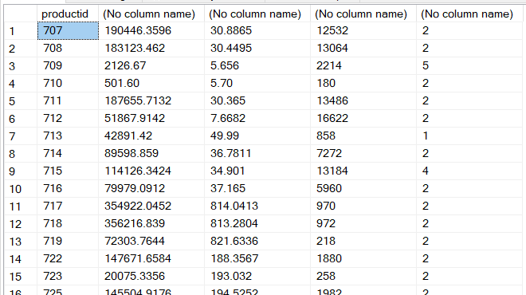

_Execution Plan_

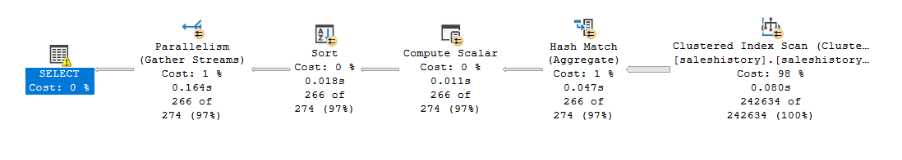

_Estimated Subtree Cost_

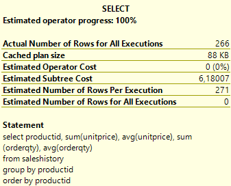

**Zapytanie z indeksem ColumnStore**

_Wynik_

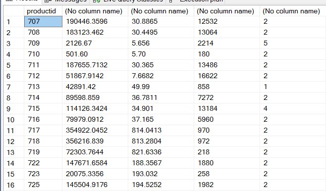

_Execution Plan_

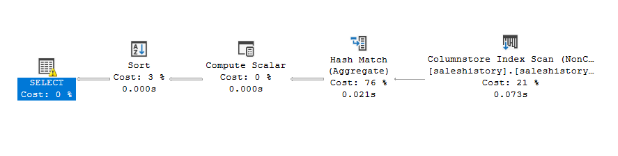

_Estimated Subtree Cost_

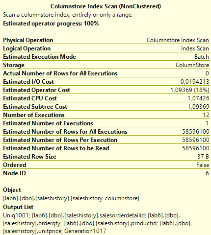

> Indeks typu ColumnStore w przeciwieństwie do zwykłych indeksów ustawia kolejność pamięci kolumnami, a nie wierszami. Przez to, zapytanie, które bierze pod uwagę całość kolumny w celu pogrupowania lub obliczenia jej średnich wartości może wykonać się szybciej i prościej - bez dodania równoległości. Możemy jeszcze zauważyć, że Estimated Subtree Cost dla zwykłego indeksu to 6,18007 a Columnstore to 1,09369 co jest prawie 6 razy mniejsze.

# Zadanie 4 – własne eksperymenty

Należy zaprojektować tabelę w bazie danych, lub wybrać dowolny schemat danych (poza używanymi na zajęciach), a następnie wypełnić ją danymi w taki sposób, aby zrealizować poszczególne punkty w analizie indeksów. Warto wygenerować sobie tabele o większym rozmiarze.

Do analizy, proszę uwzględnić następujące rodzaje indeksów:

- Klastrowane (np.  dla atrybutu nie będącego kluczem głównym)
- Nieklastrowane
- Indeksy wykorzystujące kilka atrybutów, indeksy include
- Filtered Index (Indeks warunkowy)
- Kolumnowe

## Analiza

Proszę przygotować zestaw zapytań do danych, które:

- wykorzystują poszczególne indeksy
- które przy wymuszeniu indeksu działają gorzej, niż bez niego (lub pomimo założonego indeksu, tabela jest w pełni skanowana)
  Odpowiedź powinna zawierać:
- Schemat tabeli
- Opis danych (ich rozmiar, zawartość, statystyki)
- Trzy indeksy:
- Opis indeksu
- Przygotowane zapytania, wraz z wynikami z planów (zrzuty ekranow)
- Komentarze do zapytań, ich wyników
- Sprawdzenie, co proponuje Database Engine Tuning Advisor (porównanie czy udało się Państwu znaleźć odpowiednie indeksy do zapytania)

> Wyniki:

### Klastrowane (np. dla atrybutu nie będącego kluczem głównym)

> Pierwszy eksperyment, polega na stworzeniu indeksu klastrowego dla atrybutu, który nie jest kluczem głównym tabeli. W przypadku, gdy atrybut nie jest kluczem głównym, indeks klastrowy jest tworzony na podstawie klucza głównego. W przypadku, gdy atrybut jest kluczem głównym, indeks klastrowy jest tworzony na podstawie tego atrybutu.

**Schemat tabeli**

Tworzymy tabelę `Orders` z następującymi kolumnami:

- **OrderID**
- **CustomerID**
- **OrderDate**
- **OrderPrice**

Table zawierać będzie id zamówniea, id klienta, datę zamówienia oraz cenę zamówienia.

```sql
CREATE TABLE Orders (
  OrderID INT NOT NULL PRIMARY KEY,
  CustomerID INT NOT NULL,
  OrderDate DATE NOT NULL,
  OrderPrice DECIMAL(10, 2) NOT NULL
)
```

_Wynik_

Wypełniamy tabelę przykładowymi danymi z 100 000 rekordami:

```sql
DECLARE @count INT = 0

WHILE @count < 100000
BEGIN
  INSERT INTO Orders (OrderID, CustomerID, OrderDate, OrderPrice) VALUES (
    @count,
    @count % 100,
    DATEADD(DAY, @count % 365, '2020-01-01'),
    ROUND(RAND() * 100, 2)
  )
  SET @count = @count + 1
END
```

Dodajemy indeks klastrowany dla kolumny `OrderDate`, która nie jest kluczem głównym tabeli `Orders`:

```sql
CREATE CLUSTERED INDEX Index_OrderDate ON Orders (OrderDate);
```

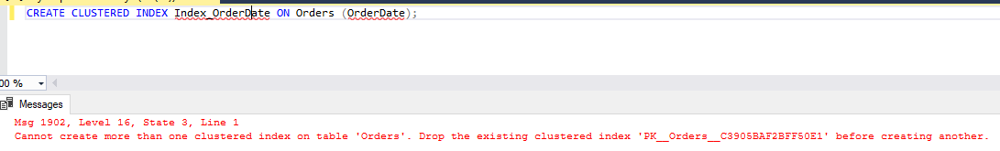

> Otrzymujemy jednak błąd! Wynika to z faktu, że klucz główny jest już indeksem klastrowym. W takim przypadku, aby móc stworzyć indeks klastrowy dla innej kolumny, musimy usunąć indeks klastrowy dla klucza głównego. W naszym przypadku kluczem głównym jest `OrderID` i usuniemy go w taki sposób:

```sql
ALTER TABLE Orders
DROP CONSTRAINT PK__Orders__C3905BAF2BFF50E1;
```

Teraz możemy dodać nasz indeks.

**Przykładowe zapytania**

> Wykonujemy teraz przykładowe zapytanie. Zwróci nam on wszystkie dane dla zamówień z danego dnia. Zostanie wykonane porównanie działania zapytania z indeksem i bez niego. Przedstawione zostaną wyniki, plany wykonania oraz napisane zostaną wnioski.

```sql
SELECT * FROM Orders WHERE OrderDate = '2020-02-14'
```

**Wyniki**

| Zapytanie | Wynik                   |
| --------- | ----------------------- |
| 1         | 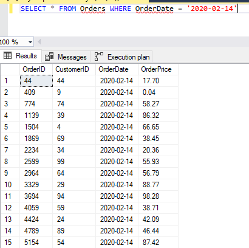 |
| 2         | 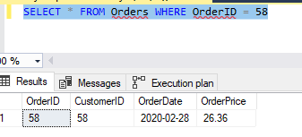 |

**Plany wykonania**

| Zapytanie | Plan wykonania              |
| --------- | --------------------------- |
| 1         | 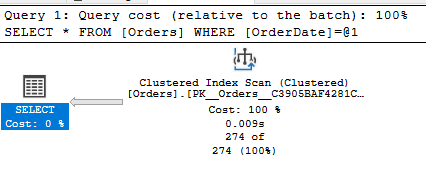 |
| 2         | 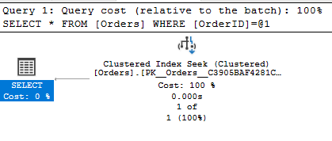 |

**Komantarz**

> Możemy zauważyć, że w przypadku zapytania, które korzysta z indeksu klastrowanego, czas wykonania zapytania jest znacznie krótszy. W przypadku zapytania, które nie korzysta z indeksu klastrowanego, czas wykonania zapytania jest dłuższy, ponieważ wykonuje `Table Scan`. Zapytanie z indeksem wykonuje `Clustered Index Seek`. Dzięki indeksowi, koszt zapytania jest znacznie niższy, a liczba operacji wejścia/wyjścia jest mniejsza.

**Rekomendacja Databse Engine Tuning Advisor**

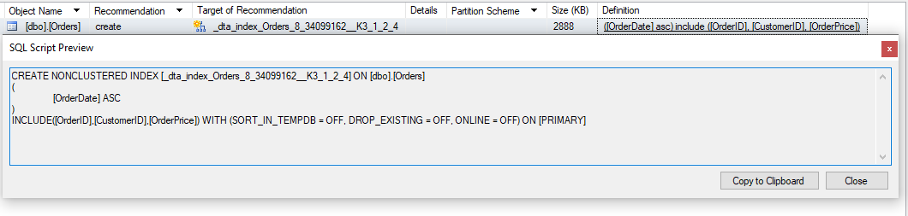

> Narzędzie sugeruje utworzenie indeksu nieklastrowego na OrderDate. W naszym przypadku usunęliśmy indeks klastrowy dla klucza głównego i zastąpiliśmy go nowym indeksem klastrowym dla OrderDate.

> Wniosek: Indeks klastrowany jest przydatny, gdy zapytania często odwołują się do kolumny, która jest indeksem klastrowym. W przypadku, gdy kolumna nie jest kluczem głównym, musimy usunąć indeks klastrowy dla klucza głównego, aby móc stworzyć indeks klastrowy dla innej kolumny.

### Nieklastrowane

> Drugi eksperyment polega na użyciu indeksu nieklastrowego. Indeks nieklastrowy jest indeksem, który nie zmienia kolejności wierszy w tabeli. Indeks nieklastrowy jest tworzony na kolumnach, które nie są kluczami głównymi tabeli.

**Schemat tabeli**

Tworzymy tabelę `Products` z następującymi kolumnami:

- **ProductID**
- **ProductName**
- **CategoryID**
- **ProductPrice**

Tabela ta zawierać będzie id produktu, nazwę produktu, id kategori oraz cenę produktu.

```sql
CREATE TABLE Products (
  ProductID INT NOT NULL PRIMARY KEY,
  ProductName NVARCHAR(50) NOT NULL,
  CategoryID INT NOT NULL,
  ProductPrice DECIMAL(10, 2) NOT NULL
)
```

Wypełniamy tabelę przykładowymi danymi z 100 000 rekordami:

```sql
DECLARE @count INT = 0

WHILE @count < 100000
BEGIN
  INSERT INTO Products (ProductID, ProductName, CategoryID, ProductPrice) VALUES (
    @count,
    CONCAT('Product', @count),
    @count % 10,
    ROUND(RAND() * 100, 2)
  )
  SET @count = @count + 1
END
```

_Wynik_

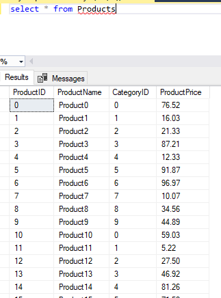

Dodajemy indeks nieklastrowany dla kolumny `CategoryID`:

```sql
CREATE NONCLUSTERED INDEX Index_CategoryID ON Products (CategoryID);
```

**Przykładowe zapytania**

> Wykonujemy teraz przykładowe zapytanie, które zwróci nam wszystkie dane dla kateogri równej 5.Zostanie wykonane porównanie działania zapytania z indeksem i bez niego. Przedstawione zostaną wyniki, plany wykonania oraz napisane zostaną wnioski.

```sql
SELECT * FROM Products WHERE CategoryID = 5
```

**Wyniki**

| Zapytanie | Wynik                   |
| --------- | ----------------------- |
| 1         | 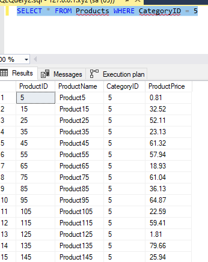 |
| 2         | 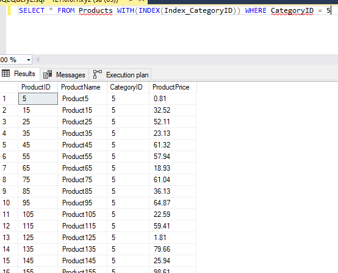 |

**Plany wykonania**

| Zapytanie | Plan wykonania              |
| --------- | --------------------------- |
| 1         | 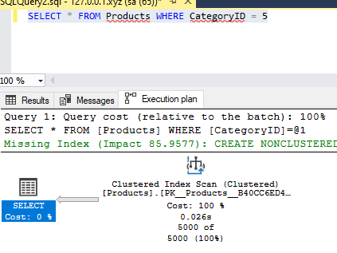 |
| 2         |  |

**Komantarz**

> Użycie indeksu nieklastrowego przyspiesza nam działanie zapytania. Możemy zauważyć, że pierwsze zapytanie, czyli zapytanie bez indeksu wykonuje się o około 4 razy dłużej niż drugie, które ten indeks wykorzystuje. Zapytanie z indeksem wykonuje `Index Seek` natomiast to bez indeksu scana całej tabeli, co można zauważyć na planie wykonania.

**Rekomendacja Databse Engine Tuning Advisor**

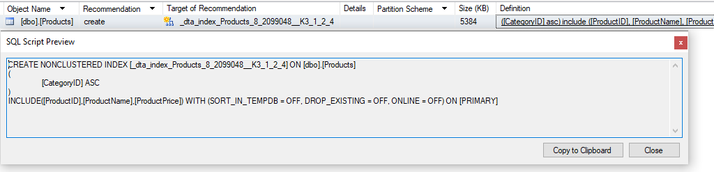

> Narzędzie sugeruje utworzenie nieklastrowego indeksu na CategoryID, czyli takiego jaki został przez nas wcześniej stworzony.

### Indeksy wykorzystujące kilka atrybutów, indeksy include

> Trzeci ekperyment polega na użyciu indeksu wykorzystującego kilka atrybutów, czyli indeksu include. Polega on na dodaniu do indeksu dodatkowych kolumn, które nie są kluczami indeksu, ale są dodawane do indeksu, aby zwiększyć jego wydajność.

**Schemat tabeli**

Tworzymy tabelę `Employees` z następującymi kolumnami:

- **EmployeeID**
- **Name**
- **Surname**
- **City**
- **Salary**

Tabela zawierać będzie rekordy z danymi takimi jak: id pracownika, imie oraz naziwsko pracownika, miasto zamieszkania i jego zarobki.

```sql
CREATE TABLE Employees (
  EmployeeID INT NOT NULL PRIMARY KEY,
  Name NVARCHAR(50) NOT NULL,
  Surname NVARCHAR(50) NOT NULL,
  City NVARCHAR(30) NOT NULL,
  Salary DECIMAL(10, 2) NOT NULL
)
```

Wypełniamy tabelę przykładowymi danymi z 100 000 rekordami:

```sql
DECLARE @count INT = 0

WHILE @count < 100000
BEGIN
  INSERT INTO Employees (EmployeeID, Name, Surname, City, Salary)
  VALUES (
    @count,
    CONCAT('Name', @count),
    CONCAT('Surname', @count),
    CONCAT('City', @count % 20),
    ROUND(RAND() * 10000, 2)
  )
  SET @count = @count + 1
END
```

_Wynik_

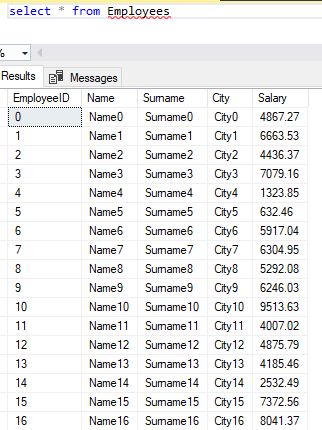

Dodajemy indeks nieklastrowany dla kolumny `City` oraz include dla `Name`, `Surname` i `Salary`:

```sql
CREATE NONCLUSTERED INDEX Index_City_Salary
ON Employees (City) INCLUDE (Name, Surname, Salary);
```

**Przykładowe zapytania**

> Wykonujemy teraz przykładowe zapytanie. W zapytaniu tym chcemy otrzymać Imiona, Nazwiska, Miasto oraz zarobki osób z miasta City2 z zarobkami poniżej 5000. Sprawdzimy wyniki bez indeksu oraz dla indeksu. Przedstawione zostaną wyniki, plany wykonania oraz napisane zostaną wnioski.

```sql
SELECT Name, Surname, Salary
FROM Employees
WHERE City = 'City2' and Salary < 5000
```

**Wyniki**

| Zapytanie | Wynik                   |
| --------- | ----------------------- |
| 1         | 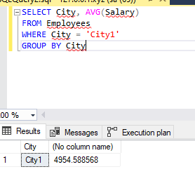 |
| 2         | 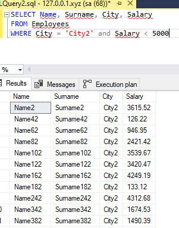 |

**Plany wykonania**

| Zapytanie | Plan wykonania              |
| --------- | --------------------------- |
| 1         | 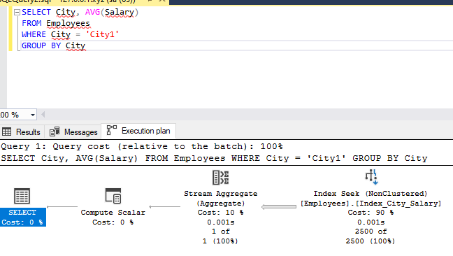 |
| 2         | 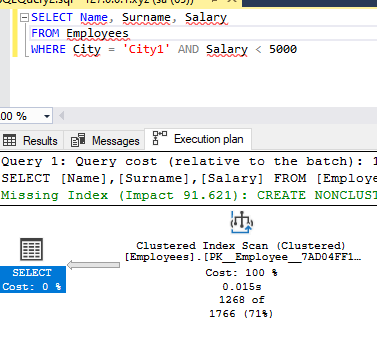 |

**Rekomendacja Databse Engine Tuning Advisor**

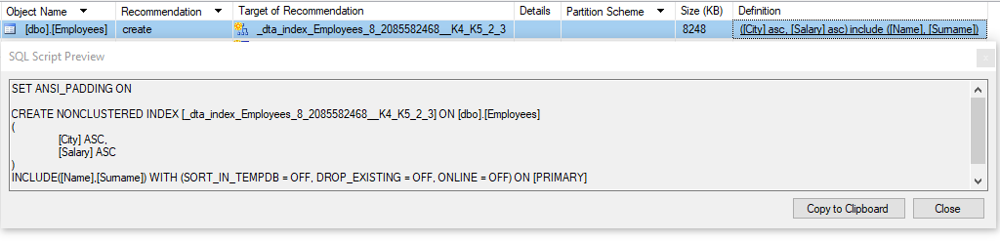

> Narzędzie sugeruje utworzeniu indeksu, który został przez nas już zdefiniowany, czyli indeks wykorzystujący kilka atrybutów.

> Wniosek: Indeksy wykorzystujące kilka atrybutów, wraz z include są przydatne, gdy zapytania obejmują wiele kolumn w warunkach wyszukiwania zapytania.

**Komantarz**

> W tym ekperymencie, możemy zauważyć, że w przypadku zapytania, które nie używa indeksu, wykonywane jest pełne skanowanie tabeli `Index Seek`. W przypadku zapytania, które korzysta z indeksu, wykonywany jest `Inde Scan`. Dzięki nim zapytania stają się bardziej wydajne, bo SZBD może w szybszy sposób uzsykać dostęp do danych, które spełniają kryterium z zapytania.

### Filtered Index (Indeks warunkowy)

> Filtered Index, czyli Indeks warunkowy, którego używamy w 4 eksperymencie jest to indeks, który zawiera tylko wiersze, które spełniają określone warunki. Indeks warunkowy jest tworzony na podstawie warunku, który jest określony w klauzuli WHERE.

**Schemat tabeli**

Tworzymy tabelę `Customer` z następującymi kolumnami:

- **CustomerID**
- **Name**
- **City**
- **Mail**

Tabela ta będzie przechowywać dane o klientach, ich imionach, miastach w których mieszkają oraz mailach.

```sql
CREATE TABLE Customer (
  CustomerID INT NOT NULL PRIMARY KEY,
  Name NVARCHAR(50) NOT NULL,
  City NVARCHAR(30) NOT NULL,
  Mail NVARCHAR(50) NOT NULL
)
```

Wypełniamy tabelę przykładowymi danymi z 100 000 rekordami:

```sql
DECLARE @count INT = 0

WHILE @count < 100000
BEGIN
  INSERT INTO Customer (CustomerID, Name, City, Mail) VALUES (
    @count,
    CONCAT('Name', @count),
    CONCAT('City', @count % 5),
    CONCAT('Mail', @count)
  )
  SET @count = @count + 1
END
```

_Wynik_

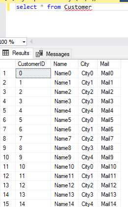

Dodajemy indeks warunkowy (filtered index) dla kolumny `City`, dla określonego miasta np. 'City3':

```sql
CREATE NONCLUSTERED INDEX Index_City
ON Customer (City, CustomerID, Name)
INCLUDE (Mail)
WHERE City = 'City3';
```

**Przykładowe zapytania**

> Wykonujemy teraz przykładowe zapytania. Pierwsze, które korzystać będzie z indeksu warunkowego zwróci nam wszystkie dane o Customerach z miasta `City3`. Drugie, które nie będzie korzystać z indeksu warunkowego, zwróci nam wszystkie dane o Customerach z miasta `City1`. Zostanie wykonane porównanie działania zapytania z indeksem i bez niego. Przedstawione zostaną wyniki, plany wykonania oraz napisane zostaną wnioski.

```sql
SELECT *
FROM Customer
WHERE City = 'City3'
```

```sql
SELECT *
FROM Customer
WHERE City = 'City1'
```

_Wynik_

| Zapytanie | Wynik                   |
| --------- | ----------------------- |
| 1         | 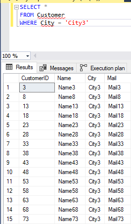 |
| 2         | 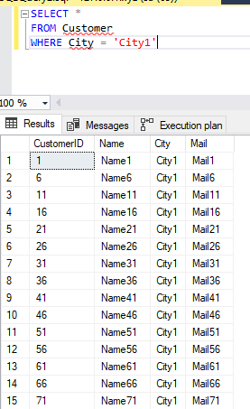 |

_Plany wykonania_

| Zapytanie | Plan wykonania              |
| --------- | --------------------------- |
| 1         | 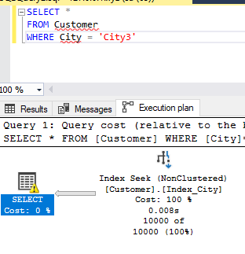 |
| 2         | 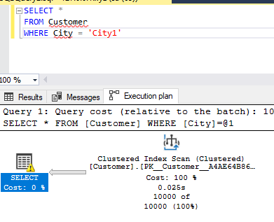 |

**Komantarz**

> W tym eksperymencie, możemy zauważyć, że tam gdzie jest użyty indeks warunkowy, zapytanie wykonuje się szybciej i to o wiele. Korzystamy tam z `Index Seek`. W przypadku zapytania, które korzysta z indeksu warunkowego, czas wykonania zapytania jest krótszy, ponieważ optymalizator korzysta z indeksu, który zawiera tylko interesujące nas wartości. W przypadku zapytania, które nie korzysta z indeksu warunkowego, czas wykonania zapytania jest dłuższy, ponieważ optymalizator musi przeszukać całą tabelę, wykonując scana tabeli, co można zaobserwować na planie wykonania zapytania, przedstawione jako `Clustered Index Scan`. Dzięki indeksowi, koszt zapytania jest znacznie niższy, a liczba operacji wejścia/wyjścia jest mniejsza.

**Rekomendacja Databse Engine Tuning Advisor**

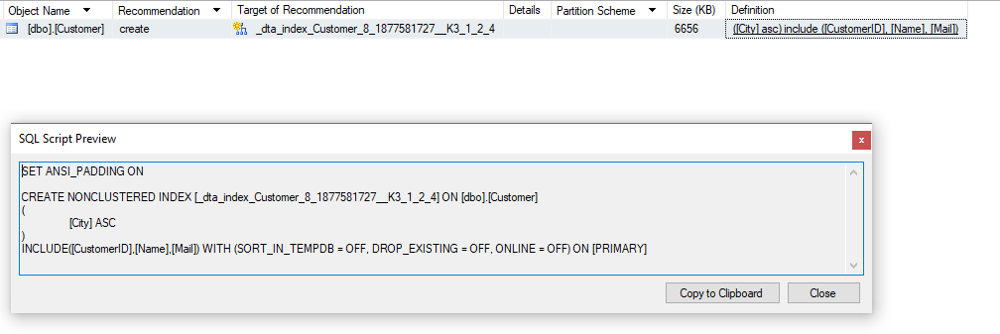

> Narzędzie sugeruje utworzenie identycznego indeksu, co wcześniej stworzony przez nas z dodatkową rekomendacją uporządkowania kategorii rosnąco.

> Wnioski: Indeks warunkowy jest skuteczny gdy zapytanie pokrywa się z jego warunkami. Kiedy warunki nie są spełnione, może dojść do kosztownego pełnego skanowania tabeli.

### Kolumnowe

> Indeksy Kolumnowe to indeksy, które przechowują dane w kolumnach, a nie w wierszach. Są one tworzone na kolumnach, które są często używane w zapytaniach, które wykonują operacje agregujące, takie jak SUM, AVG, COUNT, MAX, MIN. Tych indeksów użyjemy w eksperymencie 5.

Tworzymy tabelę `Orders` z następującymi klumnami:

- **OrderID**
- **CustomerID**
- **ProductID**
- **Quantity**
- **OrderPrice**

Tabela ta będzie przechowywać dane o zamówwieniach, identyfikatorach klientów, produktach, ilości produktów oraz ich cenie.

```sql
CREATE TABLE Orders (
  OrderID INT NOT NULL PRIMARY KEY,
  CustomerID INT NOT NULL,
  ProductID INT NOT NULL,
  Quantity DECIMAL(10, 2) NOT NULL,
  OrderPrice DECIMAL(10, 2) NOT NULL
)
```

Wypełniamy tabelę przykładowymi danymi z 100 000 rekordami:

```sql
DECLARE @count INT = 0

WHILE @count < 100000
BEGIN
  INSERT INTO Orders (OrderID, CustomerID, ProductID, Quantity, OrderPrice) VALUES (
    @count,
    @count % 100,
    @count % 10,
    ROUND(RAND() * 20, 2),
    ROUND(RAND() * 100, 2)
  )
  SET @count = @count + 1
END
```

_Wynik_

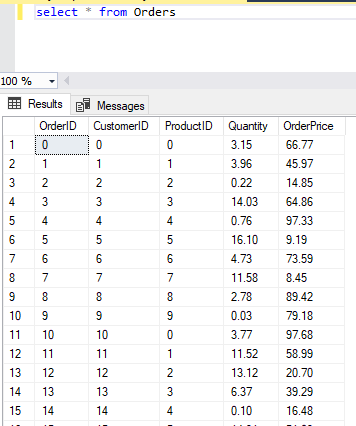

Tworzymy indeks kolumnowy na kolumnę `OrderPrice`:

```sql
CREATE NONCLUSTERED COLUMNSTORE INDEX Index_OrderPrice
ON Orders (OrderPrice);
```

**Przykładowe zapytania**

> Wykonujemy teraz przykładowe zapytanie, które zwróci nam ProductID oraz TotalSale. Pierwsze zapytanie nie będzie korzystać z indeksu kolumnowego. Drugie zapytanie będzie korzystać z indeksu kolumnowego. Zostanie wykonane porównanie działania zapytania z indeksem i bez niego. Przedstawione zostaną wyniki, plany wykonania oraz napisane zostaną wnioski.

```sql
SELECT ProductID, SUM(OrderPrice) as TotalSale
FROM Orders
GROUP BY ProductID
```

**Wyniki**

| Zapytanie | Wynik                    |
| --------- | ------------------------ |
| 1         |  |
| 2         | 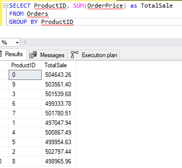 |

**Plany wykonania**

| Zapytanie | Plan wykonania               |
| --------- | ---------------------------- |
| 1         | 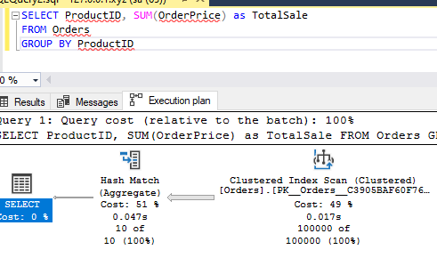 |
| 2         | 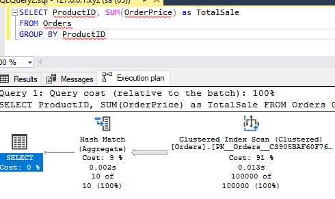 |

**Komantarz**

> W przypadku wykorzystania indeksu kolumnowego, zapytanie wykonuje się znacznie szybciej, ponieważ optymalizator korzysta z indeksu, który zawiera tylko interesujące nas wartości. W przypadku zapytania, które nie korzysta z indeksu kolumnowego, czas wykonania zapytania jest dłuższy, ponieważ optymalizator musi przeszukać całą tabelę, wykonując jej pełny skan, co można zaobserwować na planie wykonania zapytania. W przypadku zapytania, które korzysta z indeksu kolumnowego, 91% kosztów stanowiło `ClusteredIndex Scan`, bo `Hash Match` był już znany. W przypadku zapytania, które nie korzysta z indeksu kolumnowego, koszty się podzieiłu prawie po 50 % pomiędzy `Hash Match` a `Clustered Index Scan`, co jest spowodowane nie znajomością `Hash Match` przez optymalizator.

**Rekomendacja Databse Engine Tuning Advisor**

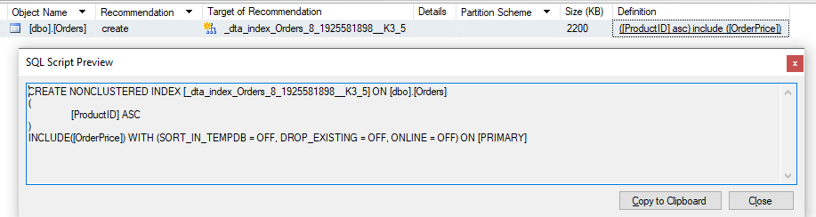

> Narzędzie Database Engine Tuning Advisor sugeruje utworzenie indeksu, który ma kolumnę `OrderPrice` jako INCLUDE. Dzięki temu baza danych może efektywniej wykonywać operacje agregujące, takie jak suma wartości zamówień dla określonego przedziału czasowego, bo ma szybszy dostęp do tych danych.

> Wnioski: Indeks kolumnowy może znacznie usprawniść i poprawić wydajność zapytań. Doskonale nadaje się on do zapytań analitycznych, które wymagają szybkiego dostępu do dużej ilości danych i obliczeń agregujących.

### Próbnie

|         |     |     |     |
| ------- | --- | --- | --- |
| zadanie | pkt |     |     |
| 1       | 2   |     |     |
| 2       | 2   |     |     |
| 3       | 2   |     |     |
| 4       | 10  |     |     |
| razem   | 16  |     |     |
